# Azure Kubernetes Service (AKS) with Terraform

## Architecture Overview

```mermaid
graph TD
    subgraph "Azure Subscription"
        subgraph "Azure Virtual Network"
            subgraph "AKS Subnet"
                AKS[AKS Cluster]
                
                subgraph "Node Pools"
                    SYS[System Node Pool]
                    USR1[User Node Pool 1]
                    USR2[User Node Pool 2]
                end
                
                AKS --> SYS
                AKS --> USR1
                AKS --> USR2
            end
            
            subgraph "Application Gateway Subnet"
                AGIC[App Gateway Ingress Controller]
                WAF[Web Application Firewall]
                
                AGIC --> WAF
            end
            
            subgraph "Private Endpoints Subnet"
                PE_ACR[ACR Private Endpoint]
                PE_KV[Key Vault Private Endpoint]
                PE_SQL[SQL Private Endpoint]
            end
        end
        
        subgraph "Supporting Services"
            ACR[Azure Container Registry]
            KV[Key Vault]
            SQL[Azure SQL Database]
            SA[Storage Account]
            MI[Managed Identity]
            
            ACR --> PE_ACR
            KV --> PE_KV
            SQL --> PE_SQL
        end
        
        subgraph "Monitoring & Management"
            LA[Log Analytics]
            INS[Container Insights]
            DIAG[Diagnostic Settings]
            APPI[Application Insights]
            
            AKS --> LA
            AKS --> INS
            AKS --> DIAG
            AGIC --> DIAG
        end
    end
    
    subgraph "External Resources"
        DNS[Azure DNS]
        FD[Front Door]
        PIP[Public IP]
        
        FD --> AGIC
        FD --> PIP
        DNS --> FD
    end
    
    subgraph "DevOps Platform"
        TF[Terraform]
        CICD[CI/CD Pipeline]
        HELM[Helm Charts]
        KUST[Kustomize]
        
        TF --> AKS
        TF --> ACR
        TF --> KV
        TF --> SQL
        TF --> AGIC
        
        CICD --> HELM
        CICD --> KUST
        CICD --> ACR
        
        HELM --> AKS
        KUST --> AKS
    end
```



## Terraform Project Structure

```
azure-aks/
├── README.md
├── terraform/
│   ├── main.tf                  # Main deployment file
│   ├── variables.tf             # Variable definitions
│   ├── outputs.tf               # Output definitions
│   ├── versions.tf              # Provider and version constraints
│   ├── terraform.tfvars         # Variable values
│   ├── backend.tf               # State backend configuration
│   └── modules/
│       ├── networking/          # VNET, subnets, NSGs, route tables
│       ├── aks/                 # AKS cluster and node pools
│       ├── acr/                 # Container registry
│       ├── key_vault/           # Secret management
│       ├── app_gateway/         # Application gateway with WAF
│       ├── monitoring/          # Log analytics and diagnostics
│       └── database/            # Azure SQL or other databases
├── kubernetes/
│   ├── namespaces/              # Namespace definitions
│   ├── rbac/                    # RBAC configurations
│   ├── policies/                # OPA/Gatekeeper policies
│   ├── ingress/                 # Ingress configurations
│   └── monitoring/              # Prometheus/Grafana configurations
├── helm-charts/
│   ├── app1/                    # Application Helm chart
│   ├── app2/                    # Application Helm chart
│   └── shared/                  # Shared services chart
└── pipelines/
    ├── terraform-pipeline.yml   # IaC deployment pipeline
    ├── application-pipeline.yml # Application deployment pipeline
    └── scripts/
        ├── aks-bootstrap.sh     # Cluster bootstrapping script
        └── validate-deployment.sh # Deployment validation
```

## AKS Cluster Components

### Core Infrastructure
- **Resource Group**: Logical container for all resources
- **Virtual Network**: Network foundation with multiple subnets
- **Network Security Groups**: Subnet-level security policies
- **Route Tables**: Custom routing for egress traffic
- **Private DNS Zones**: Name resolution for private endpoints

### AKS Cluster
- **Managed Kubernetes**: Control plane management by Azure
- **Multiple Node Pools**: Separated system and workload nodes
- **Azure CNI**: Advanced networking integration
- **Pod Identity**: Managed identities for pods
- **Kubelet Identity**: Managed identity for nodes
- **Cluster Autoscaler**: Automatic node scaling
- **Private Cluster**: API server with private endpoint

### Security Components
- **Azure AD Integration**: RBAC with Azure AD identities
- **Azure Policy for Kubernetes**: Built-in policy enforcement
- **Private ACR Integration**: Secure image pulling
- **Key Vault Integration**: Secrets management
- **Managed Identities**: Avoid credential usage
- **Network Policy**: Pod-to-pod traffic control

### Ingress & Traffic Management
- **Application Gateway Ingress Controller**: HTTP(S) routing
- **Web Application Firewall**: Protection against web attacks
- **Azure Front Door**: Global load balancing and CDN
- **Azure DNS**: Domain management
- **TLS Termination**: Certificate management

### Monitoring & Diagnostics
- **Log Analytics Workspace**: Centralized logging
- **Container Insights**: Kubernetes-specific monitoring
- **Azure Monitor**: Metrics and alerting
- **Diagnostic Settings**: Platform logs collection
- **Azure Policy Insights**: Compliance reporting

## Terraform Implementation

### Core Resources Module
```hcl
# Example of the main AKS module
module "aks" {
  source              = "./modules/aks"
  
  resource_group_name = azurerm_resource_group.main.name
  location            = var.location
  cluster_name        = var.cluster_name
  kubernetes_version  = var.kubernetes_version
  
  vnet_subnet_id      = module.networking.aks_subnet_id
  
  default_node_pool = {
    name                  = "system"
    node_count            = var.system_node_count
    vm_size               = var.system_node_vm_size
    os_disk_size_gb       = var.system_node_disk_size
    os_disk_type          = "Managed"
    vnet_subnet_id        = module.networking.aks_subnet_id
    enable_auto_scaling   = true
    min_count             = var.system_node_min_count
    max_count             = var.system_node_max_count
    max_pods              = 30
    node_labels           = var.system_node_labels
    node_taints           = ["CriticalAddonsOnly=true:NoSchedule"]
  }
  
  user_node_pools = var.user_node_pools
  
  network_profile = {
    network_plugin     = "azure"
    network_policy     = "calico"
    service_cidr       = var.service_cidr
    dns_service_ip     = var.dns_service_ip
    docker_bridge_cidr = var.docker_bridge_cidr
    outbound_type      = "userDefinedRouting"
  }
  
  identity = {
    type = "SystemAssigned"
  }
  
  role_based_access_control = {
    enabled = true
    azure_active_directory = {
      managed                = true
      admin_group_object_ids = var.aks_admin_group_object_ids
    }
  }
  
  private_cluster_enabled = true
  
  addon_profile = {
    oms_agent = {
      enabled                    = true
      log_analytics_workspace_id = module.monitoring.log_analytics_workspace_id
    }
    azure_policy = {
      enabled = true
    }
    ingress_application_gateway = {
      enabled                    = true
      gateway_id                 = module.app_gateway.gateway_id
    }
  }
  
  tags = var.tags
}
```

## AKS Configuration & Add-ons

### Networking Configuration
- **Azure CNI vs. Kubenet**: Network performance and scale 
- **Network Policies**: Calico or Azure implementation
- **Service CIDR and Pod CIDR**: Non-overlapping address spaces
- **Egress Control**: UDR for controlled outbound traffic
- **Azure Firewall**: Central egress filtering

### Security Configurations
- **API Server Access Control**: IP restrictions and private API
- **AAD Integration**: RBAC with Azure AD groups
- **Pod Security Policies/Standards**: Enforce pod security
- **Admission Controllers**: OPA/Gatekeeper policies
- **Secrets Management**: CSI Driver for Key Vault integration

### Scaling Configurations
- **Cluster Autoscaler**: Node scaling based on pod demands
- **Horizontal Pod Autoscaler**: Pod scaling based on metrics
- **Vertical Pod Autoscaler**: Resource adjustment for pods
- **Node Pool Design**: Specialized pools for different workloads
- **Spot Instances**: Cost optimization for non-critical workloads

### Monitoring Configurations
- **Prometheus and Grafana**: Open-source monitoring stack
- **Container Insights**: Azure-native monitoring
- **Fluent Bit/Fluentd**: Enhanced logging configuration
- **Jaeger/Tempo**: Distributed tracing
- **Custom Dashboards**: Workload-specific visualization

## Best Practices & Recommendations

### Cluster Design
- **Separate node pools** for system and application workloads
- **Implement taints and tolerations** for workload isolation
- **Use managed node pools** for easier maintenance
- **Plan for multi-cluster** architectures for large deployments
- **Enable AKS-managed AAD integration** for enhanced security

### Networking
- **Use dedicated subnets** for AKS nodes and pods
- **Implement network policies** from day one
- **Plan IP address space** carefully to allow for growth
- **Consider service mesh** for advanced traffic management
- **Implement proper egress control** through Azure Firewall

### Security
- **Enable Azure Policy for Kubernetes**
- **Implement pod-managed identities**
- **Scan container images** in CI/CD pipeline and at runtime
- **Restrict base container images** to approved registries
- **Review and remediate Defender for Cloud recommendations**

### Operations
- **Implement GitOps** with Flux/ArgoCD
- **Use node image upgrades** for improved security
- **Plan maintenance windows** for routine cluster upgrades
- **Implement backup strategy** for stateful workloads
- **Develop disaster recovery procedures**