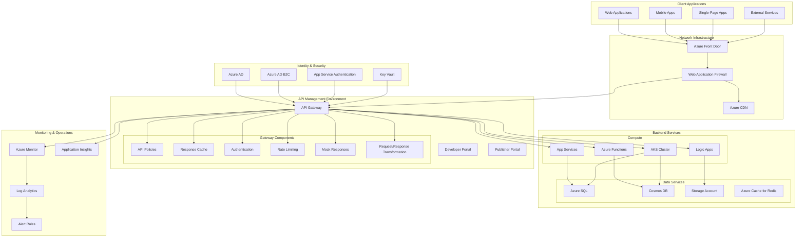

# Azure API Management Platform

## Architecture Overview



## API Management Components

### Gateway Infrastructure
- **API Gateway**: Central point for API traffic management
- **Self-hosted Gateways**: Edge deployment for hybrid scenarios
- **Multi-region Deployment**: Global distribution for performance
- **Premium Tier**: Advanced scaling and networking features
- **Virtual Network Integration**: Secure network isolation

### Developer Experience
- **Developer Portal**: Self-service developer onboarding
- **API Documentation**: OpenAPI/Swagger integration
- **Interactive Console**: API testing and exploration
- **User Registration**: Developer account management
- **Product Catalog**: API package offerings

### API Management
- **API Versioning**: Managing API lifecycle
- **Product Management**: Grouping APIs into products
- **Subscription Management**: API access control
- **API Monitoring**: Usage and performance metrics
- **API Analytics**: Traffic analysis and reporting

### Policy Management
- **Inbound Policies**: Authentication, transformation, validation
- **Backend Policies**: Retry, caching, URL rewriting
- **Outbound Policies**: Response transformation, content filtering
- **Error Policies**: Exception handling and standardization
- **Global Policies**: Organization-wide standards

## Terraform Implementation

```hcl
# Example API Management configuration
resource "azurerm_api_management" "apim" {
  name                = var.apim_name
  location            = var.location
  resource_group_name = azurerm_resource_group.rg.name
  publisher_name      = var.publisher_name
  publisher_email     = var.publisher_email
  sku_name            = "${var.apim_sku}_${var.apim_capacity}"
  
  virtual_network_type = "External"
  virtual_network_configuration {
    subnet_id = azurerm_subnet.apim_subnet.id
  }
  
  identity {
    type = "SystemAssigned"
  }
  
  protocols {
    enable_http2 = true
  }
  
  security {
    enable_backend_ssl30              = false
    enable_backend_tls10              = false
    enable_backend_tls11              = false
    enable_frontend_ssl30             = false
    enable_frontend_tls10             = false
    enable_frontend_tls11             = false
    enable_triple_des_ciphers         = false
  }
  
  tags = var.tags
}

# API Management logger for Application Insights
resource "azurerm_api_management_logger" "logger" {
  name                = "app-insights-logger"
  api_management_name = azurerm_api_management.apim.name
  resource_group_name = azurerm_resource_group.rg.name
  
  application_insights {
    instrumentation_key = azurerm_application_insights.insights.instrumentation_key
  }
}

# API definition
resource "azurerm_api_management_api" "example_api" {
  name                = "example-api"
  resource_group_name = azurerm_resource_group.rg.name
  api_management_name = azurerm_api_management.apim.name
  revision            = "1"
  display_name        = "Example API"
  path                = "example"
  protocols           = ["https"]
  
  import {
    content_format = "swagger-json"
    content_value  = file("${path.module}/api-definitions/example-api.json")
  }
}

# API operation
resource "azurerm_api_management_api_operation" "get_items" {
  operation_id        = "get-items"
  api_name            = azurerm_api_management_api.example_api.name
  api_management_name = azurerm_api_management.apim.name
  resource_group_name = azurerm_resource_group.rg.name
  display_name        = "Get Items"
  method              = "GET"
  url_template        = "/items"
  description         = "Get a list of items"
  
  response {
    status_code = 200
    description = "Successful response"
    
    representation {
      content_type = "application/json"
      
      example {
        name  = "default"
        value = file("${path.module}/api-definitions/example-responses/get-items-200.json")
      }
    }
  }
}

# Product definition
resource "azurerm_api_management_product" "standard_product" {
  product_id            = "standard"
  api_management_name   = azurerm_api_management.apim.name
  resource_group_name   = azurerm_resource_group.rg.name
  display_name          = "Standard API Package"
  description           = "Standard tier with a call volume limit"
  subscription_required = true
  approval_required     = false
  published             = true
}

# Product API association
resource "azurerm_api_management_product_api" "standard_product_api" {
  product_id          = azurerm_api_management_product.standard_product.product_id
  api_name            = azurerm_api_management_api.example_api.name
  api_management_name = azurerm_api_management.apim.name
  resource_group_name = azurerm_resource_group.rg.name
}

# Policy configuration
resource "azurerm_api_management_api_policy" "rate_limit_policy" {
  api_name            = azurerm_api_management_api.example_api.name
  api_management_name = azurerm_api_management.apim.name
  resource_group_name = azurerm_resource_group.rg.name
  
  xml_content = <<XML
<policies>
  <inbound>
    <base />
    <rate-limit calls="5" renewal-period="60" />
    <cors>
      <allowed-origins>
        <origin>https://example.com</origin>
      </allowed-origins>
      <allowed-methods>
        <method>GET</method>
        <method>POST</method>
      </allowed-methods>
      <allowed-headers>
        <header>content-type</header>
        <header>authorization</header>
      </allowed-headers>
    </cors>
    <cache-lookup vary-by-developer="false" vary-by-developer-groups="false" downstream-caching-type="none" />
  </inbound>
  <backend>
    <base />
  </backend>
  <outbound>
    <base />
    <set-header name="X-Powered-By" exists-action="delete" />
    <set-header name="X-AspNet-Version" exists-action="delete" />
  </outbound>
  <on-error>
    <base />
  </on-error>
</policies>
XML
}
```

## API Gateway Patterns

### Authentication & Authorization
- **OAuth 2.0/OpenID Connect**: Modern authentication framework
- **Azure AD Integration**: Enterprise identity management
- **Azure AD B2C**: Customer identity management
- **JWT Validation**: Token-based security
- **Certificate Authentication**: mTLS implementation

### Traffic Management
- **Rate Limiting**: Control request volume
- **Throttling**: Prevent backend overloading
- **Caching**: Improve performance
- **Routing**: Backend service selection
- **Load Balancing**: Traffic distribution

### Request/Response Processing
- **Content Transformation**: Format conversion
- **Payload Validation**: Schema validation
- **Header Manipulation**: Add, remove, or modify headers
- **URL Rewriting**: Backend URL transformation
- **Error Handling**: Standardized error responses

### Advanced Patterns
- **API Composition**: Aggregate multiple backend responses
- **API Versioning**: Support multiple API versions
- **Mock Responses**: Simulate backend services
- **Request Correlation**: End-to-end tracing
- **Service Mesh Integration**: Work with Kubernetes service mesh

## Deployment Models

### Multi-region Deployment
- **Primary/Secondary Configuration**: Disaster recovery setup
- **Active/Active Deployment**: Geographic distribution
- **Traffic Manager/Front Door**: Global load balancing
- **Backup and Restore**: Configuration management
- **Regional Considerations**: Data residency and latency

### Environment Segregation
- **Development Environment**: API testing and development
- **Testing Environment**: Integration and performance testing
- **Production Environment**: Live API traffic
- **Staging Environment**: Pre-production validation
- **Configuration Drift Management**: Maintain consistency

### Network Security Design
- **Virtual Network Integration**: Private networking
- **NSGs and Route Tables**: Network traffic control
- **Private Endpoints**: Secure backend connectivity
- **WAF Protection**: DDoS and attack prevention
- **IP Restrictions**: Gateway access control

## Observability & Monitoring

### Logging & Monitoring
- **Application Insights**: API usage and performance tracking
- **Log Analytics**: Centralized logging
- **Diagnostic Settings**: Platform logs collection
- **Custom Metrics**: Business-specific measurements
- **Alert Rules**: Proactive notification

### Dashboard & Reporting
- **Azure Monitor Dashboards**: Real-time monitoring
- **Power BI Integration**: Advanced analytics
- **Developer Analytics**: API adoption metrics
- **Performance Reporting**: SLA tracking
- **Security Reporting**: Threat detection and management