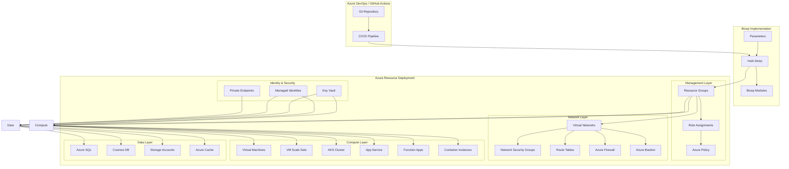

# Azure Infrastructure with Bicep

## Architecture Overview



## Bicep Project Structure

```
azure-bicep/
├── README.md
├── main.bicep                   # Main deployment file
├── parameters/
│   ├── dev.parameters.json      # Development parameters
│   ├── test.parameters.json     # Test parameters
│   └── prod.parameters.json     # Production parameters
├── modules/
│   ├── resourceGroup.bicep       # Resource group module
│   ├── networking/
│   │   ├── vnet.bicep            # Virtual network module
│   │   ├── nsg.bicep             # Network security group module
│   │   ├── bastion.bicep         # Bastion module
│   │   └── firewall.bicep        # Firewall module
│   ├── compute/
│   │   ├── aks.bicep             # AKS module
│   │   ├── appService.bicep      # App Service module
│   │   ├── vmss.bicep            # VM Scale Set module
│   │   └── functions.bicep       # Functions module
│   ├── data/
│   │   ├── sqlDatabase.bicep     # SQL Database module
│   │   ├── cosmosDb.bicep        # Cosmos DB module
│   │   └── storage.bicep         # Storage Account module
│   └── security/
│       ├── keyVault.bicep        # Key Vault module
│       ├── managedIdentity.bicep # Managed Identity module
│       └── privateEndpoint.bicep # Private Endpoint module
├── pipelines/
│   ├── azure-pipelines.yml       # Azure DevOps pipeline
│   └── github-workflow.yml       # GitHub Actions workflow
└── scripts/
    ├── deploy.ps1                # PowerShell deployment script
    ├── deploy.sh                 # Bash deployment script
    └── validate.ps1              # Validation script
```

## Main Bicep Template

```bicep
// main.bicep

targetScope = 'subscription'

// Parameters
@description('Environment name')
param environmentName string

@description('Azure region for deployment')
param location string

@description('Tags to apply to all resources')
param tags object = {}

// Variables
var resourceGroupName = 'rg-${environmentName}'

// Resource Group Module
module resourceGroup 'modules/resourceGroup.bicep' = {
  name: 'resourceGroupDeployment'
  params: {
    name: resourceGroupName
    location: location
    tags: tags
  }
}

// Virtual Network Module
module vnet 'modules/networking/vnet.bicep' = {
  name: 'vnetDeployment'
  scope: resourceGroup(resourceGroupName)
  params: {
    name: 'vnet-${environmentName}'
    location: location
    addressPrefixes: [
      '10.0.0.0/16'
    ]
    subnets: [
      {
        name: 'AksSubnet'
        addressPrefix: '10.0.0.0/22'
        privateEndpointNetworkPolicies: 'Disabled'
        privateLinkServiceNetworkPolicies: 'Enabled'
      }
      {
        name: 'AppServiceSubnet'
        addressPrefix: '10.0.4.0/24'
        delegations: [
          {
            name: 'appServicePlanDelegation'
            properties: {
              serviceName: 'Microsoft.Web/serverFarms'
            }
          }
        ]
        privateEndpointNetworkPolicies: 'Disabled'
        privateLinkServiceNetworkPolicies: 'Enabled'
      }
      {
        name: 'PrivateEndpointSubnet'
        addressPrefix: '10.0.5.0/24'
        privateEndpointNetworkPolicies: 'Disabled'
        privateLinkServiceNetworkPolicies: 'Enabled'
      }
    ]
    tags: tags
  }
  dependsOn: [
    resourceGroup
  ]
}

// AKS Module
module aks 'modules/compute/aks.bicep' = {
  name: 'aksDeployment'
  scope: resourceGroup(resourceGroupName)
  params: {
    name: 'aks-${environmentName}'
    location: location
    tags: tags
    kubernetesVersion: '1.25.5'
    networkPlugin: 'azure'
    networkPolicy: 'calico'
    serviceCidr: '10.5.0.0/16'
    dnsServiceIp: '10.5.0.10'
    dockerBridgeCidr: '172.17.0.1/16'
    subnetId: vnet.outputs.subnetIds['AksSubnet']
    nodePoolName: 'systempool'
    nodeCount: 3
    vmSize: 'Standard_DS2_v2'
    maxPods: 30
    enableAutoScaling: true
    minCount: 2
    maxCount: 5
    osDiskSizeGB: 100
    enableRBAC: true
    adminGroupObjectIDs: []
  }
  dependsOn: [
    vnet
  ]
}

// Key Vault Module
module keyVault 'modules/security/keyVault.bicep' = {
  name: 'keyVaultDeployment'
  scope: resourceGroup(resourceGroupName)
  params: {
    name: 'kv-${environmentName}-${uniqueString(subscription().id, environmentName)}'
    location: location
    tags: tags
    sku: 'standard'
    enableRbacAuthorization: true
    enableSoftDelete: true
    softDeleteRetentionInDays: 90
    networkAcls: {
      defaultAction: 'Deny'
      bypass: 'AzureServices'
      ipRules: []
      virtualNetworkRules: []
    }
  }
  dependsOn: [
    resourceGroup
  ]
}

// Managed Identity Module
module managedIdentity 'modules/security/managedIdentity.bicep' = {
  name: 'managedIdentityDeployment'
  scope: resourceGroup(resourceGroupName)
  params: {
    name: 'mi-${environmentName}'
    location: location
    tags: tags
  }
  dependsOn: [
    resourceGroup
  ]
}

// Role Assignment Module (Key Vault Access)
module roleAssignment 'modules/security/roleAssignment.bicep' = {
  name: 'roleAssignmentDeployment'
  scope: resourceGroup(resourceGroupName)
  params: {
    principalId: managedIdentity.outputs.principalId
    roleDefinitionId: subscriptionResourceId('Microsoft.Authorization/roleDefinitions', '4633458b-17de-408a-b874-0445c86b69e6') // Key Vault Secrets User
    principalType: 'ServicePrincipal'
  }
  dependsOn: [
    managedIdentity
    keyVault
  ]
}

// App Service Module
module appService 'modules/compute/appService.bicep' = {
  name: 'appServiceDeployment'
  scope: resourceGroup(resourceGroupName)
  params: {
    name: 'app-${environmentName}'
    location: location
    tags: tags
    sku: {
      name: 'P1v2'
      tier: 'PremiumV2'
      size: 'P1v2'
      family: 'Pv2'
      capacity: 1
    }
    managedIdentityId: managedIdentity.outputs.id
    keyVaultName: keyVault.outputs.name
    vnetIntegrationSubnetId: vnet.outputs.subnetIds['AppServiceSubnet']
  }
  dependsOn: [
    vnet
    managedIdentity
    keyVault
  ]
}

// SQL Database Module
module sqlDatabase 'modules/data/sqlDatabase.bicep' = {
  name: 'sqlDatabaseDeployment'
  scope: resourceGroup(resourceGroupName)
  params: {
    serverName: 'sql-${environmentName}-${uniqueString(subscription().id, environmentName)}'
    databaseName: 'sqldb-${environmentName}'
    location: location
    tags: tags
    administratorLogin: 'sqladmin'
    administratorLoginPassword: 'P@ssw0rd1234!'  // In production, use Key Vault or parameter
    databaseSku: {
      name: 'Standard'
      tier: 'Standard'
    }
    maxSizeBytes: 1073741824
    zoneRedundant: false
    enableAzureActiveDirectory: true
    enablePrivateEndpoint: true
    privateEndpointSubnetId: vnet.outputs.subnetIds['PrivateEndpointSubnet']
  }
  dependsOn: [
    vnet
  ]
}

// Outputs
output aksName string = aks.outputs.name
output appServiceName string = appService.outputs.name
output keyVaultName string = keyVault.outputs.name
output sqlServerName string = sqlDatabase.outputs.serverName
output sqlDatabaseName string = sqlDatabase.outputs.databaseName
```

## Example Module: AKS

```bicep
// modules/compute/aks.bicep

@description('AKS cluster name')
param name string

@description('Azure region for AKS')
param location string

@description('Tags to apply')
param tags object = {}

@description('Kubernetes version')
param kubernetesVersion string = '1.25.5'

@description('Network plugin')
@allowed([
  'azure'
  'kubenet'
])
param networkPlugin string = 'azure'

@description('Network policy')
@allowed([
  'azure'
  'calico'
])
param networkPolicy string = 'calico'

@description('Service CIDR')
param serviceCidr string

@description('DNS Service IP')
param dnsServiceIp string

@description('Docker Bridge CIDR')
param dockerBridgeCidr string

@description('AKS subnet ID')
param subnetId string

@description('System node pool name')
param nodePoolName string = 'systempool'

@description('Node count')
param nodeCount int = 3

@description('VM size for nodes')
param vmSize string = 'Standard_DS2_v2'

@description('Maximum pods per node')
param maxPods int = 30

@description('Enable cluster autoscaling')
param enableAutoScaling bool = false

@description('Minimum node count for autoscaling')
param minCount int = 1

@description('Maximum node count for autoscaling')
param maxCount int = 5

@description('OS disk size in GB')
param osDiskSizeGB int = 0

@description('Enable RBAC')
param enableRBAC bool = true

@description('AAD admin group object IDs')
param adminGroupObjectIDs array = []

resource aksCluster 'Microsoft.ContainerService/managedClusters@2023-01-01' = {
  name: name
  location: location
  tags: tags
  identity: {
    type: 'SystemAssigned'
  }
  properties: {
    kubernetesVersion: kubernetesVersion
    enableRBAC: enableRBAC
    dnsPrefix: name
    agentPoolProfiles: [
      {
        name: nodePoolName
        count: nodeCount
        vmSize: vmSize
        osDiskSizeGB: osDiskSizeGB
        vnetSubnetID: subnetId
        maxPods: maxPods
        osType: 'Linux'
        mode: 'System'
        enableAutoScaling: enableAutoScaling
        minCount: enableAutoScaling ? minCount : null
        maxCount: enableAutoScaling ? maxCount : null
        type: 'VirtualMachineScaleSets'
        osDiskType: 'Managed'
      }
    ]
    networkProfile: {
      networkPlugin: networkPlugin
      networkPolicy: networkPolicy
      serviceCidr: serviceCidr
      dnsServiceIP: dnsServiceIp
      dockerBridgeCidr: dockerBridgeCidr
      loadBalancerSku: 'standard'
    }
    aadProfile: !empty(adminGroupObjectIDs) ? {
      managed: true
      enableAzureRBAC: true
      adminGroupObjectIDs: adminGroupObjectIDs
    } : null
    addonProfiles: {
      azurepolicy: {
        enabled: true
      }
      omsagent: {
        enabled: true
        config: {
          logAnalyticsWorkspaceResourceID: logAnalyticsWorkspace.id
        }
      }
      azureKeyvaultSecretsProvider: {
        enabled: true
        config: {
          enableSecretRotation: 'true'
        }
      }
    }
  }
}

resource logAnalyticsWorkspace 'Microsoft.OperationalInsights/workspaces@2022-10-01' = {
  name: 'log-${name}'
  location: location
  tags: tags
  properties: {
    sku: {
      name: 'PerGB2018'
    }
    retentionInDays: 30
    features: {
      searchVersion: 1
      legacy: 0
      enableLogAccessUsingOnlyResourcePermissions: true
    }
  }
}

// Outputs
output name string = aksCluster.name
output id string = aksCluster.id
output fqdn string = aksCluster.properties.fqdn
output kubeletIdentity object = aksCluster.properties.identityProfile.kubeletidentity
```

## Deployment Pipeline with GitHub Actions

```yaml
# .github/workflows/deploy-bicep.yml
name: Deploy Azure Infrastructure with Bicep

on:
  push:
    branches: [ main ]
    paths:
      - 'azure-bicep/**'
  pull_request:
    branches: [ main ]
    paths:
      - 'azure-bicep/**'
  workflow_dispatch:
    inputs:
      environment:
        description: 'Environment to deploy to'
        required: true
        default: 'dev'
        type: choice
        options:
          - dev
          - test
          - prod

env:
  AZURE_SUBSCRIPTION_ID: ${{ secrets.AZURE_SUBSCRIPTION_ID }}
  AZURE_TENANT_ID: ${{ secrets.AZURE_TENANT_ID }}
  ENVIRONMENT: ${{ github.event.inputs.environment || 'dev' }}

jobs:
  validate:
    name: Validate Bicep Templates
    runs-on: ubuntu-latest
    steps:
      - name: Checkout repository
        uses: actions/checkout@v3
        
      - name: Login to Azure
        uses: azure/login@v1
        with:
          creds: ${{ secrets.AZURE_CREDENTIALS }}
          
      - name: Azure CLI - Validate Bicep templates
        uses: azure/CLI@v1
        with:
          inlineScript: |
            az config set bicep.use_binary_from_path=false
            az bicep build --file azure-bicep/main.bicep --stdout
            az deployment sub validate \
              --name validation-${{ github.run_number }} \
              --location eastus \
              --template-file azure-bicep/main.bicep \
              --parameters @azure-bicep/parameters/${{ env.ENVIRONMENT }}.parameters.json

  preview:
    name: Preview Changes
    runs-on: ubuntu-latest
    needs: validate
    steps:
      - name: Checkout repository
        uses: actions/checkout@v3
        
      - name: Login to Azure
        uses: azure/login@v1
        with:
          creds: ${{ secrets.AZURE_CREDENTIALS }}
          
      - name: Azure CLI - What-If deployment
        uses: azure/CLI@v1
        with:
          inlineScript: |
            az deployment sub what-if \
              --name preview-${{ github.run_number }} \
              --location eastus \
              --template-file azure-bicep/main.bicep \
              --parameters @azure-bicep/parameters/${{ env.ENVIRONMENT }}.parameters.json \
              --result-format JsonC > whatif-results.json
      
      - name: Upload What-If results
        uses: actions/upload-artifact@v3
        with:
          name: whatif-results
          path: whatif-results.json

  deploy:
    name: Deploy Infrastructure
    runs-on: ubuntu-latest
    needs: preview
    if: github.event_name == 'workflow_dispatch' || github.ref == 'refs/heads/main'
    environment:
      name: ${{ env.ENVIRONMENT }}
    
    steps:
      - name: Checkout repository
        uses: actions/checkout@v3
        
      - name: Login to Azure
        uses: azure/login@v1
        with:
          creds: ${{ secrets.AZURE_CREDENTIALS }}
          
      - name: Azure CLI - Deploy Bicep templates
        uses: azure/CLI@v1
        with:
          inlineScript: |
            az deployment sub create \
              --name deployment-${{ github.run_number }}-${{ env.ENVIRONMENT }} \
              --location eastus \
              --template-file azure-bicep/main.bicep \
              --parameters @azure-bicep/parameters/${{ env.ENVIRONMENT }}.parameters.json
              
      - name: Get deployment outputs
        id: deployment_outputs
        uses: azure/CLI@v1
        with:
          inlineScript: |
            outputs=$(az deployment sub show \
              --name deployment-${{ github.run_number }}-${{ env.ENVIRONMENT }} \
              --query properties.outputs)
            echo "AKS_NAME=$(echo $outputs | jq -r '.aksName.value')" >> $GITHUB_ENV
            echo "APP_SERVICE_NAME=$(echo $outputs | jq -r '.appServiceName.value')" >> $GITHUB_ENV

      - name: Summarize deployment
        run: |
          echo "## Deployment Summary for ${{ env.ENVIRONMENT }}" >> $GITHUB_STEP_SUMMARY
          echo "* AKS Cluster: ${{ env.AKS_NAME }}" >> $GITHUB_STEP_SUMMARY
          echo "* App Service: ${{ env.APP_SERVICE_NAME }}" >> $GITHUB_STEP_SUMMARY
```

## Deployment Pipeline with Azure DevOps

```yaml
# azure-pipelines.yml
trigger:
  branches:
    include:
      - main
  paths:
    include:
      - azure-bicep/**

parameters:
  - name: environment
    displayName: Environment
    type: string
    default: dev
    values:
      - dev
      - test
      - prod

variables:
  - name: environment
    value: ${{ parameters.environment }}
  - name: location
    value: eastus
  - group: bicep-deployment-variables

stages:
  - stage: Validate
    displayName: 'Validate Templates'
    jobs:
      - job: ValidateBicep
        displayName: 'Validate Bicep Templates'
        pool:
          vmImage: ubuntu-latest
        steps:
          - task: AzureCLI@2
            displayName: 'Validate Bicep Templates'
            inputs:
              azureSubscription: 'Azure Subscription'
              scriptType: 'bash'
              scriptLocation: 'inlineScript'
              inlineScript: |
                az config set bicep.use_binary_from_path=false
                az bicep build --file azure-bicep/main.bicep --stdout
                az deployment sub validate \
                  --name validation-$(Build.BuildNumber) \
                  --location $(location) \
                  --template-file azure-bicep/main.bicep \
                  --parameters @azure-bicep/parameters/$(environment).parameters.json
  
  - stage: Preview
    displayName: 'Preview Changes'
    dependsOn: Validate
    jobs:
      - job: PreviewChanges
        displayName: 'What-If Deployment'
        pool:
          vmImage: ubuntu-latest
        steps:
          - task: AzureCLI@2
            displayName: 'Run What-If Analysis'
            inputs:
              azureSubscription: 'Azure Subscription'
              scriptType: 'bash'
              scriptLocation: 'inlineScript'
              inlineScript: |
                az deployment sub what-if \
                  --name preview-$(Build.BuildNumber) \
                  --location $(location) \
                  --template-file azure-bicep/main.bicep \
                  --parameters @azure-bicep/parameters/$(environment).parameters.json \
                  --result-format JsonC > $(System.DefaultWorkingDirectory)/whatif-results.json
          
          - task: PublishBuildArtifacts@1
            displayName: 'Publish What-If Results'
            inputs:
              pathToPublish: '$(System.DefaultWorkingDirectory)/whatif-results.json'
              artifactName: 'whatif-results'
              publishLocation: 'Container'
  
  - stage: Deploy
    displayName: 'Deploy to $(environment)'
    dependsOn: Preview
    condition: and(succeeded(), eq(variables['Build.SourceBranch'], 'refs/heads/main'))
    jobs:
      - deployment: DeployBicep
        displayName: 'Deploy Bicep Templates'
        environment: $(environment)
        pool:
          vmImage: ubuntu-latest
        strategy:
          runOnce:
            deploy:
              steps:
                - task: AzureCLI@2
                  displayName: 'Deploy Bicep Templates'
                  inputs:
                    azureSubscription: 'Azure Subscription'
                    scriptType: 'bash'
                    scriptLocation: 'inlineScript'
                    inlineScript: |
                      az deployment sub create \
                        --name deployment-$(Build.BuildNumber)-$(environment) \
                        --location $(location) \
                        --template-file $(Pipeline.Workspace)/s/azure-bicep/main.bicep \
                        --parameters @$(Pipeline.Workspace)/s/azure-bicep/parameters/$(environment).parameters.json
                
                - task: AzureCLI@2
                  displayName: 'Get Deployment Outputs'
                  inputs:
                    azureSubscription: 'Azure Subscription'
                    scriptType: 'bash'
                    scriptLocation: 'inlineScript'
                    inlineScript: |
                      outputs=$(az deployment sub show \
                        --name deployment-$(Build.BuildNumber)-$(environment) \
                        --query properties.outputs)
                      
                      echo "##vso[task.setvariable variable=aksName;isOutput=true]$(echo $outputs | jq -r '.aksName.value')"
                      echo "##vso[task.setvariable variable=appServiceName;isOutput=true]$(echo $outputs | jq -r '.appServiceName.value')"
                  name: DeploymentOutputs
                  
                - script: |
                    echo "## Deployment Summary for $(environment)" 
                    echo "* AKS Cluster: $(DeploymentOutputs.aksName)" 
                    echo "* App Service: $(DeploymentOutputs.appServiceName)" 
                  displayName: 'Summarize Deployment'
```

## Bicep Best Practices

### Modular Structure
- **Modules**: Create reusable modules for common resource types
- **Parameters**: Use parameters for environment-specific values
- **Variables**: Define variables for calculated values
- **Outputs**: Return important values from modules
- **Consistent naming**: Follow a naming convention across templates

### Security Implementation
- **Key Vault integration**: Store secrets in Key Vault
- **Managed identities**: Use for service authentication
- **RBAC assignments**: Implement role-based access control
- **Network security**: Configure firewall rules and NSGs
- **Private endpoints**: Secure connectivity to PaaS services

### Resource Configuration
- **Resource properties**: Define all required properties
- **Resource dependencies**: Use dependsOn for ordered deployment
- **Conditional deployment**: Use conditions for optional resources
- **Environment-specific settings**: Parameterize for different environments
- **Tags**: Apply consistent tags to all resources

### CI/CD Integration
- **Validation**: Verify templates before deployment
- **What-If analysis**: Preview changes before applying
- **Environment progression**: Deploy to dev, test, then prod
- **Automated testing**: Validate deployed resources
- **Approval gates**: Require approval for production deployments

## Bicep vs. Terraform Considerations

### Bicep Advantages
- **Native Azure integration**: Deep integration with Azure
- **No state management**: Built on ARM template deployment history
- **Azure CLI integration**: Seamless CLI experience
- **Visual Studio Code extension**: Rich authoring experience
- **Simplified syntax**: Cleaner than ARM templates

### Terraform Advantages
- **Multi-cloud support**: Works across cloud providers
- **Larger ecosystem**: More extensive module library
- **Rich provider ecosystem**: Broader third-party support
- **Mature tooling**: Established toolchain
- **Community adoption**: Widely used and supported

### When to Choose Bicep
- **Azure-only environments**: When only deploying to Azure
- **Azure-focused teams**: Teams familiar with Azure ecosystem
- **ARM template migration**: When moving from ARM templates
- **Visual Studio integration**: Teams using Visual Studio tooling
- **Preview feature support**: Early access to Azure features

### When to Choose Terraform
- **Multi-cloud strategy**: When deploying to multiple clouds
- **Existing Terraform usage**: Teams already using Terraform
- **Non-Azure resources**: When managing resources outside Azure
- **Community modules**: When leveraging community modules
- **CI/CD platform requirements**: Better support in some platforms