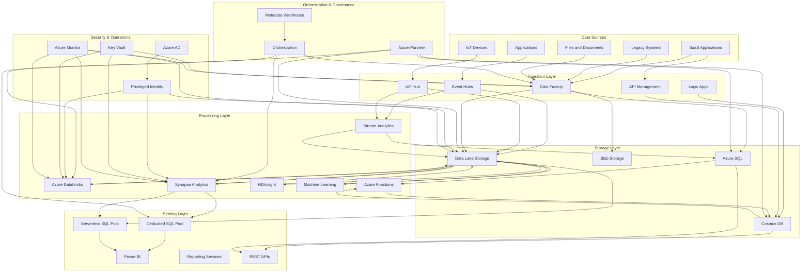

# Azure Data Platform Architecture

## Architecture Overview



## Terraform Implementation

```hcl
# Resource Group
resource "azurerm_resource_group" "data_platform" {
  name     = var.resource_group_name
  location = var.location
  tags     = var.tags
}

# Storage Account for Data Lake
resource "azurerm_storage_account" "datalake" {
  name                     = var.datalake_storage_name
  resource_group_name      = azurerm_resource_group.data_platform.name
  location                 = azurerm_resource_group.data_platform.location
  account_tier             = "Standard"
  account_replication_type = "LRS"
  account_kind             = "StorageV2"
  is_hns_enabled           = true
  min_tls_version          = "TLS1_2"
  
  tags = var.tags
  
  network_rules {
    default_action = "Deny"
    bypass         = ["Logging", "Metrics", "AzureServices"]
    ip_rules       = var.allowed_ips
    virtual_network_subnet_ids = var.subnet_ids
  }
  
  identity {
    type = "SystemAssigned"
  }
}

# Data Lake File Systems
resource "azurerm_storage_data_lake_gen2_filesystem" "zones" {
  for_each           = toset(["raw", "cleansed", "curated", "workspace"])
  name               = each.key
  storage_account_id = azurerm_storage_account.datalake.id
}

# Event Hub Namespace
resource "azurerm_eventhub_namespace" "event_hub" {
  name                = var.eventhub_namespace_name
  location            = azurerm_resource_group.data_platform.location
  resource_group_name = azurerm_resource_group.data_platform.name
  sku                 = "Standard"
  capacity            = 2
  
  tags = var.tags
  
  network_rulesets {
    default_action = "Deny"
    trusted_service_access_enabled = true
    virtual_network_rule {
      subnet_id = var.subnet_ids[0]
    }
  }
}

# Event Hub
resource "azurerm_eventhub" "events" {
  name                = var.eventhub_name
  namespace_name      = azurerm_eventhub_namespace.event_hub.name
  resource_group_name = azurerm_resource_group.data_platform.name
  partition_count     = 8
  message_retention   = 7
}

# Event Hub Consumer Group
resource "azurerm_eventhub_consumer_group" "stream_analytics" {
  name                = "stream-analytics"
  namespace_name      = azurerm_eventhub_namespace.event_hub.name
  eventhub_name       = azurerm_eventhub.events.name
  resource_group_name = azurerm_resource_group.data_platform.name
}

# Synapse Workspace
resource "azurerm_synapse_workspace" "synapse" {
  name                                 = var.synapse_workspace_name
  resource_group_name                  = azurerm_resource_group.data_platform.name
  location                             = azurerm_resource_group.data_platform.location
  storage_data_lake_gen2_filesystem_id = azurerm_storage_data_lake_gen2_filesystem.zones["workspace"].id
  sql_administrator_login              = var.synapse_sql_admin
  sql_administrator_login_password     = var.synapse_sql_admin_password
  
  tags = var.tags
  
  identity {
    type = "SystemAssigned"
  }
  
  aad_admin {
    login     = "AzureAD Admin"
    object_id = var.synapse_aad_admin_object_id
    tenant_id = var.tenant_id
  }
  
  sql_identity_control {
    allow_azure_ad_only_authentication = true
  }
}

# Synapse SQL Pool
resource "azurerm_synapse_sql_pool" "sql_pool" {
  name                 = var.sql_pool_name
  synapse_workspace_id = azurerm_synapse_workspace.synapse.id
  sku_name             = "DW100c"
  create_mode          = "Default"
  
  tags = var.tags
}

# Synapse Spark Pool
resource "azurerm_synapse_spark_pool" "spark_pool" {
  name                 = var.spark_pool_name
  synapse_workspace_id = azurerm_synapse_workspace.synapse.id
  node_size_family     = "MemoryOptimized"
  node_size            = "Small"
  
  auto_scale {
    max_node_count = 10
    min_node_count = 3
  }
  
  auto_pause {
    delay_in_minutes = 15
  }
  
  tags = var.tags
}

# Databricks Workspace
resource "azurerm_databricks_workspace" "databricks" {
  name                        = var.databricks_workspace_name
  resource_group_name         = azurerm_resource_group.data_platform.name
  location                    = azurerm_resource_group.data_platform.location
  sku                         = "premium"
  managed_resource_group_name = "${var.resource_group_name}-databricks-managed"
  
  tags = var.tags
  
  custom_parameters {
    virtual_network_id                                   = var.vnet_id
    private_subnet_name                                  = var.databricks_private_subnet_name
    public_subnet_name                                   = var.databricks_public_subnet_name
    private_subnet_network_security_group_association_id = var.databricks_private_nsg_association_id
    public_subnet_network_security_group_association_id  = var.databricks_public_nsg_association_id
  }
}

# Data Factory
resource "azurerm_data_factory" "data_factory" {
  name                = var.data_factory_name
  location            = azurerm_resource_group.data_platform.location
  resource_group_name = azurerm_resource_group.data_platform.name
  
  identity {
    type = "SystemAssigned"
  }
  
  github_configuration {
    account_name    = var.github_account
    repository_name = var.github_repo
    branch_name     = var.github_branch
    root_folder     = var.github_root_folder
  }
  
  tags = var.tags
}

# Key Vault
resource "azurerm_key_vault" "key_vault" {
  name                        = var.key_vault_name
  location                    = azurerm_resource_group.data_platform.location
  resource_group_name         = azurerm_resource_group.data_platform.name
  enabled_for_disk_encryption = true
  tenant_id                   = var.tenant_id
  soft_delete_retention_days  = 7
  purge_protection_enabled    = true
  sku_name                    = "standard"
  
  network_acls {
    default_action = "Deny"
    bypass         = "AzureServices"
    ip_rules       = var.allowed_ips
    virtual_network_subnet_ids = var.subnet_ids
  }
  
  tags = var.tags
}

# Access policies for Data Factory to Key Vault
resource "azurerm_key_vault_access_policy" "data_factory" {
  key_vault_id = azurerm_key_vault.key_vault.id
  tenant_id    = var.tenant_id
  object_id    = azurerm_data_factory.data_factory.identity[0].principal_id
  
  secret_permissions = [
    "Get", "List"
  ]
}

# Log Analytics Workspace
resource "azurerm_log_analytics_workspace" "logs" {
  name                = var.log_analytics_workspace_name
  location            = azurerm_resource_group.data_platform.location
  resource_group_name = azurerm_resource_group.data_platform.name
  sku                 = "PerGB2018"
  retention_in_days   = 30
  
  tags = var.tags
}

# Diagnostic settings for Synapse
resource "azurerm_monitor_diagnostic_setting" "synapse_diag" {
  name                       = "synapse-diag-settings"
  target_resource_id         = azurerm_synapse_workspace.synapse.id
  log_analytics_workspace_id = azurerm_log_analytics_workspace.logs.id
  
  log {
    category = "SynapseRbacOperations"
    enabled  = true
    
    retention_policy {
      enabled = true
      days    = 30
    }
  }
  
  log {
    category = "GatewayApiRequests"
    enabled  = true
    
    retention_policy {
      enabled = true
      days    = 30
    }
  }
  
  log {
    category = "BuiltinSqlReqsEnded"
    enabled  = true
    
    retention_policy {
      enabled = true
      days    = 30
    }
  }
  
  metric {
    category = "AllMetrics"
    enabled  = true
    
    retention_policy {
      enabled = true
      days    = 30
    }
  }
}
```

## Data Platform Components

### Data Ingestion
- **Azure Event Hubs**: Real-time data ingestion
- **Azure IoT Hub**: IoT device connectivity
- **Azure Data Factory**: ETL/ELT orchestration
- **Logic Apps**: Workflow automation
- **API Management**: API integration
- **Azure Synapse Pipelines**: Data movement

### Data Storage
- **Azure Data Lake Storage Gen2**: Scalable data lake
- **Azure Blob Storage**: Object storage
- **Azure SQL Database**: Relational data
- **Cosmos DB**: NoSQL storage
- **Azure Database for PostgreSQL/MySQL**: Open-source databases
- **Azure Cache for Redis**: High-performance caching

### Data Processing
- **Azure Databricks**: Apache Spark-based analytics
- **Azure Synapse Analytics**: Unified analytics
- **Azure Stream Analytics**: Real-time processing
- **Azure HDInsight**: Open-source big data
- **Azure Functions**: Serverless compute
- **Azure Machine Learning**: ML model training and deployment

### Data Serving
- **Synapse Dedicated SQL Pools**: Data warehousing
- **Synapse Serverless SQL Pools**: Ad-hoc querying
- **Power BI**: Business intelligence
- **REST APIs**: Data services
- **Event Grid**: Event distribution
- **Service Bus**: Message queuing

### Orchestration & Governance
- **Azure Purview**: Data governance and discovery
- **Azure Data Factory/Synapse Pipelines**: Workflow orchestration
- **Azure DevOps**: CI/CD for data pipelines
- **Data Catalog**: Metadata management
- **Metadata Service**: Lineage tracking
- **Policy Service**: Data access policies

## Data Architecture Patterns

### Modern Data Warehouse
- **Raw, Bronze, Silver, Gold zones**: Multi-layered data architecture
- **Batch processing**: Regular data loads
- **Star schema optimization**: Dimensional modeling
- **Incremental loads**: Delta-based processing
- **Enterprise BI**: Organizational reporting

### Data Lakehouse
- **Delta Lake/Delta format**: ACID transaction support
- **Schema enforcement**: Data quality control
- **Time travel**: Historical data access
- **Unified batch and streaming**: Converged processing
- **Mixed workload optimization**: SQL and Spark integration

### Real-time Analytics
- **Stream processing**: Event handling
- **Materialized views**: Pre-computed results
- **Incremental aggregation**: Continuous updates
- **Hot and cold paths**: Dual processing streams
- **Complex event processing**: Pattern detection

### Machine Learning Operations
- **Feature store**: Centralized feature management
- **Model registry**: Version control for models
- **Training pipelines**: Reproducible training
- **Model deployment**: Continuous delivery for ML
- **Model monitoring**: Drift detection

## Security & Governance Implementation

### Data Security
- **Azure AD integration**: Identity management
- **RBAC implementation**: Fine-grained access control
- **Column-level security**: Data field protection
- **Dynamic data masking**: Sensitive data protection
- **Customer-managed keys**: Encryption control

### Data Governance
- **Data classification**: Identify sensitive data
- **Data lineage**: Track data origins and transformations
- **Business glossary**: Common data terminology
- **Data discovery**: Self-service data exploration
- **Compliance monitoring**: Policy enforcement

### Operations Management
- **Monitoring and alerting**: System health tracking
- **Cost management**: Resource optimization
- **Disaster recovery**: Business continuity
- **Automated testing**: Data quality validation
- **CI/CD pipelines**: Automated deployment

## Best Practices & Recommendations

### Data Platform Design
- **Layer separation**: Clear boundaries between ingestion, storage, processing
- **Zone architecture**: Raw, cleansed, curated data zones
- **Metadata-driven pipelines**: Configurable data flows
- **Polyglot persistence**: Different storage for different needs
- **Infrastructure as Code**: Terraform/Bicep deployment

### Performance Optimization
- **Data partitioning**: Efficient query patterns
- **Query optimization**: Performance tuning
- **Caching strategies**: Reduce processing overhead
- **Resource scaling**: Match compute to workload
- **Cost management**: Budget controls and monitoring

### Implementation Approach
- **Start small**: Begin with core components
- **Iterative expansion**: Add capabilities over time
- **Self-service enablement**: Empower data consumers
- **Centralized governance**: Consistent data management
- **DevOps practices**: Automated pipelines