# Azure DevOps CI/CD Pipeline

## Architecture Overview

```mermaid
graph TD
    subgraph "Azure DevOps"
        subgraph "Repository"
            CODE[Source Code]
            PIPE[Pipeline Definitions]
            VARS[Variable Groups]
            GATE[Approval Gates]
        end
        
        subgraph "Build Pipeline"
            CI[CI Pipeline]
            
            subgraph "Build Steps"
                RESTORE[Restore Dependencies]
                COMPILE[Compile Code]
                UNIT[Unit Tests]
                ANALYZE[Code Analysis]
                PACKAGE[Package Artifacts]
                SIGN[Sign Artifacts]
                PUBLISH[Publish Artifacts]
            end
            
            CI --> RESTORE
            RESTORE --> COMPILE
            COMPILE --> UNIT
            UNIT --> ANALYZE
            ANALYZE --> PACKAGE
            PACKAGE --> SIGN
            SIGN --> PUBLISH
        end
        
        subgraph "Release Pipeline"
            CD[CD Pipeline]
            
            subgraph "Stages"
                DEV[Development Stage]
                QA[QA Stage]
                UAT[UAT Stage]
                PROD[Production Stage]
            end
            
            CD --> DEV
            DEV --> QA
            QA --> UAT
            UAT --> PROD
            
            GATE --> PROD
        end
    end
    
    subgraph "Azure Resources"
        subgraph "Development"
            DEV_RG[Resource Group]
            DEV_APP[App Service]
            DEV_DB[Database]
        end
        
        subgraph "QA"
            QA_RG[Resource Group]
            QA_APP[App Service]
            QA_DB[Database]
        end
        
        subgraph "UAT"
            UAT_RG[Resource Group]
            UAT_APP[App Service]
            UAT_DB[Database]
        end
        
        subgraph "Production"
            PROD_RG[Resource Group]
            PROD_APP[App Service]
            PROD_DB[Database]
        end
    end
    
    subgraph "Shared Resources"
        KV[Key Vault]
        CR[Container Registry]
        INSIGHTS[Application Insights]
        STOR[Storage Account]
    end
    
    DEV --> DEV_APP
    QA --> QA_APP
    UAT --> UAT_APP
    PROD --> PROD_APP
    
    KV --> DEV
    KV --> QA
    KV --> UAT
    KV --> PROD
    
    CR --> DEV
    CR --> QA
    CR --> UAT
    CR --> PROD
    
    subgraph "Testing"
        INT_TEST[Integration Tests]
        LOAD_TEST[Load Tests]
        UI_TEST[UI Tests]
        SECURITY[Security Tests]
    end
    
    DEV --> INT_TEST
    QA --> LOAD_TEST
    QA --> UI_TEST
    UAT --> SECURITY
    
    subgraph "Monitoring & Feedback"
        DASH[Dashboards]
        ALERT[Alerts]
        FEED[Feedback Loop]
        
        INSIGHTS --> DASH
        INSIGHTS --> ALERT
        ALERT --> FEED
    end
```



## Project Structure

```
azure-devops-project/
├── azure-pipelines/
│   ├── ci-pipeline.yml
│   ├── cd-pipeline.yml
│   ├── templates/
│   │   ├── build-template.yml
│   │   ├── test-template.yml
│   │   ├── deploy-template.yml
│   │   └── security-template.yml
│   └── variable-groups/
│       ├── global-variables.yml
│       ├── dev-variables.yml
│       ├── qa-variables.yml
│       ├── uat-variables.yml
│       └── prod-variables.yml
├── src/
│   ├── api/
│   ├── web/
│   ├── shared/
│   └── tests/
│       ├── unit-tests/
│       ├── integration-tests/
│       └── ui-tests/
├── infra/
│   ├── arm-templates/
│   │   ├── app-service.json
│   │   ├── sql-database.json
│   │   └── parameters/
│   │       ├── dev.parameters.json
│   │       ├── qa.parameters.json
│   │       ├── uat.parameters.json
│   │       └── prod.parameters.json
│   ├── terraform/
│   │   ├── modules/
│   │   └── environments/
│   ├── scripts/
│   │   ├── deploy.ps1
│   │   ├── load-test.ps1
│   │   └── database-migration.ps1
│   └── kubernetes/
│       ├── base/
│       └── overlays/
├── docs/
│   ├── architecture/
│   ├── deployment/
│   └── runbooks/
└── README.md
```

## CI Pipeline (YAML)

```yaml
# azure-pipelines/ci-pipeline.yml
trigger:
  branches:
    include:
      - main
      - develop
      - feature/*
  paths:
    exclude:
      - README.md
      - docs/*
      - azure-pipelines/cd-pipeline.yml

pool:
  vmImage: 'ubuntu-latest'

variables:
  - group: global-variables
  - name: solution
    value: '**/*.sln'
  - name: buildPlatform
    value: 'Any CPU'
  - name: buildConfiguration
    value: 'Release'
  - name: dotnetVersion
    value: '7.0.x'

stages:
- stage: Build
  displayName: 'Build and Test'
  jobs:
  - job: BuildAndTest
    displayName: 'Build and Test Job'
    steps:
    - task: UseDotNet@2
      displayName: 'Install .NET SDK'
      inputs:
        packageType: 'sdk'
        version: '$(dotnetVersion)'
        
    - task: DotNetCoreCLI@2
      displayName: 'Restore Packages'
      inputs:
        command: 'restore'
        projects: '$(solution)'
        feedsToUse: 'select'
        
    - task: DotNetCoreCLI@2
      displayName: 'Build Solution'
      inputs:
        command: 'build'
        projects: '$(solution)'
        arguments: '--configuration $(buildConfiguration) --no-restore'
        
    - task: DotNetCoreCLI@2
      displayName: 'Run Unit Tests'
      inputs:
        command: 'test'
        projects: 'src/tests/unit-tests/*.csproj'
        arguments: '--configuration $(buildConfiguration) --no-build --collect:"XPlat Code Coverage" -- DataCollectionRunSettings.DataCollectors.DataCollector.Configuration.Format=cobertura'
        
    - task: PublishCodeCoverageResults@1
      displayName: 'Publish Code Coverage'
      inputs:
        codeCoverageTool: 'Cobertura'
        summaryFileLocation: '$(Agent.TempDirectory)/**/coverage.cobertura.xml'

    - task: SonarCloudPrepare@1
      displayName: 'Prepare SonarCloud Analysis'
      inputs:
        SonarCloud: 'SonarCloud'
        organization: '$(SonarCloudOrganization)'
        scannerMode: 'MSBuild'
        projectKey: '$(SonarCloudProjectKey)'
        projectName: '$(SonarCloudProjectName)'
        extraProperties: |
          sonar.cs.opencover.reportsPaths=$(Agent.TempDirectory)/**/coverage.cobertura.xml
          
    - task: SonarCloudAnalyze@1
      displayName: 'Run SonarCloud Analysis'
      
    - task: SonarCloudPublish@1
      displayName: 'Publish SonarCloud Results'
      inputs:
        pollingTimeoutSec: '300'
        
    - task: DotNetCoreCLI@2
      displayName: 'Publish Web Application'
      inputs:
        command: 'publish'
        publishWebProjects: true
        arguments: '--configuration $(buildConfiguration) --output $(Build.ArtifactStagingDirectory)/WebApp --no-build'
        zipAfterPublish: true
        
    - task: DotNetCoreCLI@2
      displayName: 'Publish API Application'
      inputs:
        command: 'publish'
        publishWebProjects: false
        projects: 'src/api/*.csproj'
        arguments: '--configuration $(buildConfiguration) --output $(Build.ArtifactStagingDirectory)/Api --no-build'
        zipAfterPublish: true
        
    - task: CopyFiles@2
      displayName: 'Copy ARM Templates'
      inputs:
        SourceFolder: 'infra/arm-templates'
        Contents: '**'
        TargetFolder: '$(Build.ArtifactStagingDirectory)/infrastructure'
        
    - task: CopyFiles@2
      displayName: 'Copy Deployment Scripts'
      inputs:
        SourceFolder: 'infra/scripts'
        Contents: '**'
        TargetFolder: '$(Build.ArtifactStagingDirectory)/scripts'
        
    - task: ArchiveFiles@2
      displayName: 'Archive Infrastructure Files'
      inputs:
        rootFolderOrFile: '$(Build.ArtifactStagingDirectory)/infrastructure'
        includeRootFolder: false
        archiveType: 'zip'
        archiveFile: '$(Build.ArtifactStagingDirectory)/infrastructure.zip'
        replaceExistingArchive: true
        
    - task: PublishBuildArtifacts@1
      displayName: 'Publish Build Artifacts'
      inputs:
        PathtoPublish: '$(Build.ArtifactStagingDirectory)'
        ArtifactName: 'drop'
        publishLocation: 'Container'

- stage: Security
  displayName: 'Security Scanning'
  dependsOn: Build
  jobs:
  - job: SecurityScan
    displayName: 'Security Scan Job'
    steps:
    - task: DownloadBuildArtifacts@1
      inputs:
        buildType: 'current'
        downloadType: 'single'
        artifactName: 'drop'
        downloadPath: '$(System.ArtifactsDirectory)'
        
    - task: WhiteSource@21
      displayName: 'WhiteSource Scan'
      inputs:
        cwd: '$(System.DefaultWorkingDirectory)'
        
    - task: CredScan@3
      displayName: 'Run CredScan'
      inputs:
        outputFormat: 'pre'
        
    - task: ComponentGovernanceComponentDetection@0
      displayName: 'Component Governance'
      inputs:
        scanType: 'Register'
        verbosity: 'Verbose'
        alertWarningLevel: 'High'
        
    - task: PublishSecurityAnalysisLogs@3
      displayName: 'Publish Security Analysis Logs'
      inputs:
        ArtifactName: 'CodeAnalysisLogs'
        
    - task: PostAnalysis@2
      displayName: 'Post Analysis'
      inputs:
        AllTools: false
        CredScan: true
        ToolLogsNotFoundAction: 'Standard'

- stage: CreateArtifact
  displayName: 'Create Release Artifact'
  dependsOn: Security
  condition: and(succeeded(), eq(variables['Build.SourceBranch'], 'refs/heads/main'))
  jobs:
  - job: CreateRelease
    displayName: 'Create Release Job'
    steps:
    - task: DownloadBuildArtifacts@1
      inputs:
        buildType: 'current'
        downloadType: 'single'
        artifactName: 'drop'
        downloadPath: '$(System.ArtifactsDirectory)'
        
    - task: PowerShell@2
      displayName: 'Prepare Release Notes'
      inputs:
        targetType: 'inline'
        script: |
          $commits = git log -5 --pretty=format:"- %s (%an)" $(git describe --tags --abbrev=0)..HEAD
          $releaseNotes = "# Release Notes`n`n## Changes in this release`n`n$commits"
          Set-Content -Path "$(System.ArtifactsDirectory)/release-notes.md" -Value $releaseNotes
        
    - task: PublishBuildArtifacts@1
      displayName: 'Publish Release Notes'
      inputs:
        PathtoPublish: '$(System.ArtifactsDirectory)/release-notes.md'
        ArtifactName: 'ReleaseNotes'
        publishLocation: 'Container'
```

## CD Pipeline (YAML)

```yaml
# azure-pipelines/cd-pipeline.yml
trigger: none

resources:
  pipelines:
  - pipeline: CI_Pipeline
    source: CI_Pipeline
    trigger:
      branches:
        include:
        - main

variables:
  - group: global-variables

stages:
- stage: DeployToDev
  displayName: 'Deploy to Development'
  variables:
  - group: dev-variables
  jobs:
  - deployment: DeployWebApp
    displayName: 'Deploy Web Application'
    environment: Development
    strategy:
      runOnce:
        deploy:
          steps:
          - template: templates/deploy-template.yml
            parameters:
              environmentName: 'Development'
              appServiceName: '$(WebAppName)'
              artifactName: 'WebApp'
              resourceGroupName: '$(ResourceGroupName)'
              appType: 'web'
              
  - deployment: DeployApi
    displayName: 'Deploy API Application'
    environment: Development
    strategy:
      runOnce:
        deploy:
          steps:
          - template: templates/deploy-template.yml
            parameters:
              environmentName: 'Development'
              appServiceName: '$(ApiAppName)'
              artifactName: 'Api'
              resourceGroupName: '$(ResourceGroupName)'
              appType: 'api'
              
  - job: RunIntegrationTests
    displayName: 'Run Integration Tests'
    dependsOn:
    - DeployWebApp
    - DeployApi
    pool:
      vmImage: 'windows-latest'
    steps:
    - task: UseDotNet@2
      displayName: 'Install .NET SDK'
      inputs:
        packageType: 'sdk'
        version: '7.0.x'
        
    - task: DotNetCoreCLI@2
      displayName: 'Run Integration Tests'
      inputs:
        command: 'test'
        projects: 'src/tests/integration-tests/*.csproj'
        arguments: '--configuration Release /p:ApiBaseUrl=$(ApiBaseUrl) /p:WebBaseUrl=$(WebBaseUrl)'

- stage: DeployToQA
  displayName: 'Deploy to QA'
  dependsOn: DeployToDev
  condition: succeeded()
  variables:
  - group: qa-variables
  jobs:
  - deployment: DeployWebApp
    displayName: 'Deploy Web Application'
    environment: QA
    strategy:
      runOnce:
        deploy:
          steps:
          - template: templates/deploy-template.yml
            parameters:
              environmentName: 'QA'
              appServiceName: '$(WebAppName)'
              artifactName: 'WebApp'
              resourceGroupName: '$(ResourceGroupName)'
              appType: 'web'
              
  - deployment: DeployApi
    displayName: 'Deploy API Application'
    environment: QA
    strategy:
      runOnce:
        deploy:
          steps:
          - template: templates/deploy-template.yml
            parameters:
              environmentName: 'QA'
              appServiceName: '$(ApiAppName)'
              artifactName: 'Api'
              resourceGroupName: '$(ResourceGroupName)'
              appType: 'api'
              
  - job: RunLoadTests
    displayName: 'Run Load Tests'
    dependsOn:
    - DeployWebApp
    - DeployApi
    pool:
      vmImage: 'windows-latest'
    steps:
    - task: AzurePowerShell@5
      displayName: 'Run Load Tests'
      inputs:
        azureSubscription: 'Azure Subscription'
        ScriptPath: '$(Pipeline.Workspace)/CI_Pipeline/drop/scripts/load-test.ps1'
        ScriptArguments: '-WebAppUrl $(WebBaseUrl) -ApiUrl $(ApiBaseUrl)'
        azurePowerShellVersion: 'LatestVersion'
        
  - job: RunUITests
    displayName: 'Run UI Tests'
    dependsOn:
    - DeployWebApp
    - DeployApi
    pool:
      vmImage: 'windows-latest'
    steps:
    - task: UseDotNet@2
      displayName: 'Install .NET SDK'
      inputs:
        packageType: 'sdk'
        version: '7.0.x'
        
    - task: DotNetCoreCLI@2
      displayName: 'Run UI Tests'
      inputs:
        command: 'test'
        projects: 'src/tests/ui-tests/*.csproj'
        arguments: '--configuration Release /p:BaseUrl=$(WebBaseUrl)'

- stage: DeployToUAT
  displayName: 'Deploy to UAT'
  dependsOn: DeployToQA
  condition: succeeded()
  variables:
  - group: uat-variables
  jobs:
  - deployment: DeployInfrastructure
    displayName: 'Deploy Infrastructure'
    environment: UAT
    strategy:
      runOnce:
        deploy:
          steps:
          - task: AzureResourceManagerTemplateDeployment@3
            displayName: 'Deploy ARM Template'
            inputs:
              deploymentScope: 'Resource Group'
              azureResourceManagerConnection: 'Azure Subscription'
              subscriptionId: '$(SubscriptionId)'
              action: 'Create Or Update Resource Group'
              resourceGroupName: '$(ResourceGroupName)'
              location: '$(Location)'
              templateLocation: 'Linked artifact'
              csmFile: '$(Pipeline.Workspace)/CI_Pipeline/drop/infrastructure/app-service.json'
              csmParametersFile: '$(Pipeline.Workspace)/CI_Pipeline/drop/infrastructure/parameters/uat.parameters.json'
              deploymentMode: 'Incremental'
              
  - deployment: DeployWebApp
    displayName: 'Deploy Web Application'
    dependsOn: DeployInfrastructure
    environment: UAT
    strategy:
      runOnce:
        deploy:
          steps:
          - template: templates/deploy-template.yml
            parameters:
              environmentName: 'UAT'
              appServiceName: '$(WebAppName)'
              artifactName: 'WebApp'
              resourceGroupName: '$(ResourceGroupName)'
              appType: 'web'
              
  - deployment: DeployApi
    displayName: 'Deploy API Application'
    dependsOn: DeployInfrastructure
    environment: UAT
    strategy:
      runOnce:
        deploy:
          steps:
          - template: templates/deploy-template.yml
            parameters:
              environmentName: 'UAT'
              appServiceName: '$(ApiAppName)'
              artifactName: 'Api'
              resourceGroupName: '$(ResourceGroupName)'
              appType: 'api'
              
  - job: SecurityTests
    displayName: 'Run Security Tests'
    dependsOn:
    - DeployWebApp
    - DeployApi
    pool:
      vmImage: 'ubuntu-latest'
    steps:
    - task: Bash@3
      displayName: 'Install OWASP ZAP'
      inputs:
        targetType: 'inline'
        script: |
          wget https://github.com/zaproxy/zaproxy/releases/download/v2.12.0/ZAP_2.12.0_Linux.tar.gz
          tar -xzvf ZAP_2.12.0_Linux.tar.gz
          
    - task: Bash@3
      displayName: 'Run OWASP ZAP Scan'
      inputs:
        targetType: 'inline'
        script: |
          cd ZAP_2.12.0
          ./zap.sh -cmd -quickurl $(WebBaseUrl) -quickout ../zap-report.html
          ./zap.sh -cmd -quickurl $(ApiBaseUrl)/swagger -quickout ../zap-api-report.html
          
    - task: PublishBuildArtifacts@1
      displayName: 'Publish Security Test Results'
      inputs:
        PathtoPublish: 'zap-report.html'
        ArtifactName: 'SecurityScanReports'
        publishLocation: 'Container'

- stage: DeployToProd
  displayName: 'Deploy to Production'
  dependsOn: DeployToUAT
  condition: succeeded()
  variables:
  - group: prod-variables
  jobs:
  - deployment: DeployInfrastructure
    displayName: 'Deploy Infrastructure'
    environment: 
      name: Production
      resourceType: VirtualMachine
    strategy:
      runOnce:
        deploy:
          steps:
          - task: AzureResourceManagerTemplateDeployment@3
            displayName: 'Deploy ARM Template'
            inputs:
              deploymentScope: 'Resource Group'
              azureResourceManagerConnection: 'Azure Subscription'
              subscriptionId: '$(SubscriptionId)'
              action: 'Create Or Update Resource Group'
              resourceGroupName: '$(ResourceGroupName)'
              location: '$(Location)'
              templateLocation: 'Linked artifact'
              csmFile: '$(Pipeline.Workspace)/CI_Pipeline/drop/infrastructure/app-service.json'
              csmParametersFile: '$(Pipeline.Workspace)/CI_Pipeline/drop/infrastructure/parameters/prod.parameters.json'
              deploymentMode: 'Incremental'
              
  - deployment: DeployWebApp
    displayName: 'Deploy Web Application'
    dependsOn: DeployInfrastructure
    environment: 
      name: Production
      resourceType: VirtualMachine
    strategy:
      runOnce:
        deploy:
          steps:
          - template: templates/deploy-template.yml
            parameters:
              environmentName: 'Production'
              appServiceName: '$(WebAppName)'
              artifactName: 'WebApp'
              resourceGroupName: '$(ResourceGroupName)'
              appType: 'web'
              slotName: 'staging'
              useSlot: true
              
  - deployment: DeployApi
    displayName: 'Deploy API Application'
    dependsOn: DeployInfrastructure
    environment: 
      name: Production
      resourceType: VirtualMachine
    strategy:
      runOnce:
        deploy:
          steps:
          - template: templates/deploy-template.yml
            parameters:
              environmentName: 'Production'
              appServiceName: '$(ApiAppName)'
              artifactName: 'Api'
              resourceGroupName: '$(ResourceGroupName)'
              appType: 'api'
              slotName: 'staging'
              useSlot: true
              
  - job: SwapSlots
    displayName: 'Swap Deployment Slots'
    dependsOn:
    - DeployWebApp
    - DeployApi
    pool:
      vmImage: 'windows-latest'
    steps:
    - task: AzureAppServiceManage@0
      displayName: 'Swap Web App Slots'
      inputs:
        azureSubscription: 'Azure Subscription'
        Action: 'Swap Slots'
        WebAppName: '$(WebAppName)'
        ResourceGroupName: '$(ResourceGroupName)'
        SourceSlot: 'staging'
        PreserveVnet: false
        
    - task: AzureAppServiceManage@0
      displayName: 'Swap API App Slots'
      inputs:
        azureSubscription: 'Azure Subscription'
        Action: 'Swap Slots'
        WebAppName: '$(ApiAppName)'
        ResourceGroupName: '$(ResourceGroupName)'
        SourceSlot: 'staging'
        PreserveVnet: false
        
  - job: VerifyDeployment
    displayName: 'Verify Deployment'
    dependsOn: SwapSlots
    pool:
      vmImage: 'ubuntu-latest'
    steps:
    - task: Bash@3
      displayName: 'Verify Web App'
      inputs:
        targetType: 'inline'
        script: |
          response=$(curl -s -o /dev/null -w "%{http_code}" $(WebBaseUrl)/health)
          if [ $response -ne 200 ]; then
            echo "Web app health check failed with status code: $response"
            exit 1
          fi
          
    - task: Bash@3
      displayName: 'Verify API App'
      inputs:
        targetType: 'inline'
        script: |
          response=$(curl -s -o /dev/null -w "%{http_code}" $(ApiBaseUrl)/health)
          if [ $response -ne 200 ]; then
            echo "API app health check failed with status code: $response"
            exit 1
          fi
```

## Deployment Template

```yaml
# azure-pipelines/templates/deploy-template.yml
parameters:
  - name: environmentName
    type: string
  - name: appServiceName
    type: string
  - name: artifactName
    type: string
  - name: resourceGroupName
    type: string
  - name: appType
    type: string
  - name: slotName
    type: string
    default: ''
  - name: useSlot
    type: boolean
    default: false

steps:
- task: DownloadPipelineArtifact@2
  displayName: 'Download Artifacts'
  inputs:
    buildType: 'specific'
    project: '$(System.TeamProject)'
    definition: '$(resources.pipeline.CI_Pipeline.pipelineID)'
    buildVersionToDownload: 'latest'
    artifactName: 'drop'
    targetPath: '$(Pipeline.Workspace)/CI_Pipeline/drop'

- task: ExtractFiles@1
  displayName: 'Extract Application Package'
  inputs:
    archiveFilePatterns: '$(Pipeline.Workspace)/CI_Pipeline/drop/${{ parameters.artifactName }}/*.zip'
    destinationFolder: '$(Pipeline.Workspace)/app-package'
    cleanDestinationFolder: true
    
- task: AzureAppServiceSettings@1
  displayName: 'Configure App Settings'
  inputs:
    azureSubscription: 'Azure Subscription'
    appName: '${{ parameters.appServiceName }}'
    resourceGroupName: '${{ parameters.resourceGroupName }}'
    ${{ if eq(parameters.useSlot, true) }}:
      slotName: '${{ parameters.slotName }}'
    appSettings: |
      [
        {
          "name": "ASPNETCORE_ENVIRONMENT",
          "value": "${{ parameters.environmentName }}",
          "slotSetting": false
        },
        {
          "name": "ApplicationInsights__InstrumentationKey",
          "value": "$(AppInsightsKey)",
          "slotSetting": false
        },
        {
          "name": "ConnectionStrings__DefaultConnection",
          "value": "$(SqlConnectionString)",
          "slotSetting": true
        }
      ]
      
- task: AzureRmWebAppDeployment@4
  displayName: 'Deploy App Service'
  inputs:
    ConnectionType: 'AzureRM'
    azureSubscription: 'Azure Subscription'
    appType: 'webApp'
    WebAppName: '${{ parameters.appServiceName }}'
    ${{ if eq(parameters.useSlot, true) }}:
      deployToSlotOrASE: true
      ResourceGroupName: '${{ parameters.resourceGroupName }}'
      SlotName: '${{ parameters.slotName }}'
    packageForLinux: '$(Pipeline.Workspace)/app-package'
    RuntimeStack: 'DOTNETCORE|7.0'
    StartupCommand: ''
    ScriptType: 'Inline Script'
    InlineScript: |
      # Perform any additional configuration if needed
      echo "Deployment to ${{ parameters.environmentName }} completed successfully"

- task: AzureAppServiceManage@0
  displayName: 'Restart App Service'
  inputs:
    azureSubscription: 'Azure Subscription'
    Action: 'Restart Azure App Service'
    WebAppName: '${{ parameters.appServiceName }}'
    ${{ if eq(parameters.useSlot, true) }}:
      SpecifySlotOrASE: true
      ResourceGroupName: '${{ parameters.resourceGroupName }}'
      Slot: '${{ parameters.slotName }}'
```

## Classic Release Pipeline

The above YAML-based CD pipeline can also be implemented as a Classic Release Pipeline in Azure DevOps:

### Classic Release Pipeline Structure

1. **Artifacts**:
   - Source: Build pipeline
   - Alias: CI_Pipeline

2. **Stages**:
   - Development
   - QA
   - UAT
   - Production

3. **Pre-deployment Conditions**:
   - QA: Successful deployment to Development
   - UAT: Successful deployment to QA
   - Production: Successful deployment to UAT + Manual approval

4. **Environment Configuration**:
   - Variable groups per environment
   - Deployment targets defined as environments
   - Pre-deployment approvals for Production

### Development Stage Tasks:

1. **Deploy Infrastructure**:
   - Task: ARM Template Deployment
   - Template: app-service.json
   - Parameters: dev.parameters.json

2. **Deploy Web Application**:
   - Task: Azure App Service Deploy
   - Package: WebApp.zip

3. **Deploy API Application**:
   - Task: Azure App Service Deploy
   - Package: Api.zip

4. **Configure App Settings**:
   - Task: Azure App Service Settings
   - App settings from variable group

5. **Run Integration Tests**:
   - Task: .NET Core CLI
   - Project: integration-tests.csproj

### Production Stage Tasks:

1. **Deploy Infrastructure**:
   - Task: ARM Template Deployment
   - Template: app-service.json
   - Parameters: prod.parameters.json

2. **Deploy to Staging Slot**:
   - Task: Azure App Service Deploy
   - Package: WebApp.zip
   - Slot: staging

3. **Verify Staging Deployment**:
   - Task: PowerShell
   - Script: Run health checks

4. **Swap Slots**:
   - Task: Azure App Service Manage
   - Action: Swap slots

5. **Post-deployment Verification**:
   - Task: PowerShell
   - Script: Run health checks on production URL

## Pipeline Variables & Variable Groups

### Global Variables

```yaml
# Variable Group: global-variables
variables:
  - name: AppName
    value: 'MyApplication'
  - name: BuildConfiguration
    value: 'Release'
  - name: BuildPlatform
    value: 'Any CPU'
  - name: SonarCloudOrganization
    value: 'my-organization'
  - name: SonarCloudProjectKey
    value: 'my-project-key'
  - name: SonarCloudProjectName
    value: 'My Project'
```

### Environment-Specific Variables

```yaml
# Variable Group: dev-variables
variables:
  - name: Environment
    value: 'Development'
  - name: ResourceGroupName
    value: 'rg-myapp-dev'
  - name: Location
    value: 'East US'
  - name: SubscriptionId
    value: '<subscription-id>'
  - name: WebAppName
    value: 'app-mywebapp-dev'
  - name: ApiAppName
    value: 'app-myapi-dev'
  - name: SqlConnectionString
    value: '<connection-string>'  # Stored as a secret
  - name: AppInsightsKey
    value: '<instrumentation-key>'  # Stored as a secret
  - name: WebBaseUrl
    value: 'https://app-mywebapp-dev.azurewebsites.net'
  - name: ApiBaseUrl
    value: 'https://app-myapi-dev.azurewebsites.net'
```

```yaml
# Variable Group: prod-variables
variables:
  - name: Environment
    value: 'Production'
  - name: ResourceGroupName
    value: 'rg-myapp-prod'
  - name: Location
    value: 'East US'
  - name: SubscriptionId
    value: '<subscription-id>'
  - name: WebAppName
    value: 'app-mywebapp-prod'
  - name: ApiAppName
    value: 'app-myapi-prod'
  - name: SqlConnectionString
    value: '<connection-string>'  # Stored as a secret
  - name: AppInsightsKey
    value: '<instrumentation-key>'  # Stored as a secret
  - name: WebBaseUrl
    value: 'https://app-mywebapp-prod.azurewebsites.net'
  - name: ApiBaseUrl
    value: 'https://app-myapi-prod.azurewebsites.net'
```

## Azure DevOps Security & Compliance

### Service Connections

- **Azure Resource Manager**:
   - Scope: Subscription or Resource Group
   - Authentication: Service Principal
   - Permission: Contributor

- **SonarCloud**:
   - Authentication: Service Token
   - Organization: My Organization

- **Container Registry**:
   - Authentication: Service Principal
   - Registry: Azure Container Registry

### Security Features

- **Branch Policies**:
   - Require minimum number of reviewers
   - Check for linked work items
   - Enforce build validation
   - Reset code reviewer votes when new changes are pushed

- **Pipeline Permissions**:
   - Restrict environment access to specific users/groups
   - Limit service connection usage
   - Set resource scopes for service principals

- **Secret Management**:
   - Store secrets in variable groups with secret protection
   - Use Azure Key Vault for sensitive configuration
   - Integrate Key Vault with variable groups
   - Limit secret access to specific pipelines

- **Approval Gates**:
   - Manual approval for production deployments
   - Required approvers: Senior developers or ops team
   - Approval timeout: 7 days
   - Instructions for approvers

## Azure DevOps Advanced Features

### Deployment Groups

```yaml
# Create a Deployment Group for VM-based deployments
resources:
  deploymentGroups:
    - deploymentGroup: ProductionServers
      tags:
        - web
        - api
```

### Deployment Jobs with Multiple Targets

```yaml
jobs:
- deployment: DeployWeb
  displayName: 'Deploy Web Application'
  pool:
    vmImage: 'windows-latest'
  environment:
    name: Production
    resourceType: VirtualMachine
    tags: web
  strategy:
    rolling:
      maxParallel: 2
      deploy:
        steps:
        - script: echo Deploy Web App
```

### Pull Request Validation Pipeline

```yaml
# pr-validation.yml
trigger: none

pr:
  branches:
    include:
    - main
    - develop
  paths:
    exclude:
    - README.md
    - docs/*

pool:
  vmImage: 'ubuntu-latest'

steps:
- script: echo Pull Request Validation
```

### Multi-Stage Matrix Strategy

```yaml
jobs:
- job: BuildMultiple
  strategy:
    matrix:
      Windows:
        imageName: 'windows-latest'
        framework: 'net7.0'
      Linux:
        imageName: 'ubuntu-latest'
        framework: 'net7.0'
      MacOS:
        imageName: 'macOS-latest'
        framework: 'net7.0'
  pool:
    vmImage: $(imageName)
  steps:
  - script: echo Building for $(framework) on $(imageName)
```

## Azure DevOps Best Practices

### Pipeline Organization
- **Modular templates**: Create reusable pipeline components
- **Clear stage progression**: Define clear flow between environments
- **Consistent naming**: Use a standardized naming convention
- **Self-documenting**: Include descriptions and comments
- **Variable group hierarchy**: Global, shared, and environment-specific

### Performance Optimization
- **Parallel jobs**: Run independent tasks concurrently
- **Caching**: Implement dependency caching
- **Optimized tasks**: Use latest task versions
- **Right-sized agents**: Match agent capabilities to needs
- **Minimal dependencies**: Only include necessary steps

### Security Best Practices
- **Least privilege principle**: Minimize service connection permissions
- **Secret rotation**: Regularly rotate credentials
- **Environment isolation**: Separate resources by environment
- **Approval workflows**: Require approvals for sensitive deployments
- **Audit logging**: Enable pipeline audit logging

### Reliability
- **Health checks**: Verify deployments with automated checks
- **Rollback strategy**: Implement automated rollbacks
- **Blue-green deployments**: Use deployment slots for zero downtime
- **Testing gates**: Enforce quality gates between stages
- **Deployment verification**: Monitor post-deployment health

### Governance
- **Pipeline analytics**: Track pipeline performance
- **Cost monitoring**: Monitor build minutes and resources
- **Compliance checks**: Enforce organizational policies
- **Documentation**: Maintain pipeline documentation
- **Shared responsibility**: Define clear ownership