# Azure DevOps Implementation with Terraform

## Architecture Overview

```mermaid
graph TD
    subgraph "Azure DevOps Organization"
        PROJ[Azure DevOps Projects]
        REPO[Git Repositories]
        PIPE[Pipelines]
        ART[Artifacts]
        BOARD[Boards]
        TEST[Test Plans]
        
        PROJ --> REPO
        PROJ --> PIPE
        PROJ --> ART
        PROJ --> BOARD
        PROJ --> TEST
    end
    
    subgraph "Azure Subscription"
        subgraph "Shared Services"
            SA[Storage Account]
            KV[Key Vault]
            ACR[Container Registry]
            ASP[App Service Plan]
        end
        
        subgraph "Development Environment"
            DEV_RG[Resource Group]
            DEV_APP[App Services]
            DEV_SQL[Azure SQL]
            DEV_FUNC[Azure Functions]
            DEV_APIM[API Management]
            
            DEV_RG --> DEV_APP
            DEV_RG --> DEV_SQL
            DEV_RG --> DEV_FUNC
            DEV_RG --> DEV_APIM
        end
        
        subgraph "Test Environment"
            TEST_RG[Resource Group]
            TEST_APP[App Services]
            TEST_SQL[Azure SQL]
            TEST_FUNC[Azure Functions]
            TEST_APIM[API Management]
            
            TEST_RG --> TEST_APP
            TEST_RG --> TEST_SQL
            TEST_RG --> TEST_FUNC
            TEST_RG --> TEST_APIM
        end
        
        subgraph "Production Environment"
            PROD_RG[Resource Group]
            PROD_APP[App Services]
            PROD_SQL[Azure SQL]
            PROD_FUNC[Azure Functions]
            PROD_APIM[API Management]
            
            PROD_RG --> PROD_APP
            PROD_RG --> PROD_SQL
            PROD_RG --> PROD_FUNC
            PROD_RG --> PROD_APIM
        end
    end
    
    subgraph "Pipeline Agents"
        MSHOST[Microsoft-hosted Agents]
        SELF[Self-hosted Agents]
        SCALE[Scale Sets Agents]
    end
    
    subgraph "Terraform Implementation"
        TF_ADO[Terraform for Azure DevOps]
        TF_AZURE[Terraform for Azure Resources]
        TF_CI[CI Pipeline for Terraform]
        TF_STATE[Terraform State]
        
        TF_ADO --> PROJ
        TF_AZURE --> DEV_RG
        TF_AZURE --> TEST_RG
        TF_AZURE --> PROD_RG
        TF_CI --> TF_ADO
        TF_CI --> TF_AZURE
        SA --> TF_STATE
    end
    
    PIPE --> MSHOST
    PIPE --> SELF
    PIPE --> SCALE
    
    PIPE --> DEV_RG
    PIPE --> TEST_RG
    PIPE --> PROD_RG
    
    ART --> ACR
    KV --> PIPE
```



## Terraform Project Structure

```
azure-devops/
├── README.md
├── terraform/
│   ├── azure-devops/
│   │   ├── main.tf                # Main Azure DevOps configuration
│   │   ├── variables.tf           # Variable definitions
│   │   ├── outputs.tf             # Output definitions
│   │   ├── projects.tf            # Project configurations
│   │   ├── repositories.tf        # Repository configurations
│   │   ├── pipelines.tf           # Pipeline configurations
│   │   ├── service-connections.tf # Service connection configs
│   │   ├── variable-groups.tf     # Variable group configs
│   │   └── agent-pools.tf         # Agent pool configurations
│   ├── azure-infrastructure/
│   │   ├── environments/
│   │   │   ├── dev/
│   │   │   │   ├── main.tf
│   │   │   │   ├── variables.tf
│   │   │   │   └── terraform.tfvars
│   │   │   ├── test/
│   │   │   │   ├── main.tf
│   │   │   │   ├── variables.tf
│   │   │   │   └── terraform.tfvars
│   │   │   └── prod/
│   │   │       ├── main.tf
│   │   │       ├── variables.tf
│   │   │       └── terraform.tfvars
│   │   └── modules/
│   │       ├── app-service/
│   │       ├── sql-database/
│   │       ├── function-app/
│   │       ├── api-management/
│   │       └── shared-services/
│   └── pipeline/
│       ├── terraform-init.yml
│       ├── terraform-plan.yml
│       └── terraform-apply.yml
├── azure-pipelines/
│   ├── app-ci.yml                 # App CI pipeline
│   ├── app-cd.yml                 # App CD pipeline
│   ├── infrastructure-ci.yml      # Infrastructure CI pipeline
│   ├── infrastructure-cd.yml      # Infrastructure CD pipeline
│   └── templates/
│       ├── build-template.yml
│       ├── test-template.yml
│       ├── deploy-template.yml
│       └── approval-template.yml
└── scripts/
    ├── bootstrap.sh               # Initial setup script
    ├── import-resources.sh        # Import existing resources
    └── validate.sh                # Validation script
```

## Azure DevOps Components

### Project Configuration
- **Project Structure**: Team organization and hierarchy
- **Process Template**: Agile, Scrum, or custom process
- **Security Groups**: Access control and permissions
- **Area and Iteration Paths**: Work item organization
- **Project Settings**: Default configurations

### Repository Management
- **Git Repositories**: Source code management
- **Branch Policies**: Protected branches and code review
- **Repository Permissions**: Access control
- **Default Branch**: Main branch configuration
- **Commit Templates**: Standardized commit messages

### Pipeline Configuration
- **Build Pipelines**: CI automation
- **Release Pipelines**: CD automation
- **Pipeline Variables**: Environment-specific settings
- **Pipeline Templates**: Reusable pipeline components
- **Environments**: Deployment targets and approvals

### Artifact Management
- **Feed Management**: Package repository
- **Universal Packages**: Binary storage
- **Container Registry Integration**: Docker image storage
- **Package Versioning**: Semantic versioning
- **Artifact Retention**: Storage policies

### Testing Integration
- **Test Plans**: Manual test case management
- **Test Suites**: Logical test grouping
- **Automated Testing**: Integration with build pipelines
- **Test Results**: Reporting and dashboards
- **Code Coverage**: Quality metrics

## Terraform Implementation

### Azure DevOps Configuration
```hcl
# Example of Azure DevOps project configuration
resource "azuredevops_project" "project" {
  name               = var.project_name
  description        = var.project_description
  visibility         = var.project_visibility
  version_control    = "Git"
  work_item_template = "Agile"
  
  features = {
    "testplans"    = "enabled"
    "artifacts"    = "enabled"
    "boards"       = "enabled"
    "repositories" = "enabled"
    "pipelines"    = "enabled"
  }
}

# Repository configuration
resource "azuredevops_git_repository" "repo" {
  project_id = azuredevops_project.project.id
  name       = var.repository_name
  initialization {
    init_type = "Clean"
  }
}

# Branch policy configuration
resource "azuredevops_branch_policy_min_reviewers" "policy" {
  project_id = azuredevops_project.project.id
  
  enabled  = true
  blocking = true
  
  settings {
    reviewer_count     = 2
    submitter_can_vote = false
    last_pusher_cannot_approve = true
    
    scope {
      repository_id  = azuredevops_git_repository.repo.id
      repository_ref = "refs/heads/main"
      match_type     = "Exact"
    }
  }
}

# Build pipeline configuration
resource "azuredevops_build_definition" "build" {
  project_id = azuredevops_project.project.id
  name       = "CI Pipeline"
  
  repository {
    repo_type   = "TfsGit"
    repo_id     = azuredevops_git_repository.repo.id
    branch_name = "refs/heads/main"
    yml_path    = "azure-pipelines/app-ci.yml"
  }
  
  variable_groups = [
    azuredevops_variable_group.build_variables.id
  ]
}

# Service connection for Azure
resource "azuredevops_serviceendpoint_azurerm" "azure_service_connection" {
  project_id            = azuredevops_project.project.id
  service_endpoint_name = "Azure Subscription"
  
  credentials {
    serviceprincipalid  = var.service_principal_id
    serviceprincipalkey = var.service_principal_key
  }
  
  azurerm_spn_tenantid      = var.tenant_id
  azurerm_subscription_id   = var.subscription_id
  azurerm_subscription_name = var.subscription_name
}
```

### Azure Infrastructure Configuration
```hcl
# Example of Azure resource configuration
module "app_service" {
  source = "../modules/app-service"
  
  resource_group_name = azurerm_resource_group.rg.name
  location            = var.location
  app_service_name    = "${var.environment}-app-service"
  app_service_plan_id = module.shared_services.app_service_plan_id
  
  app_settings = {
    "WEBSITE_NODE_DEFAULT_VERSION" = "~14"
    "APPINSIGHTS_INSTRUMENTATIONKEY" = module.shared_services.app_insights_key
    "KeyVaultName" = module.shared_services.key_vault_name
    "ENVIRONMENT" = var.environment
  }
  
  connection_strings = var.connection_strings
  
  tags = var.tags
}

module "sql_database" {
  source = "../modules/sql-database"
  
  resource_group_name = azurerm_resource_group.rg.name
  location            = var.location
  sql_server_name     = "${var.environment}-sql-server"
  database_name       = "${var.environment}-database"
  
  administrator_login          = var.sql_admin_username
  administrator_login_password = var.sql_admin_password
  
  sku_name   = var.sql_database_sku
  max_size_gb = var.sql_database_max_size
  
  tags = var.tags
}
```

## Pipeline Implementations

### CI Pipeline
```yaml
# Example of a CI pipeline (app-ci.yml)
trigger:
  branches:
    include:
      - main
      - feature/*

pool:
  vmImage: 'ubuntu-latest'

variables:
  - group: common-variables
  - name: buildConfiguration
    value: 'Release'

stages:
- stage: Build
  jobs:
  - job: BuildAndTest
    steps:
    - template: templates/build-template.yml
      parameters:
        buildConfiguration: $(buildConfiguration)
    
    - template: templates/test-template.yml
      parameters:
        buildConfiguration: $(buildConfiguration)
    
    - task: PublishBuildArtifacts@1
      inputs:
        pathtoPublish: '$(Build.ArtifactStagingDirectory)'
        artifactName: 'drop'
```

### CD Pipeline
```yaml
# Example of a CD pipeline (app-cd.yml)
trigger: none
pr: none

resources:
  pipelines:
  - pipeline: 'CI'
    source: 'CI Pipeline'
    trigger: true

stages:
- stage: DeployToDev
  jobs:
  - deployment: DeployWebApp
    environment: 'Development'
    strategy:
      runOnce:
        deploy:
          steps:
          - template: templates/deploy-template.yml
            parameters:
              environmentName: 'dev'
              serviceConnection: 'Azure Development'

- stage: DeployToTest
  dependsOn: DeployToDev
  jobs:
  - deployment: DeployWebApp
    environment: 'Test'
    strategy:
      runOnce:
        deploy:
          steps:
          - template: templates/deploy-template.yml
            parameters:
              environmentName: 'test'
              serviceConnection: 'Azure Test'

- stage: DeployToProd
  dependsOn: DeployToTest
  jobs:
  - deployment: DeployWebApp
    environment: 'Production'
    strategy:
      runOnce:
        deploy:
          steps:
          - template: templates/approval-template.yml
          - template: templates/deploy-template.yml
            parameters:
              environmentName: 'prod'
              serviceConnection: 'Azure Production'
```

## Best Practices & Recommendations

### DevOps Organization
- **Organization structure**: Align with business units
- **Project organization**: Balance between monorepo and multiple repos
- **Team structure**: Cross-functional teams with clear ownership
- **Governance model**: Central CoE with distributed implementation
- **Inner-source model**: Shared code and knowledge

### Pipeline Design
- **YAML pipelines**: Source-controlled pipeline definitions
- **Template reuse**: Modular pipeline components
- **Multi-stage pipelines**: Consistent CI/CD process
- **Environment targeting**: Controlled promotion between environments
- **Approval gates**: Human approvals for critical environments

### Security & Compliance
- **Service principal management**: Least privilege access
- **Pipeline variables**: Secure handling of secrets
- **Branch policies**: Enforce code review and quality
- **Compliance validation**: Automated policy checking
- **Audit trail**: Track changes and approvals

### Infrastructure Management
- **State isolation**: Separate state files per environment
- **Provider version constraints**: Pin provider versions
- **Modular design**: Reusable infrastructure components
- **Validation steps**: Pre-apply verification
- **Configuration drift detection**: Regular plan execution