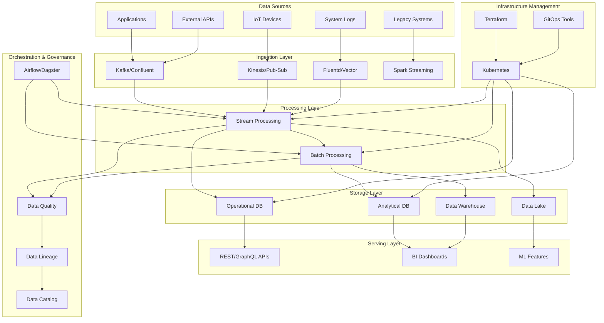

# Cloud-Native Data Platform

## Architecture Overview

## Platform Components

### Data Ingestion
- **Kafka/Confluent Platform**: Event streaming backbone
- **Kinesis/Pub-Sub**: Cloud-native messaging services
- **Fluentd/Vector/Fluent Bit**: Log collection
- **Debezium**: Change data capture
- **Airbyte/Fivetran**: ETL connectors

### Processing Frameworks
- **Apache Spark**: Distributed processing
- **Apache Flink**: Stream processing
- **Apache Beam**: Unified batch and stream
- **dbt**: SQL-based transformations
- **Kubernetes-native processing**: Spark on K8s operator

### Data Storage
- **PostgreSQL/MySQL**: Operational databases
- **Snowflake/BigQuery/Redshift**: Data warehouses
- **Delta Lake/Iceberg/Hudi**: Lakehouse storage formats
- **MinIO/S3/GCS/ADLS**: Object storage
- **MongoDB/Cassandra/DynamoDB**: NoSQL databases

### Orchestration
- **Apache Airflow**: Workflow orchestration
- **Dagster/Prefect**: Modern data orchestration
- **Argo Workflows**: Kubernetes-native workflows
- **Luigi**: Python-based pipelines

### Data Governance
- **OpenMetadata/DataHub**: Metadata management
- **Great Expectations**: Data quality validation
- **Apache Atlas**: Data lineage tracking
- **Amundsen/DataHub**: Data discovery
- **Marquez**: Data lineage collection

### Infrastructure
- **Kubernetes**: Container orchestration
- **Knative**: Serverless workloads
- **Terraform/Pulumi**: IaC for cloud resources
- **ArgoCD/FluxCD**: GitOps deployment
- **Istio/Linkerd**: Service mesh

## Implementation Patterns

### Data Mesh Architecture
- Domain-oriented ownership
- Self-serve data platform
- Federated governance
- Treating data as a product

### MLOps Integration
- Feature stores for ML features
- Model training pipeline integration
- Model serving infrastructure
- Experiment tracking

### Data Reliability Engineering
- SLOs for data pipelines
- Observability for data flows
- Self-healing data systems
- Error budget approach to data quality

### Security & Compliance
- Data encryption in transit and at rest
- Fine-grained access control
- Audit logging for data access
- Automated compliance checks
- PII detection and masking

## Deployment Models

### Multi-Cloud Strategy
- Cloud-agnostic data storage layers
- Abstraction of cloud provider services
- Cross-cloud data replication
- Unified governance across environments

### Hybrid Edge-Cloud Processing
- Edge data preprocessing
- Intelligent data routing
- Local-first processing with cloud offload
- Eventual consistency models