# DevSecOps Case Study: Financial Institution Compliance & Security Platform

## Organization Overview

A major retail banking institution with over 15 million customers needed to transform their security practices to address increasing regulatory requirements, frequent security breaches in the industry, and the need for faster software delivery. The bank maintains over 300 applications, including customer-facing web and mobile banking platforms, internal banking systems, and data analytics platforms.

## Architecture Overview

```mermaid
graph TD
    subgraph "DevSecOps Platform"
        subgraph "CI/CD Pipeline"
            IDE[Developer IDE]
            PR[Pull Request]
            Build[Automated Build]
            Test[Automated Testing]
            Security[Security Gates]
            Deploy[Deployment]
            
            IDE --> PR
            PR --> Build
            Build --> Test
            Test --> Security
            Security --> Deploy
        end
        
        subgraph "Security Toolchain"
            SCA[SCA - Dependency Check]
            SAST[SAST - Static Analysis]
            DAST[DAST - Dynamic Testing]
            SecretScan[Secret Scanner]
            CompScan[Container Scanning]
            IAST[IAST - Runtime Analysis]
            IACScan[IAC Security Scanning]
            PolicyCheck[Policy Validation]
            
            SCA --> Security
            SAST --> Security
            DAST --> Security
            SecretScan --> Security
            CompScan --> Security
            IAST --> Security
            IACScan --> Security
            PolicyCheck --> Security
        end
        
        subgraph "Compliance Controls"
            RBAC[Role-Based Access]
            Audit[Audit Logging]
            CMDB[CMDB Integration]
            Approval[Approval Workflows]
            Evidence[Evidence Collection]
            
            RBAC --> PR
            RBAC --> Deploy
            Audit --> PR
            Audit --> Deploy
            CMDB --> Deploy
            Approval --> Deploy
            Evidence --> Deploy
        end
        
        subgraph "Runtime Security"
            RASP[Runtime Application Protection]
            CWPP[Cloud Workload Protection]
            CSPM[Cloud Security Posture Mgmt]
            WAF[Web Application Firewall]
            Logging[Centralized Logging]
            SIEM[SIEM Integration]
            
            RASP --> Deploy
            CWPP --> Deploy
            CSPM --> Deploy
            WAF --> Deploy
            Deploy --> Logging
            Logging --> SIEM
        end
    end
    
    subgraph "Regulated Environments"
        subgraph "Development"
            DevApps[Dev Applications]
            DevData[Non-sensitive Data]
        end
        
        subgraph "Testing"
            TestApps[Test Applications]
            TestData[Masked Production Data]
        end
        
        subgraph "Production"
            ProdApps[Production Applications]
            ProdData[Customer Data]
            PCI[PCI-DSS Zone]
            SOX[SOX Compliance Zone]
        end
        
        Deploy --> DevApps
        Deploy --> TestApps
        Deploy --> ProdApps
        
        ProdApps --> PCI
        ProdApps --> SOX
    end
```

## Challenges

1. **Regulatory Requirements**: Meeting PCI-DSS, SOX, GDPR, and local banking regulations
2. **Legacy Systems**: Many core banking applications with limited security features
3. **Siloed Teams**: Development, security, and operations teams working separately
4. **Manual Security Reviews**: Delaying release cycles by 4-6 weeks per application
5. **Poor Visibility**: Limited visibility into vulnerabilities across the application portfolio
6. **Cloud Adoption**: Secure migration to hybrid cloud environment
7. **Audit Overhead**: Significant manual effort for compliance evidence collection

## DevSecOps Implementation

### Phase 1: Foundation

1. **Security Automation in CI/CD**
   - Implemented GitLab-based CI/CD pipeline
   - Integrated SAST (SonarQube, Checkmarx)
   - Added dependency scanning (OWASP Dependency-Check, Snyk)
   - Container security scanning (Trivy, Aqua)
   - Secrets detection (GitLeaks, TruffleHog)
   - Implemented "break the build" policy for critical issues

2. **Standardized Infrastructure**
   - Infrastructure as Code using Terraform
   - Hardened container images and Kubernetes configurations
   - Automated compliance checks for infrastructure (Terraform Compliance, OPA Conftest)
   - Configuration management with Ansible using security-focused roles

3. **Governance Framework**
   - Created centralized policy repository
   - Implemented automated policy enforcement
   - Defined security gates with compliance mapping
   - Built evidence collection automation

### Phase 2: Security Integration

1. **Development Practices**
   - Security-focused code reviews
   - Pre-commit hooks for early detection
   - IDE security plugins for real-time feedback
   - Security unit tests for critical components
   - Threat modeling integration

2. **Testing Practices**
   - DAST integration (OWASP ZAP, BurpSuite Enterprise)
   - Interactive Application Security Testing (IAST)
   - Automated penetration testing
   - Compliance verification tests
   - Data masking for test environments

3. **Operational Security**
   - Runtime Application Self-Protection (RASP)
   - Cloud Security Posture Management (CSPM)
   - Cloud Workload Protection Platform (CWPP)
   - Automated incident response
   - Centralized logging and security monitoring

### Phase 3: Culture and Process

1. **Training and Awareness**
   - Security Champions program across 15 development teams
   - Secure coding training curriculum
   - Monthly security guild meetings
   - Internal CTF competitions
   - Executive-level security metrics dashboard

2. **Process Transformation**
   - Automated compliance controls mapping
   - Continuous control monitoring
   - Risk-based security gates
   - Joint security/dev incident response
   - Agile governance model

## Technology Stack

| Category | Tools |
|----------|-------|
| Version Control | GitLab Enterprise |
| CI/CD Pipeline | GitLab CI/CD, Jenkins |
| SAST | SonarQube Enterprise, Checkmarx |
| SCA | Snyk, OWASP Dependency-Check |
| Container Security | Trivy, Aqua Security |
| DAST | OWASP ZAP, Burp Suite Enterprise |
| IAST | Contrast Security |
| Infrastructure Security | Terraform Compliance, OPA Conftest, Chef InSpec |
| Secrets Management | HashiCorp Vault, AWS Secrets Manager |
| Runtime Security | Aqua Security, Sysdig Secure |
| Compliance Automation | Compliance as Code framework, Audit Manager |
| Logging & Monitoring | ELK Stack, Splunk Enterprise Security |
| WAF | F5 Advanced WAF, AWS WAF |

## Results and Benefits

### Security Improvements
- **Vulnerability Reduction**: 78% reduction in critical/high vulnerabilities
- **Detection Speed**: Average time to detect security issues reduced from 45 days to 2.5 hours
- **Coverage**: Security testing coverage increased from 40% to 95% of applications
- **Mean Time to Remediate**: Reduced from 30 days to 4.5 days for critical issues

### Compliance Benefits
- **Audit Preparation**: Reduced from 6 weeks to 3 days
- **Control Evidence**: 93% of evidence collection automated
- **Audit Findings**: Decreased by 65% year-over-year
- **Regulatory Approvals**: Reduced time for new system approval by 60%

### Development Efficiency
- **Deployment Frequency**: Increased from monthly to daily deployments
- **Time to Market**: Reduced by 65% for new features
- **Failed Deployments**: Decreased by 72%
- **Unplanned Work**: Security-related unplanned work reduced by 67%

## Lessons Learned

1. **Balance Security and Development**
   - Implemented risk-based approach for different applications
   - Tuned security gates to avoid false positives
   - Created bypass processes for genuine exceptions with audit trail

2. **Focus on Developer Experience**
   - Shifted tools left with IDE integration
   - Provided clear, actionable remediation guidance
   - Measured and reduced security friction 

3. **Critical Success Factors**
   - Executive sponsorship from both CIO and CISO
   - Joint KPIs between security and development teams
   - Center of Excellence model for DevSecOps practices
   - Continuous measurement and improvement

4. **Challenges During Implementation**
   - Tool integration complexity and duplication
   - Legacy application compatibility
   - Initial false positive management
   - Scaling security expertise across teams

## Key Terms and Concepts

### DevSecOps
**DevSecOps** is a software development approach that integrates security practices within the DevOps process, making security a shared responsibility throughout the entire IT lifecycle.

### Shift Left Security
**Shift Left Security** is the practice of moving security testing and processes earlier in the development lifecycle, allowing issues to be found and fixed sooner when they are less costly to address.

### CI/CD Pipeline
**CI/CD Pipeline** (Continuous Integration/Continuous Delivery) is an automated software delivery process that includes building, testing, and deploying code changes.

### SAST (Static Application Security Testing)
**SAST** analyzes source code or compiled code for security vulnerabilities without executing the application, identifying issues like SQL injection, cross-site scripting, and buffer overflows.

### DAST (Dynamic Application Security Testing)
**DAST** tests running applications by simulating attacks against an application to identify vulnerabilities that might be exploited by attackers.

### SCA (Software Composition Analysis)
**SCA** identifies open source and third-party components in an application to check for known vulnerabilities and license compliance issues.

### IAST (Interactive Application Security Testing)
**IAST** combines elements of SAST and DAST by monitoring applications during testing to identify vulnerabilities with greater accuracy than either method alone.

### RASP (Runtime Application Self-Protection)
**RASP** is a security technology integrated with an application that can detect and block attacks in real-time by analyzing application behavior.

### CSPM (Cloud Security Posture Management)
**CSPM** tools continuously monitor cloud infrastructure configurations to identify misconfigurations, compliance gaps, and security risks.

### CWPP (Cloud Workload Protection Platform)
**CWPP** provides security for cloud workloads regardless of location (public cloud, private cloud, or hybrid environments), focusing on protecting applications, VMs, containers, and serverless functions.

### IaC (Infrastructure as Code)
**IaC** is the practice of managing and provisioning infrastructure through code and automation rather than manual processes.

### Compliance as Code
**Compliance as Code** implements regulatory compliance requirements as code-based rules that can be automatically tested and verified.

### PCI-DSS
**Payment Card Industry Data Security Standard (PCI-DSS)** is a set of security standards designed to ensure that all companies that accept, process, store, or transmit credit card information maintain a secure environment.

### Secrets Management
**Secrets Management** refers to the tools and practices for securely handling sensitive information like passwords, API keys, and certificates throughout the software development lifecycle.