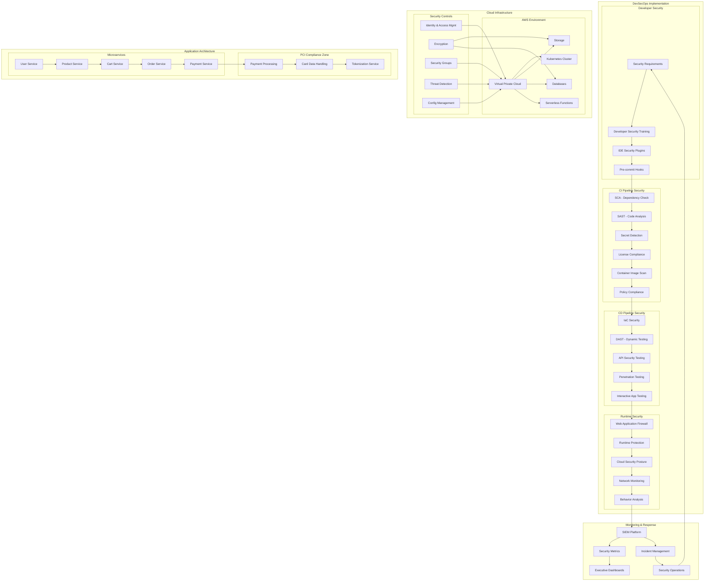

# DevSecOps Case Study: E-Commerce Platform Transformation

## Organization Overview

A global e-commerce company with over 50 million users and $1.2 billion in annual revenue undertook a significant DevSecOps transformation to address security challenges while maintaining rapid delivery of new features. The company operates a platform that processes millions of transactions daily, handles sensitive payment information, and must comply with PCI-DSS, GDPR, and various international data protection regulations.

## Architecture Overview

## Challenges

1. **Scale and Complexity**: Microservices architecture with 200+ services
2. **High Deployment Frequency**: 100+ deployments per day
3. **Payment Card Data**: PCI-DSS compliance requirements
4. **Global Data Regulations**: GDPR, CCPA, and international requirements
5. **Legacy Components**: Technical debt in older application components
6. **Third-Party Integrations**: 50+ third-party systems with varying security postures
7. **Developer Resistance**: Initial pushback against security gates
8. **Skills Gap**: Lack of security expertise in development teams

## DevSecOps Implementation

### Phase 1: Foundation & Tools Integration

1. **CI/CD Security Integration**
   - Implemented GitLab for source control with security-focused branch policies
   - Added SAST tools (Checkmarx, SonarQube) to CI pipeline
   - Integrated SCA tools (Snyk, OWASP Dependency-Check) for dependency scanning
   - Deployed Trivy and Clair for container image scanning
   - Implemented git-secrets and TruffleHog for secret detection
   - Created security quality gates with blocking policies for critical issues

2. **Infrastructure Security**
   - Migrated to infrastructure-as-code with Terraform
   - Implemented AWS Security Hub and Azure Security Center
   - Deployed compliance-as-code with Open Policy Agent
   - Established secure container orchestration with EKS
   - Created secure service mesh with Istio
   - Implemented AWS Well-Architected Framework security practices

3. **Application Security Foundations**
   - Created secure coding standards
   - Implemented secure by default frameworks and libraries
   - Deployed OWASP ZAP in DAST mode in development and staging
   - Implemented CSP and other security headers
   - Created secure API framework and validation
   - Implemented Vault for secrets management

### Phase 2: Process & Workflow Optimization

1. **PCI Compliance Automation**
   - Implemented automated PCI-DSS compliance checks
   - Created network segmentation for cardholder data environment
   - Deployed tokenization system for payment data
   - Established continuous compliance monitoring
   - Automated evidence collection for audits
   - Implemented AWS Payment Cryptography service

2. **Security Testing Transformation**
   - Integrated DAST into CI/CD pipeline with OWASP ZAP
   - Implemented API security testing with 42Crunch
   - Deployed IAST with Contrast Security
   - Established automated penetration testing with Probely
   - Created security unit tests for critical components
   - Implemented automated regression security testing

3. **Runtime Security Implementation**
   - Deployed AWS WAF and Cloudflare for application protection
   - Implemented real-time threat monitoring
   - Created container security runtime controls with Falco
   - Deployed Kubernetes security monitoring
   - Established real-time vulnerability management
   - Implemented cloud security posture management

### Phase 3: Security Culture & Continuous Improvement

1. **Developer Enablement**
   - Created security champion program across teams
   - Implemented role-based security training curriculum
   - Deployed security tools in developer IDEs
   - Established security knowledge base and playbooks
   - Created secure code templates and examples
   - Implemented security review credits system

2. **Security Governance**
   - Created security metrics dashboard
   - Implemented risk-based prioritization framework
   - Established monthly security review cadence
   - Developed security incident management process
   - Created executive security reporting
   - Implemented trend analysis for vulnerabilities

## Technology Stack

| Category | Tools |
|----------|-------|
| Source Control & CI/CD | GitLab, GitHub Actions, Jenkins |
| SAST | Checkmarx, SonarQube Enterprise |
| SCA | Snyk, OWASP Dependency-Check |
| Secrets Detection | GitLeaks, TruffleHog, Detect Secrets |
| Container Security | Trivy, Clair, Aqua Security |
| DAST | OWASP ZAP, Burp Suite Enterprise |
| IAST | Contrast Security |
| Infrastructure Security | HashiCorp Terraform, AWS CloudFormation |
| Policy Enforcement | Open Policy Agent, Conftest, AWS Config |
| API Security | 42Crunch, APIsec |
| Cloud Security | AWS Security Hub, Prisma Cloud, Wiz |
| WAF | AWS WAF, Cloudflare, F5 Advanced WAF |
| SIEM | Splunk Enterprise, ELK Stack, AWS Security Lake |
| Secrets Management | HashiCorp Vault, AWS Secrets Manager |

## Results and Benefits

### Security Improvements
- **Vulnerability Reduction**: 92% reduction in critical/high vulnerabilities
- **Time to Detection**: Reduced from 26 days to 45 minutes
- **Vulnerability Backlog**: Reduced by 87% in 6 months
- **Data Breaches**: Zero reportable breaches since implementation

### Compliance Benefits
- **PCI Audit Preparation**: Reduced from 8 weeks to 3 days
- **Compliance Coverage**: Increased from 82% to 99.9%
- **Automated Controls**: 94% of security controls automated
- **Evidence Collection**: 89% reduction in manual evidence gathering

### Development Efficiency
- **Security Review Time**: Reduced from 14 days to automated
- **Code to Production**: Reduced from 12 days to 2.5 hours
- **Deployment Frequency**: Increased by 300%
- **Failed Deployments**: Decreased by 76%

## Lessons Learned

1. **Developer Experience is Critical**
   - Made security tools developer-friendly with clear guidance
   - Provided actionable remediation advice
   - Integrated security into existing tools and workflows
   - Minimized false positives through careful tuning

2. **Risk-Based Approach Prevents Bottlenecks**
   - Implemented risk-based security gates
   - Created custom policies for different application types
   - Used blocking vs. non-blocking findings based on risk
   - Automated exceptions process with approval workflow

3. **Critical Success Factors**
   - Executive sponsorship with dedicated budget
   - Metrics-driven approach with clear goals
   - Cross-functional teams with shared ownership
   - Continuous refinement based on feedback

4. **Implementation Challenges**
   - Initial performance impact of security tools
   - Integration challenges with legacy systems
   - Early increase in reported issues overwhelming teams
   - Cultural resistance to security ownership

## Key Terms and Concepts

### DevSecOps
**DevSecOps** is an approach that integrates security practices within the DevOps methodology, making security a shared responsibility throughout the entire IT lifecycle.

### Shift Left Security
**Shift Left Security** refers to moving security considerations earlier in the development process, rather than addressing them only at the end.

### CI/CD Pipeline
**CI/CD Pipeline** (Continuous Integration/Continuous Delivery) is an automated software development practice where code changes are automatically built, tested, and prepared for deployment.

### SAST (Static Application Security Testing)
**SAST** analyzes source code for security vulnerabilities without executing the application by examining code for patterns that indicate security weaknesses.

### DAST (Dynamic Application Security Testing)
**DAST** tests running applications by simulating attacks against an application to identify vulnerabilities that might be exploited.

### SCA (Software Composition Analysis)
**SCA** identifies and analyzes open-source components in an application to identify security vulnerabilities and license compliance issues.

### IAST (Interactive Application Security Testing)
**IAST** combines elements of SAST and DAST by monitoring applications during testing to identify vulnerabilities with greater accuracy.

### WAF (Web Application Firewall)
A **WAF** protects web applications by filtering and monitoring HTTP traffic between a web application and the Internet, blocking attacks like SQL injection and cross-site scripting.

### RASP (Runtime Application Self-Protection)
**RASP** is a security technology integrated into an application's runtime environment that can detect and block attacks in real-time.

### IaC (Infrastructure as Code)
**IaC** is the practice of managing and provisioning infrastructure through code instead of manual processes.

### CSPM (Cloud Security Posture Management)
**CSPM** continuously monitors cloud infrastructure configurations to identify compliance issues, security risks, and misconfigurations.

### PCI-DSS (Payment Card Industry Data Security Standard)
**PCI-DSS** is a set of security standards designed to ensure that all companies that accept, process, store, or transmit credit card information maintain a secure environment.

### GDPR (General Data Protection Regulation)
**GDPR** is a regulation in EU law on data protection and privacy that addresses the transfer of personal data outside the EU and EEA areas.

### Security Champion
A **Security Champion** is a developer with an interest in security who helps promote secure development practices within their team, acting as a liaison between security and development teams.