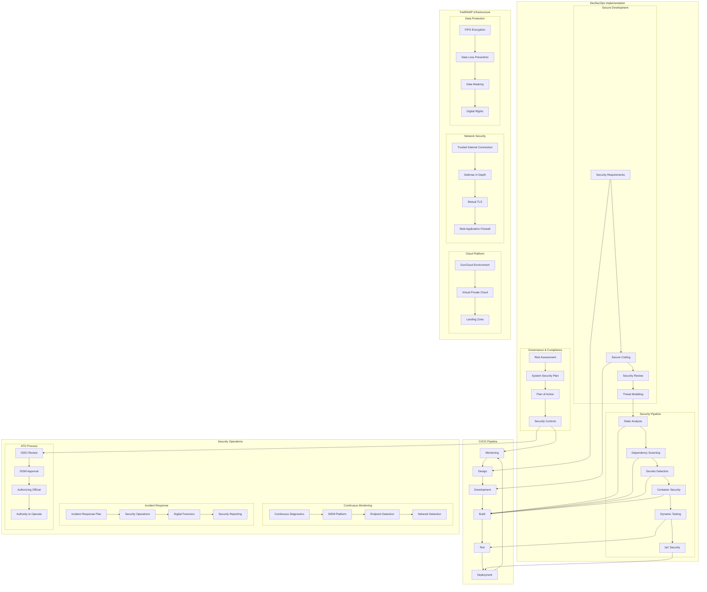

# DevSecOps Case Study: Government Agency Digital Transformation

## Organization Overview

A large federal government agency responsible for citizen services underwent a major DevSecOps transformation to modernize its digital services platform. The agency serves millions of citizens annually, manages sensitive personal data, and must comply with stringent government security requirements including FedRAMP, FISMA, NIST 800-53, and government-specific regulations for data protection.

## Architecture Overview

## Challenges

1. **Stringent Compliance**: FedRAMP, FISMA, NIST 800-53, and agency-specific requirements
2. **Legacy Systems**: Outdated mainframe systems and traditional applications
3. **Traditional Processes**: Waterfall development with lengthy ATO processes (9-18 months)
4. **Security Classification**: Handling sensitive government data with proper controls
5. **Procurement Complexity**: Federal acquisition regulations and contracting challenges
6. **Skills Gap**: Limited DevSecOps and cloud expertise in government workforce
7. **Siloed Teams**: Separation between development, security, and operations
8. **Infrastructure Limitations**: On-premises data centers with limited scalability

## DevSecOps Implementation

### Phase 1: Foundation Building

1. **Governance Framework**
   - Developed FedRAMP and NIST 800-53 control mapping
   - Created compliance-as-code implementation
   - Implemented automated documentation generation
   - Established continuous ATO (cATO) process
   - Created risk management framework automation

2. **Secure Cloud Foundation**
   - Implemented AWS GovCloud landing zone
   - Deployed infrastructure-as-code with Terraform
   - Created secure baseline configurations
   - Established security control inheritance model
   - Implemented private connectivity via TIC

3. **Pipeline Security Integration**
   - Deployed Azure DevOps pipeline with security gates
   - Integrated SonarQube and Fortify for SAST
   - Implemented OWASP Dependency-Check for SCA
   - Deployed Prisma Cloud for container security
   - Added OWASP ZAP for DAST capabilities
   - Implemented Vault for secrets management

### Phase 2: Process Transformation

1. **Secure Development Implementation**
   - Created security requirements catalog
   - Implemented threat modeling process
   - Developed secure coding standards
   - Deployed pre-commit hooks for early detection
   - Created security unit testing framework
   - Established security peer review process

2. **Continuous Compliance Monitoring**
   - Implemented NIST 800-53 controls as code
   - Created automated compliance dashboards
   - Deployed continuous control monitoring
   - Established automated evidence collection
   - Implemented POAM management system
   - Created real-time compliance reports

3. **Security Operations Modernization**
   - Deployed SIEM solution for security monitoring
   - Implemented EDR for endpoint security
   - Created automated security incident response
   - Established SOC integration
   - Deployed CDM capabilities
   - Implemented threat intelligence platform

### Phase 3: Culture & Continuous Improvement

1. **Training & Knowledge Transfer**
   - Developed role-based security training
   - Created DevSecOps playbooks and guides
   - Established internal coaching program
   - Implemented pair programming practices
   - Created security knowledge base
   - Established DevSecOps community of practice

2. **Measurement & Metrics**
   - Implemented security scorecards
   - Created vulnerability management metrics
   - Developed compliance status tracking
   - Established MTTR measurement
   - Created control effectiveness metrics
   - Implemented executive dashboard

## Technology Stack

| Category | Tools |
|----------|-------|
| Version Control & CI/CD | Azure DevOps, Jenkins |
| SAST | Fortify, SonarQube Federal Edition |
| SCA | OWASP Dependency-Check, Sonatype Nexus IQ |
| Container Security | Prisma Cloud, Anchore, Trivy |
| DAST | OWASP ZAP, Micro Focus WebInspect |
| Infrastructure Security | Terraform, AWS CloudFormation |
| Compliance Automation | OpenSCAP, InSpec, Compliance-as-Code framework |
| Secret Management | HashiCorp Vault, AWS Secrets Manager |
| Runtime Security | Prisma Cloud Compute, Wiz |
| Cloud Security | Prisma Cloud, AWS Security Hub |
| Monitoring & SIEM | Splunk Enterprise, ELK Stack, AWS Security Lake |
| Documentation | Compliance documentation engine, GRC platform |

## Results and Benefits

### Security Improvements
- **Vulnerability Reduction**: 89% reduction in critical vulnerabilities
- **Mean Time to Remediate**: Reduced from 149 days to 8 days
- **Security Coverage**: Increased from 62% to 98% of applications
- **Successful Attack Attempts**: Decreased by 76% year-over-year

### Compliance Benefits
- **ATO Timeline**: Reduced from 18 months to 3 weeks
- **Control Documentation**: 93% of documentation automated
- **Compliance Verification**: 97% of controls continuously monitored
- **Audit Findings**: Reduced by 84% in first year

### Development Efficiency
- **Deployment Frequency**: Increased from quarterly to weekly
- **Lead Time for Changes**: Reduced from 180 days to 7 days
- **Deployment Success Rate**: Improved from 68% to 99.5%
- **Mean Time to Restore**: Reduced from 72 hours to 45 minutes

## Lessons Learned

1. **Compliance Automation is Essential**
   - Automated control implementation and verification
   - Created continuous monitoring of compliance status
   - Implemented automated documentation generation
   - Established real-time compliance dashboard

2. **ATO Process Transformation**
   - Implemented continuous ATO approach
   - Created risk-based assessment model
   - Developed system security plan automation
   - Established incremental authority to operate

3. **Critical Success Factors**
   - Executive sponsorship at agency leadership level
   - Dedicated transformation team with authority
   - Clear metrics tied to mission outcomes
   - Cross-functional teams breaking down silos

4. **Implementation Challenges**
   - Policy and regulation interpretation
   - Procurement and acquisition limitations
   - Legacy system integration complexity
   - Cultural resistance from traditional security teams

## Key Terms and Concepts

### Authority to Operate (ATO)
**Authority to Operate (ATO)** is a formal declaration by an Authorizing Official that authorizes a system to operate in a specific environment, based on the implementation of an agreed-upon set of security controls.

### Continuous Authority to Operate (cATO)
**Continuous Authority to Operate (cATO)** is an approach that allows systems to maintain their authorization through continuous monitoring, automated security checks, and regularly updated documentation, rather than periodic reassessments.

### FedRAMP (Federal Risk and Authorization Management Program)
**FedRAMP** is a government-wide program that provides a standardized approach to security assessment, authorization, and continuous monitoring for cloud products and services.

### FISMA (Federal Information Security Modernization Act)
**FISMA** requires federal agencies to develop, document, and implement information security programs to protect government information and systems.

### NIST 800-53
**NIST 800-53** is a publication that provides a catalog of security and privacy controls for federal information systems, helping organizations select the appropriate controls to protect their operations.

### DevSecOps
**DevSecOps** integrates security into the DevOps software development lifecycle, making security a shared responsibility throughout the entire IT lifecycle.

### System Security Plan (SSP)
A **System Security Plan (SSP)** documents the security requirements of a system and the controls in place to meet those requirements, demonstrating compliance with security requirements.

### Plan of Action and Milestones (POA&M)
A **POA&M** is a document that identifies tasks needing to be accomplished to address known security weaknesses in an information system.

### Security Control
A **Security Control** is a safeguard or countermeasure designed to protect the confidentiality, integrity, and availability of an information system and its information.

### Compliance as Code
**Compliance as Code** is the practice of representing regulatory compliance requirements as code, allowing automated testing, monitoring, and enforcement.

### GovCloud
**GovCloud** is a cloud environment specifically designed for U.S. government agencies and contractors, offering compliance with government security requirements.

### Trusted Internet Connection (TIC)
**TIC** is a U.S. government initiative to optimize and standardize the security of network connections between federal agencies and the internet.

### Security Operations Center (SOC)
A **SOC** is a centralized function that employs people, processes, and technology to continuously monitor and improve an organization's security posture while detecting, analyzing, and responding to cybersecurity incidents.

### Information System Security Officer (ISSO)
An **ISSO** is responsible for ensuring that the appropriate operational security posture is maintained for an information system and works with the security team to address issues.

### Authorizing Official (AO)
An **Authorizing Official (AO)** is a senior official who has the authority to formally assume responsibility for operating an information system at an acceptable level of risk.