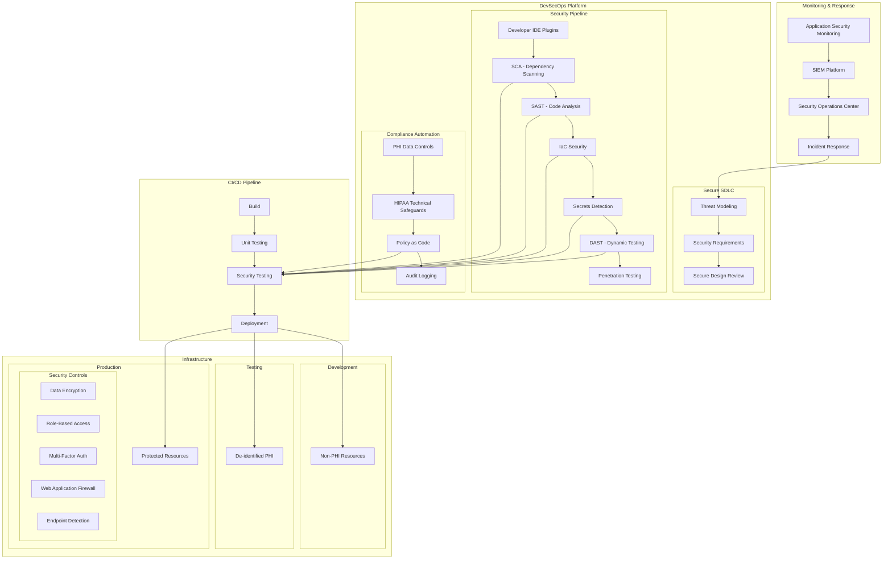

# DevSecOps Case Study: Healthcare Information System Transformation

## Organization Overview

A large healthcare provider network serving over 5 million patients across 30 hospitals and 200+ clinics underwent a digital transformation initiative to modernize their patient care applications while ensuring strict compliance with healthcare regulations. The organization manages sensitive patient data (PHI) and must adhere to HIPAA, HITECH, and various state-level healthcare privacy regulations.

## Architecture Overview

## Challenges

1. **Regulatory Compliance**: Stringent HIPAA and HITECH requirements for PHI protection
2. **Legacy Systems**: Monolithic healthcare applications with limited security features
3. **Shadow IT**: Departments implementing solutions without security review
4. **Integration Complexity**: Multiple EHR systems and third-party integrations
5. **Sensitive Data**: Need to protect PHI throughout development lifecycle
6. **Audit Requirements**: Extensive documentation needs for compliance
7. **Technical Debt**: Years of security shortcuts leading to vulnerability backlog
8. **Cloud Migration**: Secure transition from on-premises to hybrid cloud model

## DevSecOps Implementation

### Phase 1: Foundation Building

1. **Security & Compliance Framework**
   - Mapped security controls to HIPAA/HITECH requirements
   - Created compliance-as-code policies for continuous validation
   - Implemented automated evidence collection for audits
   - Developed healthcare-specific security requirements

2. **Pipeline Security Integration**
   - Implemented GitLab for source control with branch protection
   - Added SonarQube and Checkmarx for SAST
   - Integrated OWASP Dependency-Check and Snyk for SCA
   - Deployed HashiCorp Vault for secrets management
   - Implemented ContainerScan for container security

3. **Infrastructure Security Modernization**
   - Migrated to infrastructure-as-code with Terraform
   - Implemented secure baseline configurations
   - Deployed compliance automation with Chef InSpec
   - Enabled comprehensive audit logging
   - Established secure CI/CD infrastructure

### Phase 2: Process & Tool Optimization

1. **Secure Development Workflow**
   - Implemented code signing and verification
   - Deployed security-focused code review process
   - Created security gates in deployment pipeline
   - Established "break the build" policies for critical issues
   - Developed automated remediation for common issues

2. **Testing Transformation**
   - Deployed data masking and synthetic PHI for testing
   - Implemented OWASP ZAP for dynamic application security testing
   - Created security-focused acceptance criteria
   - Established continuous security testing
   - Implemented secure API testing framework

3. **Operational Security**
   - Deployed runtime application self-protection (RASP)
   - Implemented web application firewall (WAF)
   - Created security monitoring dashboards
   - Established automated security incident response
   - Developed threat hunting capabilities

### Phase 3: Culture & Continuous Improvement

1. **Security Training & Awareness**
   - Implemented role-based security training program
   - Created Security Champions program across teams
   - Developed healthcare-specific security guidelines
   - Established regular tabletop exercises
   - Created "Inner Source" security knowledge base

2. **Metrics & Measurement**
   - Developed security and compliance dashboards
   - Implemented risk-based security metrics
   - Created time-to-remediate tracking
   - Established vulnerability trend analysis
   - Developed executive reporting framework

## Technology Stack

| Category | Tools |
|----------|-------|
| Source Control & CI/CD | GitLab Enterprise, Jenkins |
| SAST | Checkmarx, SonarQube Enterprise |
| SCA | Snyk, OWASP Dependency-Check |
| DAST | OWASP ZAP, Burp Suite Enterprise |
| Infrastructure Security | Chef InSpec, Terraform Sentinel, OPA |
| Secrets Management | HashiCorp Vault, Azure Key Vault |
| Container Security | Aqua Security, Prisma Cloud |
| Cloud Security | Microsoft Defender for Cloud, CloudGuard |
| Runtime Security | Contrast Security, AppDynamics |
| Compliance Automation | Compliance-as-Code framework, Chef InSpec |
| Monitoring & SIEM | Splunk Enterprise Security, Azure Sentinel |
| WAF | F5 Advanced WAF, Akamai |

## Results and Benefits

### Security Improvements
- **Vulnerability Reduction**: 84% reduction in critical/high-severity issues
- **Detection Speed**: Average time to detect security issues reduced from 32 days to 4 hours
- **PHI Exposure**: Zero reportable PHI breaches since implementation
- **Attack Surface**: Reduced by 65% through service consolidation and security controls

### Compliance Benefits
- **Audit Preparation**: Reduced from 8 weeks to 5 days
- **Control Evidence**: 91% of evidence collection automated
- **Audit Findings**: Decreased by 78% year-over-year
- **Compliance Coverage**: Increased from 76% to 99.7%

### Development Efficiency
- **Deployment Frequency**: Increased from quarterly to weekly releases
- **Change Lead Time**: Reduced from 45 days to 9 days
- **Failed Deployments**: Decreased by 83%
- **MTTR**: Mean time to restore service reduced by 71%

## Lessons Learned

1. **Strategic PHI Protection**
   - Implemented PHI data classification system
   - Created environment-specific data protection strategies
   - Used synthetic data for development and testing
   - Automated PHI detection and masking

2. **Regulatory Compliance Balance**
   - Mapped security controls to compliance requirements
   - Automated continuous compliance verification
   - Created compliance-aligned security tests
   - Implemented "evidence by design" approach

3. **Critical Success Factors**
   - Executive sponsorship from CISO, CIO, and Chief Medical Officer
   - Cross-functional teams with embedded security expertise
   - Continuous reinforcement of security culture
   - Patient safety as primary motivator

4. **Implementation Challenges**
   - Initial productivity impact during transition
   - Integration complexity with medical devices
   - Legacy system compatibility
   - Training and skill development needs

## Key Terms and Concepts

### PHI (Protected Health Information)
**PHI** refers to individually identifiable health information that is transmitted or maintained in any form or medium by a covered entity or its business associates.

### HIPAA (Health Insurance Portability and Accountability Act)
**HIPAA** is a US law designed to provide privacy standards to protect patients' medical records and other health information, setting limits on who can access and receive PHI.

### HITECH (Health Information Technology for Economic and Clinical Health) Act
The **HITECH Act** expanded HIPAA requirements to strengthen the protection of PHI, increase penalties for HIPAA violations, and provide incentives for the adoption of electronic health records.

### DevSecOps
**DevSecOps** is an approach that integrates security practices into DevOps processes, making security a shared responsibility throughout the software development lifecycle.

### Secure SDLC (Software Development Lifecycle)
A **Secure SDLC** integrates security testing and activities into each phase of the software development process rather than treating it as a separate phase.

### Compliance as Code
**Compliance as Code** is the process of codifying compliance requirements into automated tests and policies that can be integrated into CI/CD pipelines.

### SAST (Static Application Security Testing)
**SAST** tools analyze source code for potential security vulnerabilities without executing the code.

### DAST (Dynamic Application Security Testing)
**DAST** tools test running applications by simulating attacks to identify vulnerabilities that might be exploited by attackers.

### SCA (Software Composition Analysis)
**SCA** tools identify and analyze open-source components in an application to identify security vulnerabilities and license compliance issues.

### IaC (Infrastructure as Code)
**IaC** is the management of infrastructure through code instead of manual processes, using configuration files to automate infrastructure provisioning.

### WAF (Web Application Firewall)
A **WAF** protects web applications by filtering and monitoring HTTP traffic between a web application and the Internet, blocking attacks like SQL injection and cross-site scripting.

### RASP (Runtime Application Self-Protection)
**RASP** is a security technology integrated into an application's runtime environment that can detect and block attacks in real-time.

### SIEM (Security Information and Event Management)
**SIEM** systems collect, analyze, and correlate security event information from various sources to identify potential security threats.

### Data Masking
**Data Masking** is the process of hiding original sensitive data with modified content while maintaining the data's format and usability for non-production environments.