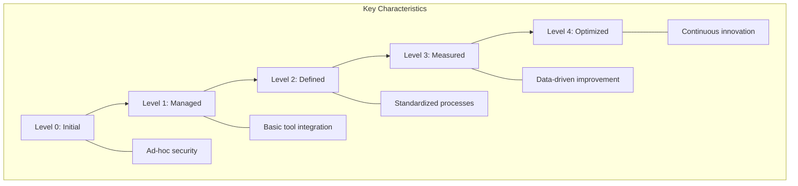
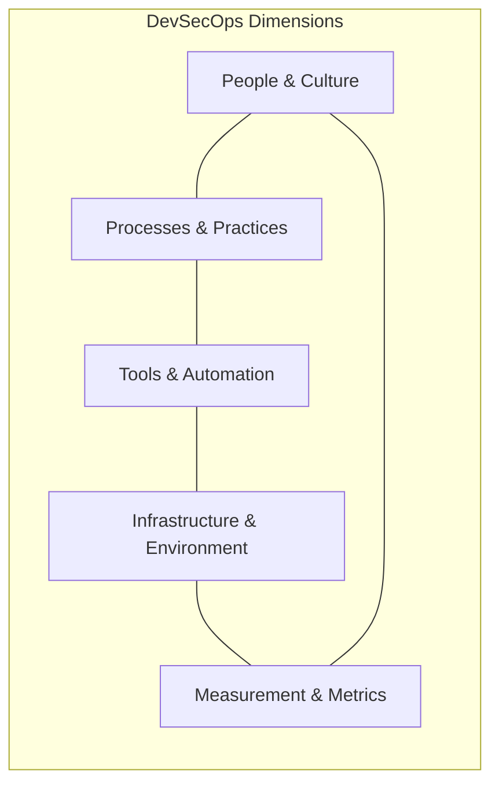

# DevSecOps Maturity Model

## Overview

The DevSecOps Maturity Model provides a framework for organizations to assess and improve their security integration within DevOps processes. This model focuses on the progressive implementation of security practices across the software development lifecycle, helping organizations to systematically enhance their security posture while maintaining development velocity.

## Maturity Levels

### Level 0: Initial (Ad-hoc)

At this level, security is reactive and ad-hoc with minimal integration into the development process:

- **Characteristics**:
  - Security testing occurs at the end of development
  - Manual security reviews and testing
  - Limited security expertise in development teams
  - No consistent security requirements
  - Security incidents trigger reactive responses

- **Challenges**:
  - Long remediation cycles
  - Security as a bottleneck
  - Limited visibility of security issues
  - Security debt accumulation
  - Frequent security incidents

- **Example Practices**:
  - Manual penetration testing before release
  - Security reviews conducted by separate team
  - Ad-hoc vulnerability scanning
  - Limited documentation of security requirements

### Level 1: Managed (Basic Integration)

At this level, basic security tools are integrated into development processes:

- **Characteristics**:
  - Basic security tools in CI pipeline
  - Defined security policies exist
  - Some automated security testing
  - Basic vulnerability management
  - Security requirements for critical features

- **Key Implementations**:
  - SAST tools running in the CI pipeline
  - SCA for detecting vulnerable dependencies
  - Basic security requirements documentation
  - Vulnerability tracking system
  - Security gates for critical issues

- **Metrics**:
  - Number of vulnerabilities found in production
  - Time to remediate critical vulnerabilities
  - Percentage of code scanned by security tools
  - Number of security incidents
  - Basic compliance status

### Level 2: Defined (Standardized Processes)

At this level, security practices are standardized across the organization:

- **Characteristics**:
  - Comprehensive security testing in CI/CD
  - Security integrated throughout SDLC
  - Defined security processes for all teams
  - Security champions program
  - Proactive vulnerability management

- **Key Implementations**:
  - Advanced SAST, DAST, and SCA integration
  - Threat modeling for new features
  - Security training for all developers
  - Container and infrastructure security scanning
  - Automated security testing in CI/CD

- **Security Controls**:
  - Pre-commit security hooks
  - Automated code review for security
  - Secrets management solution
  - Infrastructure as Code security scanning
  - Security unit testing

- **Metrics**:
  - Security test coverage
  - Security debt tracking
  - Mean time to remediate by severity
  - Security requirements coverage
  - Secure design pattern adoption rate

### Level 3: Measured (Data-Driven Improvement)

At this level, security metrics drive continuous improvement:

- **Characteristics**:
  - Comprehensive security metrics program
  - Security integrated into engineering KPIs
  - Risk-based security decision making
  - Continuous compliance monitoring
  - Security automation across all environments

- **Key Implementations**:
  - Real-time security dashboards
  - Security metrics tied to business outcomes
  - Automated compliance verification
  - Runtime security monitoring and protection
  - Advanced threat detection and response

- **Security Controls**:
  - Automated security variance detection
  - Continuous compliance validation
  - Cloud security posture management
  - Real-time vulnerability management
  - Automated incident response

- **Metrics**:
  - Risk reduction rate over time
  - Security test coverage by component
  - Security automation coverage
  - Mean time to detect security issues
  - Security posture compared to industry benchmarks

### Level 4: Optimized (Continuous Innovation)

At this level, security is fully integrated and continuously improving:

- **Characteristics**:
  - Self-service security for developers
  - Continuous security experimentation
  - Security drives business value
  - Proactive threat hunting
  - Industry-leading security practices

- **Key Implementations**:
  - AI-powered security analysis
  - Chaos security engineering
  - Security as code throughout the pipeline
  - Advanced security telemetry
  - Continuous security benchmarking

- **Security Controls**:
  - Autonomous security testing
  - Predictive vulnerability management
  - Just-in-time security controls
  - Security feature experimentation
  - Self-healing security architecture

- **Metrics**:
  - Security innovation rate
  - Time to security value
  - Predictive security effectiveness
  - Automated remediation rate
  - Security resilience score

## Security Dimensions

The maturity model evaluates security integration across multiple dimensions:

### People & Culture

- **Level 1**: Basic security awareness training
- **Level 2**: Security champions in development teams
- **Level 3**: Specialized security training by role
- **Level 4**: Security innovation driven by all teams

**Key Practices**:
- Security training and certification
- Security Champions program
- Capture the Flag (CTF) competitions
- Blameless security culture
- Security recognition and rewards

### Processes & Practices

- **Level 1**: Defined security requirements for critical systems
- **Level 2**: Secure SDLC implementation with security gates
- **Level 3**: Risk-based security processes across all systems
- **Level 4**: Continuous security process optimization

**Key Practices**:
- Threat modeling and risk assessment
- Security requirements management
- Security design reviews
- Vulnerability management process
- Incident response procedures

### Tools & Automation

- **Level 1**: Basic security tools in CI/CD
- **Level 2**: Integrated security toolchain
- **Level 3**: Automated security workflows
- **Level 4**: AI-enhanced security automation

**Key Tools**:
- SAST, DAST, and SCA tooling
- Secret scanning and management
- Container and infrastructure scanning
- API security testing
- Runtime protection tools

### Infrastructure & Environment

- **Level 1**: Basic security configurations
- **Level 2**: Security as Code for infrastructure
- **Level 3**: Immutable and compliant infrastructure
- **Level 4**: Self-healing secure infrastructure

**Key Practices**:
- Infrastructure as Code security
- Secure configuration management
- Immutable infrastructure
- Environment parity for security
- Zero trust architecture

### Measurement & Metrics

- **Level 1**: Basic security metrics
- **Level 2**: Comprehensive security KPIs
- **Level 3**: Data-driven security decision making
- **Level 4**: Predictive security analytics

**Key Metrics**:
- Mean Time to Detect/Remediate
- Risk Reduction Rate
- Security Debt Measurement
- Security Coverage Metrics
- Cost of Security Issues

## Implementation Roadmap

Organizations should follow this implementation roadmap to progress through maturity levels:

### Assessment Phase
1. Evaluate current security practices against maturity model
2. Identify gaps and opportunities for improvement
3. Establish baseline security metrics
4. Define target maturity level for each dimension

### Implementation Planning
1. Prioritize improvements based on risk and impact
2. Create phased implementation plan
3. Define resource requirements
4. Establish governance structure

### Level 1 Implementation
1. Deploy basic security tools in CI/CD pipeline
2. Define core security policies and standards
3. Implement vulnerability management process
4. Establish security requirements for critical systems
5. Create basic security metrics dashboard

### Level 2 Implementation
1. Standardize security practices across teams
2. Deploy comprehensive security testing
3. Establish Security Champions program
4. Implement security training curriculum
5. Deploy infrastructure and container security

### Level 3 Implementation
1. Develop comprehensive security metrics program
2. Implement continuous compliance monitoring
3. Deploy runtime security monitoring
4. Integrate security into engineering KPIs
5. Establish advanced security testing automation

### Level 4 Implementation
1. Deploy AI-enhanced security analysis
2. Implement predictive security capabilities
3. Establish continuous security experimentation
4. Develop self-service security capabilities
5. Implement security chaos engineering

## Challenges and Success Factors

### Common Challenges
- Balancing security with development velocity
- Tool integration complexity
- Legacy systems compatibility
- Security skills shortage
- Scaling security practices
- Regulatory complexity

### Critical Success Factors
- Executive sponsorship and leadership support
- Clear security objectives aligned with business goals
- Adequate resources and investment
- Collaboration between development, operations, and security
- Continuous learning and improvement culture
- Focus on developer experience
- Metrics-driven approach

## Industry Best Practices

### Financial Services
- Comprehensive data protection controls
- Advanced threat modeling
- Fraud detection integration
- Regulatory compliance automation
- Third-party security management

### Healthcare
- PHI protection controls
- Medical device security integration
- HIPAA compliance automation
- Patient safety risk assessment
- Healthcare-specific threat intelligence

### Government
- Compliance with government frameworks (NIST, FedRAMP)
- Supply chain security
- Controlled unclassified information protection
- Continuous monitoring for ATO
- Cross-agency security standards

### Technology
- Advanced automation and self-service
- Feature flags for security controls
- Experimentation-driven security
- Open source security contribution
- Advanced security telemetry

## Key Terms and Concepts

### DevSecOps
**DevSecOps** is an approach that integrates security practices within the DevOps process, making security a shared responsibility throughout the entire IT lifecycle.

### Shift Left Security
**Shift Left Security** is the practice of moving security testing and processes earlier in the development lifecycle, allowing issues to be found and fixed sooner when they are less costly to address.

### Security as Code
**Security as Code** is the practice of codifying security and policy decisions, making them programmable, version-controlled, and automatically enforceable throughout the software development lifecycle.

### Continuous Security Validation
**Continuous Security Validation** is the ongoing process of testing and verifying security controls to ensure they are functioning effectively, often through automated means.

### Security Debt
**Security Debt** is the accumulation of security issues that arise when security is neglected in favor of other priorities, similar to technical debt but focused on security vulnerabilities and weaknesses.

### Secure by Design
**Secure by Design** is an approach to software and hardware development that makes systems secure from the start, rather than adding security features later.

### Security Champions
**Security Champions** are team members embedded within development teams who have additional security knowledge and advocate for security practices within their teams.

### Infrastructure as Code (IaC)
**Infrastructure as Code (IaC)** is the practice of managing and provisioning infrastructure through code instead of manual processes, allowing security controls to be embedded in infrastructure definitions.

### SAST (Static Application Security Testing)
**SAST** tools analyze source code for potential security vulnerabilities without executing the code, identifying issues early in development.

### DAST (Dynamic Application Security Testing)
**DAST** tools test running applications by simulating attacks to identify vulnerabilities that might be exploited by attackers.

### SCA (Software Composition Analysis)
**SCA** tools identify and analyze open-source components in an application to detect known vulnerabilities and license compliance issues.

### IAST (Interactive Application Security Testing)
**IAST** combines elements of SAST and DAST by monitoring applications during testing to identify vulnerabilities with greater accuracy.

### RASP (Runtime Application Self-Protection)
**RASP** is a security technology integrated into an application's runtime environment that can detect and block attacks in real-time.

### Threat Modeling
**Threat Modeling** is a structured process to identify potential security threats and vulnerabilities in a system, allowing teams to implement appropriate mitigations.

### Security Posture
**Security Posture** is the overall security status of an organization's systems, network, and applications, as well as their ability to protect from and respond to security threats.