# DevSecOps Pipeline Architecture

## Pipeline Overview

```mermaid
graph LR
    Dev[Developer] --> Code[Code Repository]
    Code --> PR[Pull Request]
    
    subgraph "Continuous Integration"
        PR --> Static[Static Analysis]
        Static --> Unit[Unit Tests]
        Unit --> Build[Build]
        Build --> Scan[Security Scan]
        Scan --> DockerBuild[Container Build]
        DockerBuild --> ImageScan[Image Scanning]
        ImageScan --> Sign[Image Signing]
        Sign --> Push[Push to Registry]
    end
    
    subgraph "Continuous Delivery"
        Push --> Manifest[Update Manifests]
        Manifest --> SecPolicy[Security Policy Check]
        SecPolicy --> Integration[Integration Tests]
        Integration --> Staging[Deploy to Staging]
        Staging --> E2E[End-to-End Tests]
        E2E --> Approval[Approval Gate]
        Approval --> Prod[Production Deployment]
    end
    
    subgraph "Continuous Monitoring"
        Prod --> Monitor[Runtime Monitoring]
        Monitor --> SIEM[SIEM]
        Monitor --> Metrics[Metrics]
        Monitor --> Logs[Logs]
        Monitor --> Traces[Traces]
        
        SIEM --> Alert[Alerts]
        Metrics --> Alert
        
        Alert --> Remediation[Auto Remediation]
        Alert --> Incident[Incident Response]
    end
```

## Security Tools Integration

### Pre-Commit Phase
- **pre-commit hooks**: Local validation before commits
- **git-secrets**: Prevent committing secrets and credentials
- **commitlint**: Enforce commit message standards

### Code Analysis
- **SonarQube**: Code quality and security analysis
- **Snyk**: Vulnerability scanning for code and dependencies
- **Semgrep**: Static application security testing (SAST)
- **Checkov/TFSec**: Infrastructure-as-Code scanning

### Build Security
- **Dependency-Check**: Scan dependencies for vulnerabilities
- **OWASP ZAP**: Dynamic application security testing (DAST)
- **Trivy/Clair**: Container image scanning
- **Cosign**: Container image signing
- **Anchore**: Policy-based container compliance

### Kubernetes Security
- **OPA/Gatekeeper**: Policy enforcement
- **Kyverno**: Kubernetes-native policy management
- **Kube-bench**: CIS benchmarks for Kubernetes
- **Falco**: Runtime security monitoring
- **KubeLinter**: Static analysis for Kubernetes YAML

### Infrastructure Security
- **HashiCorp Vault**: Secret management
- **cert-manager**: TLS certificate management
- **AWS/Azure Security Center**: Cloud security posture management
- **Prowler/ScoutSuite**: Cloud infrastructure security scanning

### Monitoring & Response
- **Prometheus/Grafana**: Metrics and alerting
- **ELK Stack**: Log collection and analysis
- **Wazuh/OSSEC**: Security monitoring and HIDS
- **Falco**: Runtime anomaly detection
- **Cilium/Calico**: Network policy and microsegmentation

## Implementation Practices

### Policy as Code
- Define security controls as code
- Implement guardrails, not gates
- Version-controlled security policies
- Automated policy testing

### Immutable Infrastructure
- Scan templates and IaC
- No direct infrastructure changes
- Regular rebuilding of environments
- Golden images for instances and containers

### Zero Trust Architecture
- Multi-factor authentication
- Microsegmentation with service mesh
- Just-in-time access provisioning
- Continuous validation and verification

### Automated Compliance
- Compliance-as-Code (CaC)
- Automated evidence collection
- Continuous compliance monitoring
- Regular security posture assessment