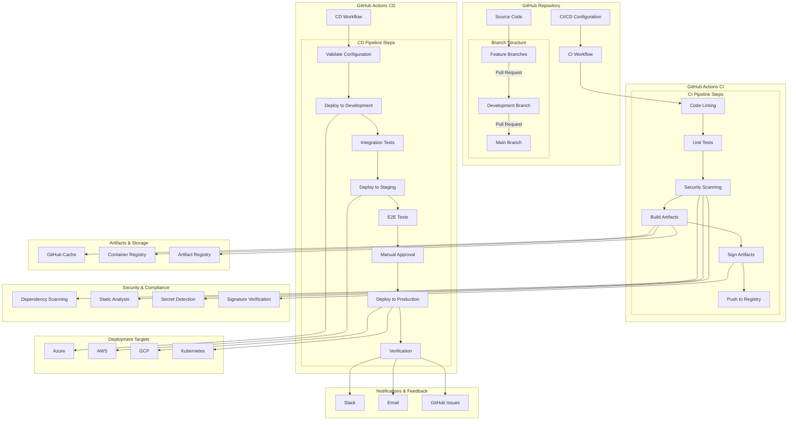

# GitHub Actions CI/CD Pipeline

## Architecture Overview



## GitHub Repository Structure

```
repo-name/
├── .github/
│   ├── workflows/
│   │   ├── ci.yml
│   │   ├── cd-dev.yml
│   │   ├── cd-staging.yml
│   │   ├── cd-production.yml
│   │   ├── dependency-review.yml
│   │   └── security-scan.yml
│   ├── actions/
│   │   ├── custom-build/
│   │   │   ├── action.yml
│   │   │   └── Dockerfile
│   │   └── deployment-check/
│   │       ├── action.yml
│   │       └── index.js
│   └── CODEOWNERS
├── src/
│   ├── api/
│   ├── ui/
│   ├── shared/
│   └── tests/
├── infra/
│   ├── terraform/
│   │   ├── modules/
│   │   └── environments/
│   ├── kubernetes/
│   │   ├── base/
│   │   └── overlays/
│   └── scripts/
├── docs/
│   ├── architecture/
│   ├── deployment/
│   └── development/
├── .dockerignore
├── .gitignore
├── Dockerfile
├── docker-compose.yml
├── package.json
└── README.md
```

## CI Workflow Example

```yaml
# .github/workflows/ci.yml
name: Continuous Integration

on:
  push:
    branches:
      - main
      - develop
    paths-ignore:
      - 'docs/**'
      - '*.md'
  pull_request:
    branches:
      - main
      - develop
    paths-ignore:
      - 'docs/**'
      - '*.md'

env:
  IMAGE_NAME: ghcr.io/${{ github.repository }}
  REGISTRY: ghcr.io

jobs:
  lint:
    name: Code Linting
    runs-on: ubuntu-latest
    steps:
      - name: Checkout code
        uses: actions/checkout@v3
        
      - name: Set up Node.js
        uses: actions/setup-node@v3
        with:
          node-version: '18'
          cache: 'npm'
          
      - name: Install dependencies
        run: npm ci
        
      - name: Run ESLint
        run: npm run lint
        
      - name: Run Prettier
        run: npm run format:check

  test:
    name: Unit Tests
    needs: lint
    runs-on: ubuntu-latest
    steps:
      - name: Checkout code
        uses: actions/checkout@v3
        
      - name: Set up Node.js
        uses: actions/setup-node@v3
        with:
          node-version: '18'
          cache: 'npm'
          
      - name: Install dependencies
        run: npm ci
        
      - name: Run tests
        run: npm test
        
      - name: Upload coverage reports
        uses: codecov/codecov-action@v3
        with:
          token: ${{ secrets.CODECOV_TOKEN }}
          fail_ci_if_error: true

  security-scan:
    name: Security Scanning
    needs: test
    runs-on: ubuntu-latest
    permissions:
      contents: read
      security-events: write
    steps:
      - name: Checkout code
        uses: actions/checkout@v3
        
      - name: Run Snyk to check for vulnerabilities
        uses: snyk/actions/node@master
        continue-on-error: true
        env:
          SNYK_TOKEN: ${{ secrets.SNYK_TOKEN }}
        with:
          args: --severity-threshold=high
          
      - name: Run CodeQL Analysis
        uses: github/codeql-action/init@v2
        with:
          languages: javascript, typescript
          
      - name: Perform CodeQL Analysis
        uses: github/codeql-action/analyze@v2
          
      - name: Run Trivy vulnerability scanner
        uses: aquasecurity/trivy-action@master
        with:
          scan-type: 'fs'
          ignore-unfixed: true
          format: 'sarif'
          output: 'trivy-results.sarif'
          severity: 'CRITICAL,HIGH'
          
      - name: Upload Trivy scan results to GitHub Security tab
        uses: github/codeql-action/upload-sarif@v2
        with:
          sarif_file: 'trivy-results.sarif'

  build:
    name: Build and Push
    needs: security-scan
    runs-on: ubuntu-latest
    if: github.event_name == 'push' || github.event.pull_request.head.repo.full_name == github.repository
    outputs:
      image_tag: ${{ steps.meta.outputs.tags }}
    permissions:
      contents: read
      packages: write
      id-token: write # needed for signing the images with GitHub OIDC Token
    
    steps:
      - name: Checkout code
        uses: actions/checkout@v3
        
      - name: Set up Docker Buildx
        uses: docker/setup-buildx-action@v2
        
      - name: Login to GitHub Container Registry
        uses: docker/login-action@v2
        with:
          registry: ${{ env.REGISTRY }}
          username: ${{ github.actor }}
          password: ${{ secrets.GITHUB_TOKEN }}
          
      - name: Extract Docker metadata
        id: meta
        uses: docker/metadata-action@v4
        with:
          images: ${{ env.IMAGE_NAME }}
          tags: |
            type=sha,format=long
            type=ref,event=branch
            type=ref,event=pr
            type=semver,pattern={{version}},enable=${{ startsWith(github.ref, 'refs/tags/v') }}
      
      - name: Build and push
        uses: docker/build-push-action@v4
        with:
          context: .
          push: ${{ github.event_name != 'pull_request' }}
          tags: ${{ steps.meta.outputs.tags }}
          labels: ${{ steps.meta.outputs.labels }}
          cache-from: type=gha
          cache-to: type=gha,mode=max
          platforms: linux/amd64,linux/arm64
          
      - name: Install cosign
        if: github.event_name != 'pull_request'
        uses: sigstore/cosign-installer@v3.0.5
        
      - name: Sign the image with GitHub OIDC Token
        if: github.event_name != 'pull_request'
        env:
          DIGEST: ${{ steps.meta.outputs.digest }}
        run: |
          cosign sign --yes ${{ env.IMAGE_NAME }}@${DIGEST}
          
      - name: Generate SBOM
        if: github.event_name != 'pull_request'
        uses: anchore/sbom-action@v0.14.1
        with:
          image: ${{ env.IMAGE_NAME }}@${{ steps.meta.outputs.digest }}
          format: spdx-json
          output-file: sbom.spdx.json
          
      - name: Upload SBOM
        if: github.event_name != 'pull_request'
        uses: actions/upload-artifact@v3
        with:
          name: sbom
          path: sbom.spdx.json
          
  notify:
    name: Notify Success
    needs: build
    runs-on: ubuntu-latest
    if: success() && github.event_name == 'push'
    steps:
      - name: Notify Slack
        uses: slackapi/slack-github-action@v1.24.0
        with:
          payload: |
            {
              "text": "CI Pipeline Completed Successfully for ${{ github.repository }}",
              "blocks": [
                {
                  "type": "section",
                  "text": {
                    "type": "mrkdwn",
                    "text": "*CI Pipeline Completed Successfully!* :white_check_mark:\n\n*Repository:* ${{ github.repository }}\n*Branch:* ${{ github.ref_name }}\n*Commit:* ${{ github.sha }}\n*Image:* ${{ needs.build.outputs.image_tag }}"
                  }
                },
                {
                  "type": "actions",
                  "elements": [
                    {
                      "type": "button",
                      "text": {
                        "type": "plain_text",
                        "text": "View Workflow"
                      },
                      "url": "https://github.com/${{ github.repository }}/actions/runs/${{ github.run_id }}"
                    }
                  ]
                }
              ]
            }
        env:
          SLACK_WEBHOOK_URL: ${{ secrets.SLACK_WEBHOOK_URL }}
          SLACK_WEBHOOK_TYPE: INCOMING_WEBHOOK
```

## CD Workflow Example

```yaml
# .github/workflows/cd-production.yml
name: Production Deployment

on:
  workflow_dispatch:
    inputs:
      image_tag:
        description: 'Image tag to deploy (defaults to latest build from main)'
        required: false
        type: string
  push:
    tags:
      - 'v*'

env:
  IMAGE_NAME: ghcr.io/${{ github.repository }}
  REGISTRY: ghcr.io
  ENVIRONMENT: production
  KUBE_CONFIG_DATA: ${{ secrets.KUBE_CONFIG_DATA }}

jobs:
  validate:
    name: Validate Deployment
    runs-on: ubuntu-latest
    permissions:
      contents: read
      id-token: write # needed for keyless signing verification
    outputs:
      image_tag: ${{ steps.get-tag.outputs.image_tag }}
    
    steps:
      - name: Checkout code
        uses: actions/checkout@v3
        
      - name: Get image tag
        id: get-tag
        run: |
          if [[ -n "${{ github.event.inputs.image_tag }}" ]]; then
            echo "image_tag=${{ github.event.inputs.image_tag }}" >> $GITHUB_OUTPUT
          elif [[ "${{ github.ref_type }}" == "tag" ]]; then
            echo "image_tag=${{ github.ref_name }}" >> $GITHUB_OUTPUT
          else
            # Get latest image tag from main branch
            echo "image_tag=sha-$(git rev-parse --short HEAD)" >> $GITHUB_OUTPUT
          fi
          
      - name: Install cosign
        uses: sigstore/cosign-installer@v3.0.5
        
      - name: Verify image signature
        env:
          IMAGE_TAG: ${{ steps.get-tag.outputs.image_tag }}
        run: cosign verify ${{ env.IMAGE_NAME }}:${IMAGE_TAG}
        
      - name: Install kubectl
        uses: azure/setup-kubectl@v3
        
      - name: Set up Kube config
        run: |
          mkdir -p ~/.kube
          echo "${{ env.KUBE_CONFIG_DATA }}" | base64 -d > ~/.kube/config
          chmod 600 ~/.kube/config
          
      - name: Validate Kubernetes manifests
        run: |
          cd infra/kubernetes/overlays/production
          kubectl apply --dry-run=server -f .

  approve:
    name: Approval Gate
    needs: validate
    runs-on: ubuntu-latest
    environment: production-approval
    steps:
      - name: Approval notification
        run: echo "Deployment to production has been approved"

  deploy:
    name: Deploy to Production
    needs: [validate, approve]
    runs-on: ubuntu-latest
    environment:
      name: production
      url: https://app.example.com
    
    steps:
      - name: Checkout code
        uses: actions/checkout@v3
        
      - name: Install kubectl
        uses: azure/setup-kubectl@v3
        
      - name: Setup Kustomize
        uses: imranismail/setup-kustomize@v2
        
      - name: Set up Kube config
        run: |
          mkdir -p ~/.kube
          echo "${{ env.KUBE_CONFIG_DATA }}" | base64 -d > ~/.kube/config
          chmod 600 ~/.kube/config
          
      - name: Update image tag
        env:
          IMAGE_TAG: ${{ needs.validate.outputs.image_tag }}
        run: |
          cd infra/kubernetes/overlays/production
          kustomize edit set image ${{ env.IMAGE_NAME }}=${{ env.IMAGE_NAME }}:${IMAGE_TAG}
          
      - name: Deploy to Kubernetes
        run: |
          cd infra/kubernetes/overlays/production
          kustomize build | kubectl apply -f -
          
      - name: Verify deployment
        run: |
          kubectl rollout status deployment/app-deployment -n production
          
      - name: Run smoke tests
        run: |
          ./infra/scripts/smoke-test.sh https://app.example.com
          
  notify:
    name: Notify Deployment
    needs: [validate, deploy]
    runs-on: ubuntu-latest
    if: success()
    
    steps:
      - name: Notify Slack
        uses: slackapi/slack-github-action@v1.24.0
        with:
          payload: |
            {
              "text": "Production Deployment Completed Successfully for ${{ github.repository }}",
              "blocks": [
                {
                  "type": "section",
                  "text": {
                    "type": "mrkdwn",
                    "text": "*Production Deployment Completed Successfully!* :rocket:\n\n*Repository:* ${{ github.repository }}\n*Image:* ${{ needs.validate.outputs.image_tag }}\n*Environment:* Production\n*URL:* https://app.example.com"
                  }
                },
                {
                  "type": "actions",
                  "elements": [
                    {
                      "type": "button",
                      "text": {
                        "type": "plain_text",
                        "text": "View Deployment"
                      },
                      "url": "https://github.com/${{ github.repository }}/actions/runs/${{ github.run_id }}"
                    }
                  ]
                }
              ]
            }
        env:
          SLACK_WEBHOOK_URL: ${{ secrets.SLACK_WEBHOOK_URL }}
          SLACK_WEBHOOK_TYPE: INCOMING_WEBHOOK
          
  rollback:
    name: Rollback on Failure
    needs: [validate, deploy]
    runs-on: ubuntu-latest
    if: failure() && needs.validate.result == 'success'
    
    steps:
      - name: Checkout code
        uses: actions/checkout@v3
        
      - name: Install kubectl
        uses: azure/setup-kubectl@v3
        
      - name: Set up Kube config
        run: |
          mkdir -p ~/.kube
          echo "${{ env.KUBE_CONFIG_DATA }}" | base64 -d > ~/.kube/config
          chmod 600 ~/.kube/config
          
      - name: Rollback deployment
        run: |
          kubectl rollout undo deployment/app-deployment -n production
          kubectl rollout status deployment/app-deployment -n production
          
      - name: Notify rollback
        uses: slackapi/slack-github-action@v1.24.0
        with:
          payload: |
            {
              "text": "⚠️ ALERT: Production Deployment Failed - Automatic Rollback Initiated",
              "blocks": [
                {
                  "type": "section",
                  "text": {
                    "type": "mrkdwn",
                    "text": "*⚠️ ALERT: Production Deployment Failed - Automatic Rollback Initiated*\n\n*Repository:* ${{ github.repository }}\n*Image:* ${{ needs.validate.outputs.image_tag }}\n*Environment:* Production"
                  }
                },
                {
                  "type": "actions",
                  "elements": [
                    {
                      "type": "button",
                      "text": {
                        "type": "plain_text",
                        "text": "View Failed Workflow"
                      },
                      "url": "https://github.com/${{ github.repository }}/actions/runs/${{ github.run_id }}"
                    }
                  ]
                }
              ]
            }
        env:
          SLACK_WEBHOOK_URL: ${{ secrets.SLACK_WEBHOOK_URL }}
          SLACK_WEBHOOK_TYPE: INCOMING_WEBHOOK
```

## Reusable Workflow Example

```yaml
# .github/workflows/deploy-environment.yml
name: Deploy to Environment

on:
  workflow_call:
    inputs:
      environment:
        required: true
        type: string
        description: 'Environment to deploy to (dev, staging, production)'
      image_tag:
        required: true
        type: string
        description: 'Image tag to deploy'
      need_approval:
        required: false
        type: boolean
        default: false
        description: 'Require manual approval'
    secrets:
      KUBE_CONFIG:
        required: true
      DEPLOY_TOKEN:
        required: true

jobs:
  deploy:
    name: Deploy to ${{ inputs.environment }}
    runs-on: ubuntu-latest
    environment:
      name: ${{ inputs.need_approval && format('{0}-approval', inputs.environment) || inputs.environment }}
      url: ${{ inputs.environment == 'production' && 'https://app.example.com' || format('https://{0}.app.example.com', inputs.environment) }}
    
    steps:
      - name: Checkout code
        uses: actions/checkout@v3
        
      - name: Install kubectl
        uses: azure/setup-kubectl@v3
        
      - name: Setup Kustomize
        uses: imranismail/setup-kustomize@v2
        
      - name: Set up Kube config
        run: |
          mkdir -p ~/.kube
          echo "${{ secrets.KUBE_CONFIG }}" | base64 -d > ~/.kube/config
          chmod 600 ~/.kube/config
          
      - name: Update image tag
        run: |
          cd infra/kubernetes/overlays/${{ inputs.environment }}
          kustomize edit set image ghcr.io/example/app=ghcr.io/example/app:${{ inputs.image_tag }}
          
      - name: Deploy to Kubernetes
        run: |
          cd infra/kubernetes/overlays/${{ inputs.environment }}
          kustomize build | kubectl apply -f -
          
      - name: Verify deployment
        run: |
          kubectl rollout status deployment/app-deployment -n ${{ inputs.environment }}
          
      - name: Run smoke tests
        run: |
          ./infra/scripts/smoke-test.sh https://${{ inputs.environment == 'production' && 'app.example.com' || format('{0}.app.example.com', inputs.environment) }}
```

## Composite Action Example

```yaml
# .github/actions/kube-deploy/action.yml
name: 'Kubernetes Deployment'
description: 'Deploy to Kubernetes using Kustomize'
inputs:
  kube-config:
    description: 'Kubernetes configuration'
    required: true
  namespace:
    description: 'Kubernetes namespace'
    required: true
  environment:
    description: 'Environment name'
    required: true
  image-name:
    description: 'Container image name'
    required: true
  image-tag:
    description: 'Container image tag'
    required: true
  timeout:
    description: 'Deployment timeout'
    required: false
    default: '300s'

runs:
  using: "composite"
  steps:
    - name: Install kubectl
      uses: azure/setup-kubectl@v3
      
    - name: Setup Kustomize
      uses: imranismail/setup-kustomize@v2
      
    - name: Set up Kube config
      shell: bash
      run: |
        mkdir -p ~/.kube
        echo "${{ inputs.kube-config }}" | base64 -d > ~/.kube/config
        chmod 600 ~/.kube/config
        
    - name: Update image tag
      shell: bash
      run: |
        cd infra/kubernetes/overlays/${{ inputs.environment }}
        kustomize edit set image ${{ inputs.image-name }}=${{ inputs.image-name }}:${{ inputs.image-tag }}
        
    - name: Deploy to Kubernetes
      shell: bash
      run: |
        cd infra/kubernetes/overlays/${{ inputs.environment }}
        kustomize build | kubectl apply -f -
        
    - name: Verify deployment
      shell: bash
      run: |
        kubectl rollout status deployment/app-deployment -n ${{ inputs.namespace }} --timeout=${{ inputs.timeout }}
```

## GitHub Actions Configuration

### Environment Configuration
```yaml
# Repository Settings > Environments > Production

# Environment Name: production
# 
# Environment Protection Rules:
# - Required reviewers: [list of required reviewers]
# - Wait timer: 15 minutes
# - Deployment branches: Selected branches (main)
#
# Environment secrets:
# - KUBE_CONFIG_DATA: [base64-encoded kubeconfig]
# - DEPLOY_TOKEN: [deployment token]
# - API_KEY: [API key for the environment]
```

### Repository Secrets
```
# Repository Secrets:
# - SNYK_TOKEN: [Snyk API token]
# - CODECOV_TOKEN: [Codecov token]
# - SLACK_WEBHOOK_URL: [Slack webhook URL]
# - DOCKER_USERNAME: [Docker Hub username]
# - DOCKER_PASSWORD: [Docker Hub password]
```

## GitHub Actions CI/CD Pipeline Flow

### CI Pipeline Flow
1. Code is pushed to a feature branch
2. CI workflow is triggered
3. Linting checks code style and quality
4. Unit tests verify code functionality
5. Security scanning checks for vulnerabilities
6. Build step creates container images
7. Images are pushed to GitHub Container Registry
8. Images are signed for security verification
9. SBOM is generated for compliance
10. Slack notification is sent on completion

### CD Pipeline Flow
1. Release is created or workflow dispatch is triggered
2. CD workflow is triggered
3. Deployment configuration is validated
4. Image signature is verified
5. Manual approval is required for production
6. Deployment is performed using Kustomize and kubectl
7. Deployment verification checks are performed
8. Smoke tests ensure basic functionality
9. Success notification is sent to Slack
10. Automatic rollback occurs if deployment fails

## RBAC and Security

### Repository Protection Rules
- Branch protection rules for main and development branches
- Required status checks before merging
- Required number of approvals for pull requests
- Dismiss stale pull request approvals when new commits are pushed
- Require signed commits
- Restrict who can push to matching branches

### Secrets Management
- Store secrets in GitHub Secrets
- Use environment-specific secrets
- Rotate secrets regularly
- Use OIDC token for cloud provider authentication
- Implement least privilege access for service accounts

### Security Scanning
- Dependency scanning with Dependabot
- SAST scanning with CodeQL
- Container scanning with Trivy
- Secret detection with GitGuardian
- License compliance scanning
- Supply chain security with SLSA

## Advanced GitHub Actions Features

### Matrix Builds
```yaml
strategy:
  matrix:
    os: [ubuntu-latest, windows-latest, macos-latest]
    node-version: [14, 16, 18]
```

### Self-hosted Runners
```yaml
runs-on: self-hosted
```

### Job Dependencies
```yaml
needs: [build, test]
```

### Caching
```yaml
- uses: actions/cache@v3
  with:
    path: ~/.npm
    key: ${{ runner.os }}-node-${{ hashFiles('**/package-lock.json') }}
    restore-keys: |
      ${{ runner.os }}-node-
```

### Artifacts
```yaml
- uses: actions/upload-artifact@v3
  with:
    name: my-artifact
    path: ./dist
```

### Reusable Workflows
```yaml
uses: ./.github/workflows/reusable-workflow.yml
with:
  param1: value1
```

## Best Practices

### Workflow Organization
- **Modular workflows**: Break down workflows into reusable components
- **Environment promotion**: Implement clear promotion paths
- **Composite actions**: Create reusable actions for common tasks
- **Consistent naming**: Use a clear naming convention
- **Documentation**: Document workflows and their purpose

### Performance Optimization
- **Caching**: Implement effective caching strategies
- **Parallel jobs**: Run independent jobs in parallel
- **Self-hosted runners**: Use self-hosted runners for specialized tasks
- **Job dependencies**: Only define necessary dependencies
- **Skip unnecessary steps**: Use conditional execution

### Security Best Practices
- **Least privilege**: Use minimal permissions for tokens
- **Dependency scanning**: Regularly scan dependencies
- **Image signing**: Sign and verify container images
- **Secret rotation**: Regularly rotate secrets
- **OIDC authentication**: Use OIDC where possible

### Reliability
- **Timeout settings**: Configure appropriate timeouts
- **Retry logic**: Implement retry mechanisms for flaky tests
- **Idempotent deployments**: Ensure deployments are idempotent
- **Rollback strategy**: Implement automatic rollbacks
- **Status checks**: Require status checks before merging

## Key Terms and Concepts

### GitHub Actions
**GitHub Actions** is a CI/CD platform integrated directly into GitHub repositories that allows you to automate your software development workflows. You can build, test, and deploy your code directly from GitHub using workflows defined in YAML files.

### Workflow
A **Workflow** is an automated process defined in a YAML file that consists of one or more jobs. Workflows are triggered by specified events like push, pull request, or schedule.

### Job
A **Job** is a set of steps that execute on the same runner within a workflow. Jobs can run in parallel or sequentially depending on their dependencies.

### Step
A **Step** is an individual task within a job that can run commands, setup tasks, or run actions.

### Action
An **Action** is a reusable, standalone unit of functionality in GitHub Actions, like a function or script. Actions can be officially provided by GitHub, created by the community, or custom-built for specific needs.

### Runner
A **Runner** is a server that runs your GitHub Actions workflows when they're triggered. GitHub provides hosted runners, or you can self-host your own.

### Environment
An **Environment** in GitHub Actions is a named deployment target (like production, staging, development) with protection rules and secrets that can be referenced in workflows.

### Composite Action
A **Composite Action** is a custom action composed of multiple steps that can be reused across workflows, helping to reduce duplication and improve maintainability.

### Reusable Workflow
A **Reusable Workflow** is a workflow that can be called from another workflow, enabling workflow composition and code reuse.

### Matrix Strategy
A **Matrix Strategy** allows you to run a job multiple times with different configurations (like different operating systems or language versions) in parallel.

### CI (Continuous Integration)
**Continuous Integration** is the practice of frequently merging code changes into a shared repository, followed by automated building and testing to catch integration issues early.

### CD (Continuous Deployment)
**Continuous Deployment** extends CI by automatically deploying every change that passes all testing stages to production environments, with no manual intervention.

### SAST (Static Application Security Testing)
**SAST** analyzes source code without executing it to identify potential security vulnerabilities, coding flaws, and other issues.

### SBOM (Software Bill of Materials)
An **SBOM** is a formal, machine-readable inventory of software components and dependencies, their relationships, and their hierarchical structure.

### Cosign
**Cosign** is a tool for signing, verifying, and managing container image signatures, enhancing supply chain security by ensuring the integrity and authenticity of container images.

### OIDC (OpenID Connect)
**OIDC** is an authentication protocol that allows GitHub Actions to access cloud resources without storing long-lived credentials as secrets in GitHub.

### Artifact
An **Artifact** is a file or collection of files produced during a workflow run that can be stored for later use or shared between jobs.

### Container Registry
A **Container Registry** stores and distributes container images, allowing teams to share and deploy applications consistently across environments. GitHub provides its own Container Registry (GHCR) integrated with GitHub Actions.

### Idempotent Deployment
An **Idempotent Deployment** can be applied multiple times without changing the result beyond the initial application, ensuring consistent and predictable deployments.