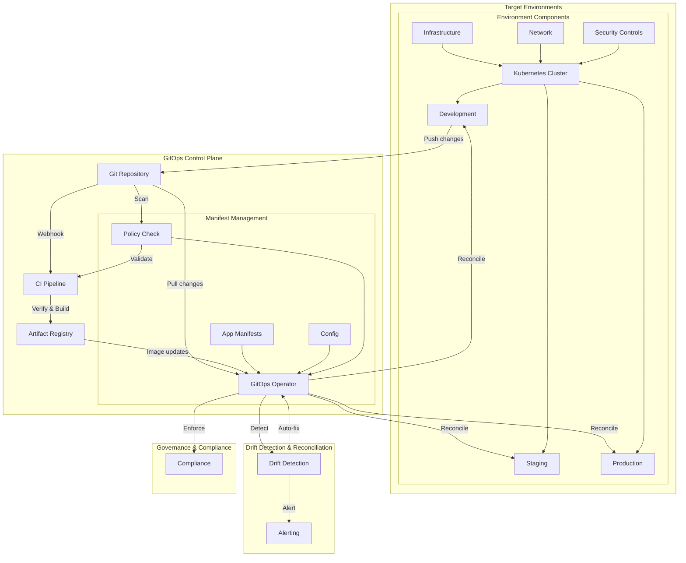

# GitOps Infrastructure Architecture

## Architecture Overview

## GitOps Components

### Source of Truth
- **Git repositories**: Declarative system configuration
- **Branch protection rules**: Prevent direct changes to main branches
- **Signed commits**: Ensure authenticity of changes
- **Pull request workflows**: Code review and validation

### Continuous Integration
- **GitHub Actions/Jenkins/CircleCI**: Automated testing and validation
- **Kustomize/Helm**: Configuration management
- **Image building**: Containerized application builds
- **Vulnerability scanning**: Integrated security testing

### Continuous Deployment
- **ArgoCD/FluxCD**: Kubernetes-native GitOps controllers
- **Automated synchronization**: Keep environments in sync with Git
- **Progressive delivery**: Canary and blue/green deployments
- **Automated rollbacks**: Revert to known-good state on failure

### Infrastructure Management
- **Terraform**: Infrastructure as Code
- **Crossplane**: Kubernetes-native resource provisioning
- **Atlantis**: Pull request automation for infrastructure
- **Terragrunt**: DRY Terraform configurations

### Security & Compliance
- **OPA/Gatekeeper**: Policy enforcement
- **Kyverno**: Kubernetes-native policy management
- **Sealed Secrets/External Secrets**: Secure secret management
- **RBAC**: Fine-grained access control
- **Audit logging**: Track all system changes

## GitOps Workflow

### Development Workflow
1. Developers create feature branches
2. Changes are tested in ephemeral environments
3. Pull requests trigger automated testing
4. Approved PRs merge to main branch
5. GitOps controllers detect changes and apply them

### Operations Workflow
1. Infrastructure changes proposed via pull requests
2. Automated validation of proposed changes
3. Review and approval process
4. Changes automatically applied to environments
5. Drift detection ensures environments stay in sync

### Security Workflow
1. Policy as Code defines security requirements
2. Automated policy checking in CI pipeline
3. Security scanning of dependencies and images
4. Admission controllers enforce runtime policies
5. Audit and compliance reporting

## Best Practices

### Environment Promotion
- Promotion-based workflow across environments
- Image promotion rather than rebuilding
- Environment-specific configuration overlays
- Progressive deployment patterns

### Secrets Management
- External secret management integration
- Encryption of secrets at rest
- Just-in-time secrets injection
- Regular secret rotation

### Drift Remediation
- Automated drift detection
- Notification of unexpected changes
- Self-healing capabilities
- Regular reconciliation intervals

### Disaster Recovery
- Git-based recovery procedures
- Complete state capture in Git
- Regular backup and validation
- Documented recovery process