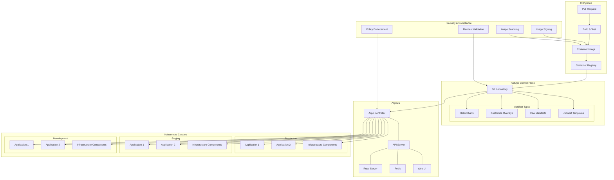

# Kubernetes GitOps with ArgoCD

## Architecture Overview



## Repository Structure

```
kubernetes-gitops/
├── README.md
├── clusters/
│   ├── production/
│   │   ├── apps/
│   │   │   ├── app1/
│   │   │   │   ├── kustomization.yaml
│   │   │   │   └── values.yaml
│   │   │   └── app2/
│   │   │       ├── kustomization.yaml
│   │   │       └── values.yaml
│   │   └── infrastructure/
│   │       ├── cert-manager/
│   │       ├── ingress-nginx/
│   │       ├── monitoring/
│   │       └── kustomization.yaml
│   ├── staging/
│   │   ├── apps/
│   │   │   ├── app1/
│   │   │   │   ├── kustomization.yaml
│   │   │   │   └── values.yaml
│   │   │   └── app2/
│   │   │       ├── kustomization.yaml
│   │   │       └── values.yaml
│   │   └── infrastructure/
│   │       ├── cert-manager/
│   │       ├── ingress-nginx/
│   │       ├── monitoring/
│   │       └── kustomization.yaml
│   └── development/
│       ├── apps/
│       │   ├── app1/
│       │   │   ├── kustomization.yaml
│       │   │   └── values.yaml
│       │   └── app2/
│       │       ├── kustomization.yaml
│       │       └── values.yaml
│       └── infrastructure/
│           ├── cert-manager/
│           ├── ingress-nginx/
│           ├── monitoring/
│           └── kustomization.yaml
├── apps/
│   ├── app1/
│   │   ├── base/
│   │   │   ├── deployment.yaml
│   │   │   ├── service.yaml
│   │   │   ├── ingress.yaml
│   │   │   ├── configmap.yaml
│   │   │   └── kustomization.yaml
│   │   └── overlays/
│   │       ├── production/
│   │       ├── staging/
│   │       └── development/
│   └── app2/
│       ├── base/
│       │   ├── deployment.yaml
│       │   ├── service.yaml
│       │   ├── ingress.yaml
│       │   ├── configmap.yaml
│       │   └── kustomization.yaml
│       └── overlays/
│           ├── production/
│           ├── staging/
│           └── development/
├── infrastructure/
│   ├── cert-manager/
│   │   ├── base/
│   │   │   ├── namespace.yaml
│   │   │   ├── release.yaml
│   │   │   └── kustomization.yaml
│   │   └── overlays/
│   │       ├── production/
│   │       ├── staging/
│   │       └── development/
│   ├── ingress-nginx/
│   │   ├── base/
│   │   │   ├── namespace.yaml
│   │   │   ├── release.yaml
│   │   │   └── kustomization.yaml
│   │   └── overlays/
│   │       ├── production/
│   │       ├── staging/
│   │       └── development/
│   └── monitoring/
│       ├── base/
│       │   ├── namespace.yaml
│       │   ├── prometheus.yaml
│       │   ├── grafana.yaml
│       │   ├── alertmanager.yaml
│       │   └── kustomization.yaml
│       └── overlays/
│           ├── production/
│           ├── staging/
│           └── development/
└── argocd/
    ├── bootstrap/
    │   ├── namespace.yaml
    │   ├── install.yaml
    │   └── projects.yaml
    ├── applications/
    │   ├── production/
    │   │   ├── apps.yaml
    │   │   └── infrastructure.yaml
    │   ├── staging/
    │   │   ├── apps.yaml
    │   │   └── infrastructure.yaml
    │   └── development/
    │       ├── apps.yaml
    │       └── infrastructure.yaml
    └── applicationsets/
        ├── all-clusters-infra.yaml
        └── all-clusters-apps.yaml
```

## ArgoCD Installation

```yaml
# argocd/bootstrap/namespace.yaml
apiVersion: v1
kind: Namespace
metadata:
  name: argocd
```

```yaml
# argocd/bootstrap/install.yaml
apiVersion: kustomize.config.k8s.io/v1beta1
kind: Kustomization
namespace: argocd
resources:
  - https://raw.githubusercontent.com/argoproj/argo-cd/v2.7.2/manifests/install.yaml

# Optional patches for customizing the installation
patches:
  - target:
      kind: Deployment
      name: argocd-server
    patch: |-
      - op: replace
        path: /spec/template/spec/containers/0/args
        value:
          - --staticassets
          - /shared/app
          - --insecure
          - --disable-admin-access
          - --repo-server-timeout-seconds
          - "90"
```

## ArgoCD Application Example

```yaml
# argocd/applications/production/infrastructure.yaml
apiVersion: argoproj.io/v1alpha1
kind: Application
metadata:
  name: production-infrastructure
  namespace: argocd
spec:
  project: production
  source:
    repoURL: https://github.com/example/kubernetes-gitops.git
    targetRevision: HEAD
    path: clusters/production/infrastructure
  destination:
    server: https://kubernetes.default.svc
    namespace: argocd
  syncPolicy:
    automated:
      prune: true
      selfHeal: true
    syncOptions:
      - CreateNamespace=true
      - PruneLast=true
      - ApplyOutOfSyncOnly=true
    retry:
      limit: 5
      backoff:
        duration: 5s
        factor: 2
        maxDuration: 3m
```

```yaml
# argocd/applications/production/apps.yaml
apiVersion: argoproj.io/v1alpha1
kind: Application
metadata:
  name: production-apps
  namespace: argocd
spec:
  project: production
  source:
    repoURL: https://github.com/example/kubernetes-gitops.git
    targetRevision: HEAD
    path: clusters/production/apps
  destination:
    server: https://kubernetes.default.svc
    namespace: argocd
  syncPolicy:
    automated:
      prune: true
      selfHeal: true
    syncOptions:
      - CreateNamespace=true
      - PruneLast=true
      - ApplyOutOfSyncOnly=true
    retry:
      limit: 5
      backoff:
        duration: 5s
        factor: 2
        maxDuration: 3m
```

## ApplicationSet Example

```yaml
# argocd/applicationsets/all-clusters-infra.yaml
apiVersion: argoproj.io/v1alpha1
kind: ApplicationSet
metadata:
  name: infrastructure-components
  namespace: argocd
spec:
  generators:
    - list:
        elements:
          - cluster: production
            url: https://kubernetes.default.svc
          - cluster: staging
            url: https://staging-cluster-api.example.com
          - cluster: development
            url: https://dev-cluster-api.example.com
  template:
    metadata:
      name: '{{cluster}}-infrastructure'
    spec:
      project: default
      source:
        repoURL: https://github.com/example/kubernetes-gitops.git
        targetRevision: HEAD
        path: clusters/{{cluster}}/infrastructure
      destination:
        server: '{{url}}'
        namespace: argocd
      syncPolicy:
        automated:
          prune: true
          selfHeal: true
        syncOptions:
          - CreateNamespace=true
```

## Kustomize Base Example

```yaml
# apps/app1/base/deployment.yaml
apiVersion: apps/v1
kind: Deployment
metadata:
  name: app1
spec:
  replicas: 1
  selector:
    matchLabels:
      app: app1
  template:
    metadata:
      labels:
        app: app1
    spec:
      containers:
      - name: app1
        image: ghcr.io/example/app1:v1.0.0
        ports:
        - containerPort: 8080
        resources:
          limits:
            cpu: 500m
            memory: 512Mi
          requests:
            cpu: 200m
            memory: 256Mi
        env:
        - name: LOG_LEVEL
          value: "info"
        - name: CONFIG_PATH
          value: "/config/config.yaml"
        volumeMounts:
        - name: config-volume
          mountPath: /config
      volumes:
      - name: config-volume
        configMap:
          name: app1-config
```

```yaml
# apps/app1/base/kustomization.yaml
apiVersion: kustomize.config.k8s.io/v1beta1
kind: Kustomization
resources:
  - deployment.yaml
  - service.yaml
  - ingress.yaml
  - configmap.yaml
```

## Kustomize Overlay Example

```yaml
# apps/app1/overlays/production/kustomization.yaml
apiVersion: kustomize.config.k8s.io/v1beta1
kind: Kustomization
resources:
  - ../../base
namePrefix: production-
namespace: production-app1
patchesStrategicMerge:
  - deployment-patch.yaml
  - ingress-patch.yaml
configMapGenerator:
  - name: app1-config
    behavior: merge
    files:
      - config.yaml
images:
  - name: ghcr.io/example/app1
    newName: ghcr.io/example/app1
    newTag: v1.2.3
```

```yaml
# apps/app1/overlays/production/deployment-patch.yaml
apiVersion: apps/v1
kind: Deployment
metadata:
  name: app1
spec:
  replicas: 3
  template:
    spec:
      containers:
      - name: app1
        resources:
          limits:
            cpu: 1000m
            memory: 1Gi
          requests:
            cpu: 500m
            memory: 512Mi
        env:
        - name: LOG_LEVEL
          value: "warn"
        - name: ENVIRONMENT
          value: "production"
```

## GitHub Actions CI Pipeline

```yaml
# .github/workflows/ci-app1.yml
name: App1 CI Pipeline

on:
  push:
    branches: [ main ]
    paths:
      - 'apps/app1/**'
      - '.github/workflows/ci-app1.yml'
  pull_request:
    branches: [ main ]
    paths:
      - 'apps/app1/**'
      - '.github/workflows/ci-app1.yml'

env:
  IMAGE_NAME: ghcr.io/${{ github.repository_owner }}/app1
  APP_DIR: ./src/app1

jobs:
  test:
    name: Test
    runs-on: ubuntu-latest
    steps:
      - name: Checkout code
        uses: actions/checkout@v3
        
      - name: Set up Node.js
        uses: actions/setup-node@v3
        with:
          node-version: '18'
          cache: 'npm'
          cache-dependency-path: ${{ env.APP_DIR }}/package-lock.json
          
      - name: Install dependencies
        run: npm ci
        working-directory: ${{ env.APP_DIR }}
        
      - name: Run tests
        run: npm test
        working-directory: ${{ env.APP_DIR }}
        
      - name: Run linting
        run: npm run lint
        working-directory: ${{ env.APP_DIR }}
  
  build:
    name: Build and Push
    needs: test
    runs-on: ubuntu-latest
    if: github.event_name == 'push'
    permissions:
      contents: read
      packages: write
      id-token: write
    
    steps:
      - name: Checkout code
        uses: actions/checkout@v3
        
      - name: Set up Docker Buildx
        uses: docker/setup-buildx-action@v2
        
      - name: Login to GitHub Container Registry
        uses: docker/login-action@v2
        with:
          registry: ghcr.io
          username: ${{ github.actor }}
          password: ${{ secrets.GITHUB_TOKEN }}
          
      - name: Extract metadata
        id: meta
        uses: docker/metadata-action@v4
        with:
          images: ${{ env.IMAGE_NAME }}
          tags: |
            type=sha,format=long
            type=ref,event=branch
            type=semver,pattern={{version}},enable=${{ startsWith(github.ref, 'refs/tags/v') }}
      
      - name: Build and push
        uses: docker/build-push-action@v4
        with:
          context: ${{ env.APP_DIR }}
          push: true
          tags: ${{ steps.meta.outputs.tags }}
          labels: ${{ steps.meta.outputs.labels }}
          cache-from: type=gha
          cache-to: type=gha,mode=max
          
      - name: Sign the images with Cosign
        uses: sigstore/cosign-installer@v3.0.1
        
      - name: Sign container image
        run: |
          cosign sign --yes ${IMAGE_NAME}@${{ steps.meta.outputs.digest }}
          
  update-manifests:
    name: Update Kubernetes Manifests
    needs: build
    runs-on: ubuntu-latest
    if: github.event_name == 'push' && github.ref == 'refs/heads/main'
    permissions:
      contents: write
    
    steps:
      - name: Checkout code
        uses: actions/checkout@v3
        
      - name: Setup Kustomize
        uses: imranismail/setup-kustomize@v2
      
      - name: Get image tag
        id: image-tag
        run: |
          echo "IMAGE_TAG=sha-$(git rev-parse --short HEAD)" >> $GITHUB_ENV
      
      - name: Update image tags
        run: |
          # Update development overlay
          cd apps/app1/overlays/development
          kustomize edit set image ghcr.io/example/app1=${IMAGE_NAME}:${IMAGE_TAG}
          
          # Only update staging in main branch
          if [[ "${{ github.ref }}" == "refs/heads/main" ]]; then
            cd ../../overlays/staging
            kustomize edit set image ghcr.io/example/app1=${IMAGE_NAME}:${IMAGE_TAG}
          fi
          
      - name: Commit and push changes
        uses: stefanzweifel/git-auto-commit-action@v4
        with:
          commit_message: "chore: update app1 image to ${{ env.IMAGE_TAG }}"
          file_pattern: "apps/app1/overlays/**/kustomization.yaml"
```

## ArgoCD Configuration

### Project Definition

```yaml
# argocd/bootstrap/projects.yaml
apiVersion: argoproj.io/v1alpha1
kind: AppProject
metadata:
  name: production
  namespace: argocd
  finalizers:
    - resources-finalizer.argocd.argoproj.io
spec:
  description: Production environment
  sourceRepos:
    - https://github.com/example/kubernetes-gitops.git
    - https://charts.helm.sh/stable
  destinations:
    - server: https://kubernetes.default.svc
      namespace: "*"
  clusterResourceWhitelist:
    - group: "*"
      kind: "*"
  namespaceResourceWhitelist:
    - group: "*"
      kind: "*"
  orphanedResources:
    warn: true

---
apiVersion: argoproj.io/v1alpha1
kind: AppProject
metadata:
  name: staging
  namespace: argocd
  finalizers:
    - resources-finalizer.argocd.argoproj.io
spec:
  description: Staging environment
  sourceRepos:
    - https://github.com/example/kubernetes-gitops.git
    - https://charts.helm.sh/stable
  destinations:
    - server: https://staging-cluster-api.example.com
      namespace: "*"
  clusterResourceWhitelist:
    - group: "*"
      kind: "*"
  namespaceResourceWhitelist:
    - group: "*"
      kind: "*"
  orphanedResources:
    warn: true

---
apiVersion: argoproj.io/v1alpha1
kind: AppProject
metadata:
  name: development
  namespace: argocd
  finalizers:
    - resources-finalizer.argocd.argoproj.io
spec:
  description: Development environment
  sourceRepos:
    - https://github.com/example/kubernetes-gitops.git
    - https://charts.helm.sh/stable
  destinations:
    - server: https://dev-cluster-api.example.com
      namespace: "*"
  clusterResourceWhitelist:
    - group: "*"
      kind: "*"
  namespaceResourceWhitelist:
    - group: "*"
      kind: "*"
  orphanedResources:
    warn: true
```

## GitOps Workflow

### Development Workflow
1. Developer creates feature branch
2. Implements code changes and tests
3. Creates a pull request
4. CI pipeline builds and tests the application
5. PR is reviewed and merged
6. CI pipeline builds and pushes container image
7. CI pipeline updates image tag in development overlay
8. ArgoCD detects changes and applies to the development environment
9. After testing, promotion to staging is triggered manually or automated

### Production Deployment Workflow
1. Create a PR to update image tag in production overlay
2. Run additional validation tests
3. Get approval from required reviewers
4. Merge PR to main branch
5. ArgoCD detects changes and applies to production environment
6. Monitor deployment and verify health
7. In case of issues, use quick rollback by reverting the PR

## ArgoCD Best Practices

### Configuration Management
- **Declarative definition**: Define all applications as YAML
- **App of Apps pattern**: Manage applications hierarchically
- **ApplicationSets**: Template-based application creation
- **Environment parity**: Consistent structure across environments
- **Secret management**: Use vault-agent or Sealed Secrets

### Deployment Strategies
- **Progressive delivery**: Implement blue/green or canary deployments
- **Automated rollbacks**: Configure automatic rollback on health check failure
- **Sync windows**: Define maintenance windows for updates
- **Selective sync**: Use sync-wave annotations to control order
- **Sync options**: Configure pruning, validation, and auto-creation

### Monitoring & Observability
- **Health checks**: Define custom health check definitions
- **Notifications**: Configure notifications for sync events
- **Metrics**: Expose Prometheus metrics
- **Dashboard**: Set up ArgoCD dashboard for visualization
- **Audit logging**: Enable detailed audit logs

### Security
- **RBAC**: Configure role-based access control
- **SSO integration**: Connect to identity provider
- **Private repositories**: Secure access to Git repositories
- **Network policies**: Control traffic to and from ArgoCD
- **TLS**: Enable TLS for all communications

## Multi-Cluster Implementation

### Hub and Spoke Model
- **Central management**: Single ArgoCD instance manages multiple clusters
- **Cluster bootstrapping**: Self-bootstrap new clusters
- **Cluster credentials**: Securely manage cluster access
- **Configuration drift**: Detect and reconcile drift across clusters
- **Cross-cluster resources**: Manage resources spanning multiple clusters

### Multi-Tenancy
- **Projects**: Isolate teams with separate projects
- **RBAC integration**: Team-based access control
- **Resource quotas**: Enforce resource limits per team
- **Network isolation**: Separate namespace networking
- **Audit trail**: Track changes by team

## Advanced Patterns

### GitOps for Infrastructure
- **Cluster bootstrapping**: Provision and configure entire clusters
- **Infrastructure components**: Network, storage, and security
- **Add-on management**: Common cluster add-ons
- **Policy enforcement**: Ensure compliance across clusters
- **Operator management**: Deploy and configure operators

### Progressive Delivery
- **Canary deployments**: Incremental traffic shifting
- **Blue/green deployments**: Zero-downtime updates
- **Traffic management**: Integration with service mesh
- **Automatic analysis**: Automated rollback based on metrics
- **Feature flags**: Granular feature enablement

## Key Terms and Concepts

### GitOps
**GitOps** is an operational framework that applies DevOps best practices for infrastructure automation to applications deployed on Kubernetes. It uses Git as the single source of truth for declarative infrastructure and applications, with automated operators that ensure the actual state matches the desired state in Git.

### ArgoCD
**ArgoCD** is a declarative, GitOps continuous delivery tool for Kubernetes. It automates the deployment of applications to Kubernetes by monitoring changes to a Git repository and synchronizing those changes to the cluster.

### Kubernetes
**Kubernetes** is an open-source container orchestration platform for automating deployment, scaling, and management of containerized applications. It groups containers into logical units for easy management and discovery.

### Declarative Configuration
**Declarative Configuration** is an approach where you specify the desired state of your system rather than the steps to get there. Kubernetes and GitOps both use declarative configuration to manage resources.

### Kustomize
**Kustomize** is a Kubernetes native configuration management tool that allows you to customize untemplated YAML files without modifying the original files. It uses overlays to apply environment-specific changes to a base configuration.

### Helm
**Helm** is a package manager for Kubernetes that helps you define, install, and upgrade applications. It uses "charts" which are packages of pre-configured Kubernetes resources.

### ApplicationSet
**ApplicationSet** is an ArgoCD resource that automatically generates ArgoCD Applications from template patterns, simplifying the management of applications across multiple environments or clusters.

### Sync Policy
A **Sync Policy** in ArgoCD defines how applications should be synchronized between the Git repository and the Kubernetes cluster, including automation, pruning, and health checks.

### Manifest
A **Kubernetes Manifest** is a YAML or JSON file that describes the desired state of a Kubernetes resource, such as a Deployment, Service, or ConfigMap.

### Container Registry
A **Container Registry** is a repository for storing and distributing container images. Examples include Docker Hub, GitHub Container Registry, and Azure Container Registry.

### Container Image
A **Container Image** is a lightweight, standalone, executable package that includes everything needed to run a piece of software, including the code, runtime, libraries, and system tools.

### Drift Detection
**Drift Detection** is the process of identifying differences between the desired state defined in Git and the actual state in the Kubernetes cluster. ArgoCD continuously monitors for and resolves drift.

### Progressive Delivery
**Progressive Delivery** is an approach to releasing software that gradually rolls out new versions to a subset of users or infrastructure, enabling safer deployments through techniques like canary releases or blue/green deployments.

### Blue/Green Deployment
**Blue/Green Deployment** is a release strategy that maintains two identical environments (blue and green), with only one serving production traffic at a time. It enables zero-downtime releases by switching traffic between environments.

### Canary Deployment
**Canary Deployment** is a release strategy that gradually rolls out changes to a small subset of users or servers before releasing to the entire infrastructure, reducing the risk of new deployments.

### Self-Healing
**Self-Healing** in GitOps refers to the automatic correction of drift between the desired state in Git and the actual state in the cluster. ArgoCD can detect and fix drift without manual intervention.

### Multi-Tenancy
**Multi-Tenancy** in Kubernetes and ArgoCD refers to the ability to have multiple teams or projects sharing the same infrastructure while maintaining isolation and security between them.