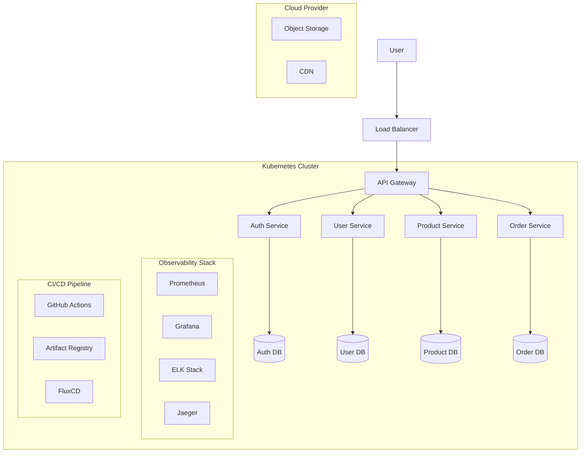

# Microservices Platform with Kubernetes

## Architecture Overview

## Project Components

### Infrastructure
- **Kubernetes**: Container orchestration
- **Istio**: Service mesh for traffic management, security, and observability
- **ArgoCD/FluxCD**: GitOps continuous delivery
- **Kustomize/Helm**: Kubernetes manifest management
- **Terraform**: IaC for cloud resources

### Observability
- **Prometheus**: Metrics collection
- **Grafana**: Visualization
- **ELK Stack**: Centralized logging
- **Jaeger**: Distributed tracing

### CI/CD
- **GitHub Actions**: CI automation
- **Container Registry**: Image storage
- **SonarQube**: Code quality and security scanning

### Security
- **Vault**: Secret management
- **OPA/Gatekeeper**: Policy enforcement
- **Trivy**: Container scanning
- **cert-manager**: Certificate management

## DevOps Practices
- Infrastructure as Code (IaC)
- GitOps deployment model
- Automated testing pipelines
- Zero-trust security model
- Horizontal scaling of services
- Canary/Blue-Green deployments

## Cloud Agnostic Design
This architecture can be deployed to any major cloud provider (AWS, GCP, Azure) with minimal changes, leveraging each cloud's managed Kubernetes service (EKS, GKE, AKS) while maintaining consistent deployment patterns and practices.