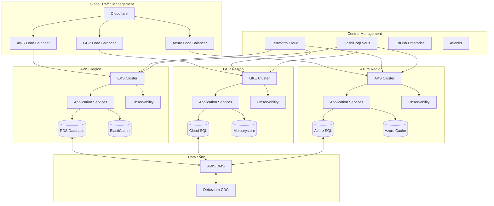

# Multi-Cloud Infrastructure Architecture

## Architecture Overview

## Project Components

### Infrastructure Abstraction Layer
- **Terraform**: Single code base with provider-specific modules
- **Crossplane**: Kubernetes-native infrastructure provisioning
- **Pulumi**: Infrastructure as actual code for complex orchestration

### Orchestration
- **Kubernetes Federation**: Cross-cloud K8s management
- **Istio/Linkerd**: Service mesh across cloud environments
- **Cilium**: eBPF-based networking and security

### Data Management
- **Database replication**: Cross-region synchronization
- **Stateful service management**: Using PV/PVC with CSI drivers
- **Change Data Capture (CDC)**: For database synchronization

### Observability
- **Prometheus/Thanos**: Cross-cloud metrics
- **Grafana/Loki**: Visualization and logs
- **OpenTelemetry**: Vendor-agnostic observability
- **Datadog/New Relic**: Commercial cross-cloud monitoring

### Disaster Recovery
- **Velero**: Kubernetes backup and restore
- **Cross-region replication**: For storage and databases
- **Chaos testing**: Regular resilience testing with Chaos Mesh

## Cloud-Agnostic Design Patterns
- **Abstraction layers** for cloud services
- **Common configuration management** across providers
- **Centralized identity management** (Keycloak/Okta)
- **Unified deployment pipelines** (GitHub Actions/ArgoCD)
- **Multi-region routing** for geographical redundancy

## Cost Management
- **Kubecost**: Kubernetes cost monitoring
- **Infracost**: Terraform cost predictions
- **FinOps practices**: Resource tagging, idle resource detection
- **Spot instance integration**: For non-critical workloads