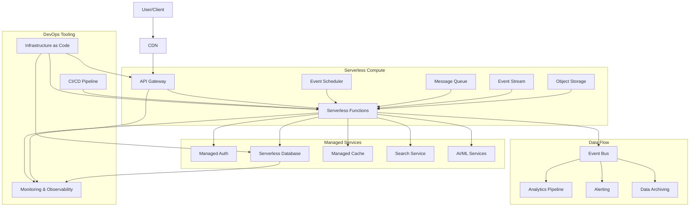

# Serverless Architecture Design

## Architecture Overview

## Serverless Components

### Compute Layer
- **AWS Lambda/Azure Functions/Cloud Run/Cloud Functions**: Core function runtime
- **AWS Step Functions/Azure Logic Apps/Workflows**: Function orchestration
- **AWS Fargate/Cloud Run/Azure Container Instances**: Containerized serverless
- **Knative**: Kubernetes-based serverless platform
- **Dapr**: Distributed application runtime for serverless

### API Management
- **API Gateway**: API routing, authentication, throttling
- **Custom Domains**: Domain mapping
- **API Keys**: API access management
- **GraphQL API**: Unified API layer
- **WebSockets**: Real-time communication

### Storage Solutions
- **DynamoDB/Cosmos DB/Firestore**: NoSQL databases
- **Aurora Serverless/Azure SQL Serverless**: Relational databases
- **S3/Blob Storage/GCS**: Object storage
- **ElastiCache/Azure Cache/Memorystore**: Caching layer
- **Serverless Redis**: Event-driven caching

### Event Processing
- **EventBridge/Event Grid**: Event routing
- **SQS/Azure Queue/Cloud Tasks**: Asynchronous processing
- **SNS/Event Hubs/Pub-Sub**: Pub-sub messaging
- **Kinesis/Event Hubs/Dataflow**: Stream processing
- **Apache Kafka**: Event streaming backbone

### Authentication & Security
- **Cognito/Auth0/Firebase Auth**: User authentication
- **IAM/Managed Identities**: Service authentication
- **KMS/Key Vault/Cloud KMS**: Key management
- **Parameter Store/App Configuration**: Secret management
- **WAF/Front Door**: Edge security

## Serverless DevOps Practices

### Infrastructure as Code
- **AWS SAM/Serverless Framework**: Function-focused IaC
- **Terraform/CDK/Pulumi**: General-purpose IaC
- **CloudFormation/ARM Templates/Deployment Manager**: Cloud-native IaC
- **OpenTofu**: Open source Terraform alternative

### CI/CD for Serverless
- **GitHub Actions/GitLab CI/CircleCI**: Automated testing and deployment
- **AWS CodePipeline/Azure DevOps**: Cloud-native CI/CD
- **Seed.io/Stackery/Serverless Inc**: Specialized serverless deployment
- **Canary deployments**: Gradual function rollouts

### Observability
- **CloudWatch/Application Insights/Cloud Monitoring**: Native monitoring
- **X-Ray/Application Insights/Cloud Trace**: Distributed tracing
- **Datadog/New Relic/Honeycomb**: Third-party observability
- **Lumigo/Thundra/Epsagon**: Serverless-specific monitoring
- **Serverless Dashboard/Dashbird**: Cost and performance monitoring

### Local Development
- **SAM Local/Azure Functions Core Tools/Functions Framework**: Local function development
- **LocalStack/Azurite**: Cloud service emulators
- **Docker Compose**: Local service orchestration
- **Jest/Mocha/Pytest**: Unit testing frameworks

## Serverless Patterns

### Event-Driven Architecture
- Event sources and consumers
- Choreography over orchestration
- Eventual consistency
- Event sourcing and CQRS

### Micro-Frontend Architecture
- Static site generation with incremental builds
- Single-page applications with serverless backends
- Server-side rendering with serverless functions
- Edge computing for frontend optimization

### Serverless Microservices
- Function-per-microservice
- Shared event backbone
- API composition
- BFF (Backend-for-Frontend) pattern

### Hybrid Approaches
- Kubernetes + serverless
- Containers + functions
- VM-based + serverless workloads
- Edge + serverless core