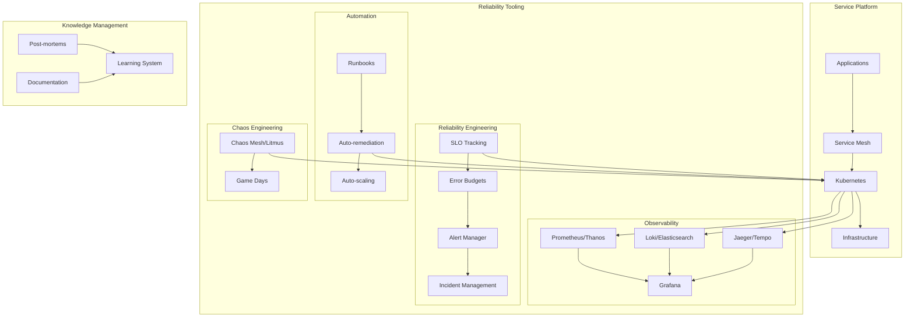

# Site Reliability Engineering Platform

## Architecture Overview

## SRE Components

### Observability Platform
- **Metrics**: Prometheus with Thanos for long-term storage
- **Logs**: Loki or ELK Stack for centralized logging
- **Traces**: Jaeger or Tempo for distributed tracing
- **Events**: Event correlation with tools like Zebrium
- **Dashboards**: Grafana for visualization
- **Unified Observability**: OpenTelemetry collection

### SLO Implementation
- **Service Level Indicators (SLIs)**: Key metrics that measure service health
- **Service Level Objectives (SLOs)**: Target values for SLIs
- **Error Budgets**: Acceptable threshold for service degradation
- **Compliance Tracking**: Automated SLO compliance reporting
- **Business Alignment**: SLOs tied to business metrics

### Incident Management
- **Alerting**: Prometheus AlertManager with PagerDuty/OpsGenie
- **Incident Response**: Automated incident creation and escalation
- **Remediation**: Runbooks and automated remediation scripts
- **Blameless Post-mortems**: Structured analysis and learning
- **Incident Database**: Historical record and pattern analysis

### Automation
- **Runbooks**: Documented operational procedures
- **ChatOps**: Operational tools integrated with communication platforms
- **Auto-remediation**: Automated fixes for known issues
- **Capacity Planning**: Predictive scaling based on historical data
- **Toil Reduction**: Automating repetitive operational tasks

### Reliability Testing
- **Chaos Engineering**: Controlled fault injection with Chaos Mesh
- **Load Testing**: Simulated load with k6/Locust
- **Disaster Recovery Testing**: Regular DR exercises
- **Game Days**: Simulated incident exercises
- **Canary Analysis**: Automated deployment verification

## SRE Practices

### Work Distribution
- 50% ops work, 50% development work
- Cap on operational load
- Systematic toil reduction
- Embedded SREs in development teams

### Continuous Improvement
- Regular service reviews
- Tracking of MTTR, MTBF, and change failure rate
- Progressive delivery techniques
- Proactive capacity planning

### Knowledge Sharing
- Comprehensive documentation
- Cross-training between teams
- SRE newsletters and internal tech talks
- Skill development programs

### Production Ownership
- Clear service ownership model
- On-call rotation management
- Production access controls
- Infrastructure as Code for all changes