# Azure Landing Zone with Terraform

## Architecture Overview

```mermaid
graph TD
    subgraph "Azure Tenant"
        subgraph "Management Subscription"
            MRG[Management Resource Group]
            
            subgraph "Management Services"
                LA[Log Analytics]
                AS[Automation Service]
                BP[Azure Blueprints]
                Pol[Azure Policy]
                SCenter[Security Center]
            end
            
            MRG --> LA
            MRG --> AS
            MRG --> BP
            MRG --> Pol
            MRG --> SCenter
        end
        
        subgraph "Identity Subscription"
            IRG[Identity Resource Group]
            
            subgraph "Identity Services"
                AAD[Azure AD]
                AADDS[Azure AD DS]
                AADC[Azure AD Connect]
                PIM[Privileged Identity Management]
                MFA[Multi-Factor Authentication]
            end
            
            IRG --> AAD
            IRG --> AADDS
            IRG --> AADC
            IRG --> PIM
            IRG --> MFA
        end
        
        subgraph "Connectivity Subscription"
            CRG[Connectivity Resource Group]
            
            subgraph "Network Services"
                VWAN[Virtual WAN]
                FW[Azure Firewall]
                VPN[VPN Gateway]
                ER[ExpressRoute]
                DNS[Azure DNS]
                BAS[Azure Bastion]
            end
            
            CRG --> VWAN
            CRG --> FW
            CRG --> VPN
            CRG --> ER
            CRG --> DNS
            CRG --> BAS
        end
        
        subgraph "Workload Subscriptions"
            subgraph "Production Subscription"
                PRG[Production Resource Groups]
                
                subgraph "Production Services"
                    PVNET[Virtual Networks]
                    PAKS[AKS Clusters]
                    PACR[Container Registry]
                    PDB[Databases]
                    PSA[Storage Accounts]
                    PAPP[App Services]
                end
                
                PRG --> PVNET
                PRG --> PAKS
                PRG --> PACR
                PRG --> PDB
                PRG --> PSA
                PRG --> PAPP
            end
            
            subgraph "Development Subscription"
                DRG[Development Resource Groups]
                
                subgraph "Development Services"
                    DVNET[Virtual Networks]
                    DAKS[AKS Clusters]
                    DACR[Container Registry]
                    DDB[Databases]
                    DSA[Storage Accounts]
                    DAPP[App Services]
                end
                
                DRG --> DVNET
                DRG --> DAKS
                DRG --> DACR
                DRG --> DDB
                DRG --> DSA
                DRG --> DAPP
            end
        end
    end
    
    subgraph "Terraform Implementation"
        TFState[Remote State Storage]
        TFModules[Terraform Modules]
        CI[CI/CD Pipeline]
        
        TFState --> CI
        TFModules --> CI
        CI --> MRG
        CI --> IRG
        CI --> CRG
        CI --> PRG
        CI --> DRG
    end
```



## Terraform Project Structure

```
azure-landing-zone/
├── README.md
├── environments/
│   ├── dev/
│   │   ├── main.tf
│   │   ├── variables.tf
│   │   └── terraform.tfvars
│   ├── prod/
│   │   ├── main.tf
│   │   ├── variables.tf
│   │   └── terraform.tfvars
│   └── shared/
│       ├── main.tf
│       ├── variables.tf
│       └── terraform.tfvars
├── modules/
│   ├── management/
│   │   ├── main.tf
│   │   ├── variables.tf
│   │   └── outputs.tf
│   ├── identity/
│   │   ├── main.tf
│   │   ├── variables.tf
│   │   └── outputs.tf
│   ├── connectivity/
│   │   ├── main.tf
│   │   ├── variables.tf
│   │   └── outputs.tf
│   ├── workload/
│   │   ├── main.tf
│   │   ├── variables.tf
│   │   └── outputs.tf
│   └── shared/
│       ├── main.tf
│       ├── variables.tf
│       └── outputs.tf
├── pipelines/
│   ├── azure-pipelines.yml
│   ├── github-actions.yml
│   └── scripts/
│       ├── validate.sh
│       └── apply.sh
└── policies/
    ├── custom-policies/
    │   └── deny-public-endpoints.json
    └── initiatives/
        └── security-baseline.json
```

## Landing Zone Components

### Management Layer
- **Log Analytics Workspace**: Centralized logging
- **Azure Monitor**: Monitoring and alerting
- **Azure Automation**: Runbooks and DSC
- **Azure Security Center**: Security posture management
- **Azure Policy**: Compliance enforcement

### Identity Layer
- **Azure Active Directory**: Identity foundation
- **Azure AD Privileged Identity Management**: Just-in-time access
- **Azure AD Conditional Access**: Context-based security
- **Role-Based Access Control (RBAC)**: Fine-grained permissions
- **Managed Identities**: Service authentication

### Connectivity Layer
- **Virtual WAN/Hub-Spoke Topology**: Network architecture
- **Azure Firewall/Network Security Groups**: Network security
- **ExpressRoute/VPN Gateway**: Hybrid connectivity
- **Azure Private Link**: Private service access
- **Azure DNS**: Name resolution
- **Azure Bastion**: Secure RDP/SSH access

### Workload Layer
- **Resource Groups**: Logical container for resources
- **Azure Kubernetes Service**: Container orchestration
- **Azure Container Registry**: Image repository
- **Azure SQL/Cosmos DB**: Database services
- **Azure App Service**: PaaS application hosting
- **Storage Accounts**: Blob, file, queue, and table storage

## Terraform Implementation

### State Management
- **Azure Storage Account**: Remote state storage
- **State locking**: Prevent concurrent modifications
- **State encryption**: Secure sensitive data
- **State versioning**: Track changes over time

### Module Design
- **Reusable modules**: Consistent resource provisioning
- **Clear interfaces**: Well-defined inputs and outputs
- **Version pinning**: Dependency management
- **Module composition**: Layered architecture

### Pipeline Integration
- **Terraform validation**: Syntax and security checks
- **Plan approval**: Manual verification of changes
- **Automated application**: CI/CD integration
- **State backup**: Automated state backup before changes

### Policy as Code
- **Azure Policy Definitions**: Custom policy rules
- **Policy Initiatives**: Policy grouping
- **Compliance reporting**: Automated compliance checks
- **Remediation tasks**: Automated fixes for non-compliance

## Security Implementation

### Network Security
- **Network segmentation**: Isolate workloads
- **Micro-segmentation**: Fine-grained network controls
- **Forced tunneling**: Route all traffic through firewalls
- **Private endpoints**: Private connectivity to PaaS services
- **DDoS protection**: Layer 3-4 protection

### Identity Security
- **Multi-factor authentication**: Enhanced identity verification
- **Conditional access policies**: Context-based access
- **Just-in-time access**: Temporary elevated permissions
- **Managed identities**: Avoid credential storage
- **Identity protection**: Risk-based controls

### Data Security
- **Encryption at rest**: For all data stores
- **Encryption in transit**: TLS enforcement
- **Key Vault integration**: Central secret management
- **Customer-managed keys**: BYOK for sensitive data
- **Data classification**: Information protection

### Operational Security
- **Monitoring and alerting**: Security event detection
- **Security Center integration**: Threat protection
- **Vulnerability assessment**: Regular security scanning
- **Update management**: Automated patching
- **Security baselines**: Hardened configurations

## Key Terms and Concepts

### Azure Landing Zone
A **Landing Zone** is a pre-configured, secure, scalable environment in Azure that serves as a foundation for hosting your workloads and applications. It implements best practices for security, operations, and governance to accelerate cloud adoption.

### Azure Tenant
The **Azure Tenant** is a dedicated and trusted instance of Azure Active Directory (Azure AD) that represents an organization. It's the security boundary for your organization in Azure.

### Subscription
An **Azure Subscription** is a logical container for your resources and represents an agreement with Microsoft to use Azure services. Subscriptions help organize resources, manage billing, and control access.

### Resource Group
A **Resource Group** is a logical container that holds related resources for an Azure solution. It allows you to manage and organize resources as a single unit.

### Management Group
**Management Groups** provide a governance scope above subscriptions, allowing you to organize subscriptions into hierarchies for unified policy and access management.

### Hub-Spoke Network Topology
The **Hub-Spoke** model is a network architecture where a central hub virtual network connects to multiple spoke virtual networks. The hub contains shared services like firewalls, while spokes contain workload-specific resources.

### Azure Policy
**Azure Policy** is a service that evaluates your resources for non-compliance with defined rules. Policies can enforce standards, security requirements, and regulatory compliance.

### RBAC (Role-Based Access Control)
**RBAC** provides fine-grained access management for Azure resources, allowing you to control who has access to specific resources and what actions they can perform.

### Managed Identity
**Managed Identities** eliminate the need for developers to manage credentials by providing Azure services with an automatically managed identity in Azure AD.

### Azure Blueprints
**Azure Blueprints** enable you to define a repeatable set of Azure resources that implements and adheres to standards, patterns, and requirements.

### Terraform
**Terraform** is an open-source Infrastructure as Code (IaC) tool that allows you to define and provision infrastructure using a declarative configuration language.

### State File
A Terraform **State File** stores the current state of your infrastructure, allowing Terraform to map real-world resources to your configuration and track metadata.

### Module
A Terraform **Module** is a reusable, self-contained package of Terraform configurations that manages a specific set of resources in a consistent way.

### Terraform Provider
A Terraform **Provider** is a plugin that interacts with APIs of a specific service, such as Azure, and exposes resources that can be managed.

### Azure Private Link
**Azure Private Link** provides private connectivity from a virtual network to Azure PaaS services, customer-owned services, or Microsoft partner services.

### Azure Bastion
**Azure Bastion** is a fully managed PaaS service that provides secure RDP and SSH access to virtual machines without exposing public IP addresses.

### ExpressRoute
**ExpressRoute** provides a private connection between your on-premises infrastructure and Microsoft cloud services, bypassing the public internet for enhanced security and performance.

### Privileged Identity Management (PIM)
**PIM** provides just-in-time privileged access to Azure resources and Azure AD with time-bound permissions, requiring explicit approval or MFA for activation.